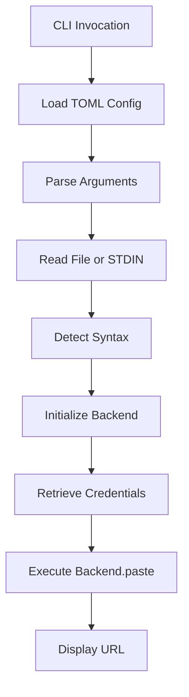
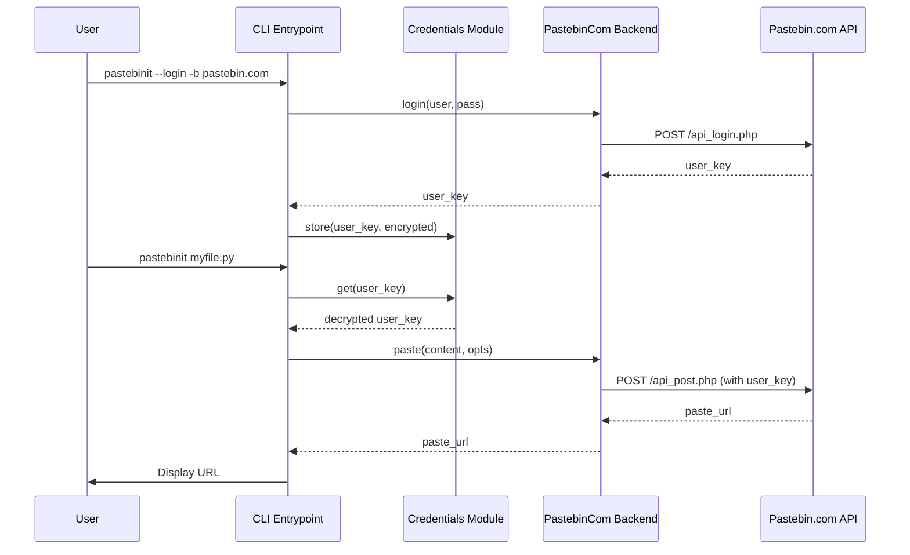

<details>
<summary>Relevant source files</summary>

The following files were used as context for generating this wiki page:

- [README.md](README.md)
- [pastebinit/cli.py](pastebinit/cli.py)
- [pastebinit/backends/base.py](pastebinit/backends/base.py)
- [pastebinit/backends/pastebin_com.py](pastebinit/backends/pastebin_com.py)
- [pastebinit/syntax.py](pastebinit/syntax.py)
- [AGENTS.md](AGENTS.md)
- [pyproject.toml](pyproject.toml)

</details>

# Introduction to pastebinit

`pastebinit` is a command-line utility written in Python designed to streamline the process of sending text and files to various pastebin services. Originally a Launchpad project, the current version is a complete rewrite (v2.0.0+) focused on modern Python packaging, security, and full API integration for supported backends. Sources: [README.md:1-15](README.md#L1-L15), [CHANGELOG.md:18-21](CHANGELOG.md#L18-L21), [AGENTS.md:3-5](AGENTS.md#L3-L5)

The tool provides advanced features such as automatic syntax detection, encrypted credential storage via OS keyrings or Fernet/PBKDF2 keystores, and specialized support for `pastebin.com` including folder management and user-specific operations. Sources: [README.md:9-18](README.md#L9-L18), [pastebinit/cli.py:65-80](pastebinit/cli.py#L65-L80)

## Architecture and Design

The system is built on a modular backend architecture where a base abstract class defines the interface for different pastebin services. The CLI acts as the orchestrator, handling user input, configuration loading, and credential management before delegating the actual network transmission to a specific backend provider. Sources: [pastebinit/cli.py:100-110](pastebinit/cli.py#L100-L110), [pastebinit/backends/base.py:33-60](pastebinit/backends/base.py#L33-L60)

### Logic Flow Diagram

The following diagram illustrates the standard execution path when a user initiates a paste operation via the CLI.



Sources: [pastebinit/cli.py:100-160](pastebinit/cli.py#L100-L160), [pastebinit/syntax.py:61-82](pastebinit/syntax.py#L61-L82)

## Core Components

### Command Line Interface (CLI)
The CLI entry point, located in `pastebinit/cli.py`, manages the `argparse` configuration and coordinates the flow between input data and backend services. It handles overrides for usernames, privacy levels, and expiry settings. Sources: [pastebinit/cli.py:16-52](pastebinit/cli.py#L16-L52)

### Backend System
Each supported service is implemented as a class inheriting from `BasePastebin`. The system checks backend capabilities (e.g., `supports_auth`, `supports_expiry`) to validate user requests before attempting a paste. Sources: [pastebinit/backends/base.py:33-42](pastebinit/backends/base.py#L33-L42)

| Backend Property | Description |
| --- | --- |
| `supports_auth` | Indicates if the backend supports user login/API keys. |
| `supports_folders` | Indicates support for organizing pastes into folders. |
| `supports_expiry` | Indicates if pastes can be set to automatically expire. |
| `supports_privacy` | Indicates support for public, unlisted, or private pastes. |
| `supports_syntax` | Indicates if the backend supports syntax highlighting. |

Sources: [pastebinit/backends/base.py:36-40](pastebinit/backends/base.py#L36-L40), [pastebinit/cli.py:59-62](pastebinit/cli.py#L59-L62)

### Syntax Detection
The utility uses a multi-layered approach to detect the correct syntax for a paste:
1. **Filename/Extension**: Matches against a comprehensive `EXTENSION_MAP`.
2. **Special Names**: Identifies files like `Dockerfile` or `Makefile`.
3. **Shebang Line**: Inspects the first line of the content for interpreters (e.g., `#!/usr/bin/python`).
Sources: [pastebinit/syntax.py:1-82](pastebinit/syntax.py#L1-L82)

## Data Models and Options

Internal operations rely on the `PasteOptions` dataclass to pass parameters from the CLI to the backends consistently. Sources: [pastebinit/backends/base.py:22-31](pastebinit/backends/base.py#L22-L31)

```python
@dataclass
class PasteOptions:
    title: str = ""
    format: str = "text"
    private: int = 1
    expiry: str = "N"
    folder: Optional[str] = None
    create_folder: bool = False
    user_key: Optional[str] = None
```

Sources: [pastebinit/backends/base.py:22-31](pastebinit/backends/base.py#L22-L31)

## Sequence of Authentication and Upload

For backends requiring authentication (like `pastebin.com`), the tool performs a credential lookup and potentially a login handshake before posting data.



Sources: [pastebinit/cli.py:105-120](pastebinit/cli.py#L105-L120), [pastebinit/backends/pastebin_com.py:53-80](pastebinit/backends/pastebin_com.py#L53-L80)

## Configuration and Environment

The tool supports persistent configuration via a TOML file and environment variables for sensitive keys. Sources: [README.md:43-47](README.md#L43-L47), [README.md:65-75](README.md#L65-L75)

*  **Config File**: `~/.config/pastebinit/config.toml` handles default backends and global preferences.
*  **Environment Variables**:
  *  `PASTEBIN_API_KEY`: Developer key for pastebin.com.
  *  `PASTEBIN_USERNAME`: Account username.
  *  `PASTEBIN_PASSWORD`: Account password.
Sources: [README.md:46-50](README.md#L46-L50), [README.md:65-75](README.md#L65-L75)

## Conclusion
`pastebinit` provides a robust, extensible framework for interacting with pastebin services. By abstracting the complexities of different web APIs into a unified CLI and backend interface, it allows users to securely manage snippets with features like auto-detection and encrypted credential management. Sources: [README.md:9-25](README.md#L9-L25), [pastebinit/cli.py:145-165](pastebinit/cli.py#L145-L165)
