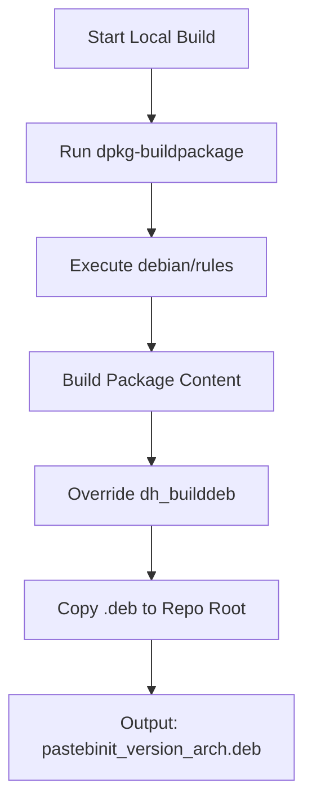

<details>
<summary>Relevant source files</summary>

The following files were used as context for generating this wiki page:

- [README.md](README.md)
- [AGENTS.md](AGENTS.md)
- [CLAUDE.md](CLAUDE.md)
- [pyproject.toml](pyproject.toml)
- [CHANGELOG.md](CHANGELOG.md)
</details>

# Installation Guide

## Introduction
The `pastebinit` utility is a command-line tool designed to send text and files to various pastebin services. It provides a modernized Python-based implementation of the original Launchpad project, supporting multiple backends including pastebin.com, paste.ubuntu.com, and bpa.st.

This guide details the various methods available for installing the software, ranging from pre-built binary packages for Debian-based systems to source-based installations for developers. It also covers the system requirements and dependency management handled by the project's build system.

Sources: [README.md:1-12](README.md#L1-L12), [AGENTS.md:3-5](AGENTS.md#L3-L5)

## System Requirements and Dependencies
`pastebinit` requires Python version 3.10 or higher. The project utilizes `setuptools` as its build backend and manages several core dependencies for security and configuration handling.

### Core Dependencies
| Dependency | Version | Purpose |
| :--- | :--- | :--- |
| `cryptography` | >= 49.0.0 | Credential encryption |
| `keyring` | >= 25.7.0 | OS-level credential storage |
| `tomli-w` | >= 1.2.0 | TOML configuration writing |
| `tomli` | >= 2.4.1 | TOML parsing (for Python < 3.11) |

Sources: [pyproject.toml:1-17](pyproject.toml#L1-L17), [AGENTS.md:7-10](AGENTS.md#L7-L10)

## Installation Methods

### 1. Debian/Ubuntu (.deb)
For users on Debian-based distributions, pre-built `.deb` packages are the recommended installation method. These packages include the man page, bash completion, and standard install paths. Packages are available for `amd64` and `arm64` architectures.

```bash
VERSION=$(curl -s https://api.github.com/repos/blixten85/pastebinit/releases/latest | grep '"tag_name"' | cut -d'"' -f4 | tr -d 'v')
ARCH=$(dpkg --print-architecture)
wget "https://github.com/blixten85/pastebinit/releases/latest/download/pastebinit_%24%7BVERSION%7D-1_%24%7BARCH%7D.deb%22
sudo dpkg -i "pastebinit_${VERSION}-1_${ARCH}.deb"
```

Sources: [README.md:18-27](README.md#L18-L27), [AGENTS.md:21-25](AGENTS.md#L21-L25)

### 2. Python Package Manager (pip)
Users can install the latest development version directly from the GitHub repository using `pip`.

```bash
pip install git+https://github.com/blixten85/pastebinit.git
```

Sources: [README.md:29-31](README.md#L29-L31)

### 3. Installation from Source
For users wishing to modify the code or contribute, the repository can be cloned and installed in editable mode.

```bash
git clone https://github.com/blixten85/pastebinit.git
cd pastebinit
pip install -e .
```

Sources: [README.md:33-37](README.md#L33-L37)

## Developer Installation and Environment
Developers require additional tools for testing and building packages. The project defines optional dependencies for testing and specific commands for local builds.

### Development Setup

```bash
# Install with development dependencies (pytest, pyyaml)
pip install -e ".[dev]"

# Run tests to verify installation
pytest
```

Sources: [AGENTS.md:12-16](AGENTS.md#L12-L16), [pyproject.toml:19-23](pyproject.toml#L19-L23)

### Local Debian Build Process
The following flow describes how the `.deb` package is constructed locally using the `debian/` directory configuration.



The build process utilizes `debian/control` to define `Architecture: any`, allowing for per-architecture package generation.

Sources: [AGENTS.md:17-25](AGENTS.md#L17-L25), [CLAUDE.md:24-28](CLAUDE.md#L24-L28)

## Post-Installation Verification
Once installed, the utility can be verified by checking the version or accessing the help menu.

| Command | Action |
| :--- | :--- |
| `pastebinit --version` | Verify installed version |
| `pastebinit --help` | View available CLI options |
| `pastebinit -l` | List supported backends and capabilities |

Sources: [README.md:41-43](README.md#L41-L43), [CLAUDE.md:15-16](CLAUDE.md#L15-L16)

## Summary
`pastebinit` provides flexible installation options including native Debian packages and standard Python installation workflows. By leveraging `pyproject.toml` for dependency management and GitHub Actions for automated release building, the project ensures that users across different architectures can easily deploy the tool while maintaining secure credential storage through system keyrings.
