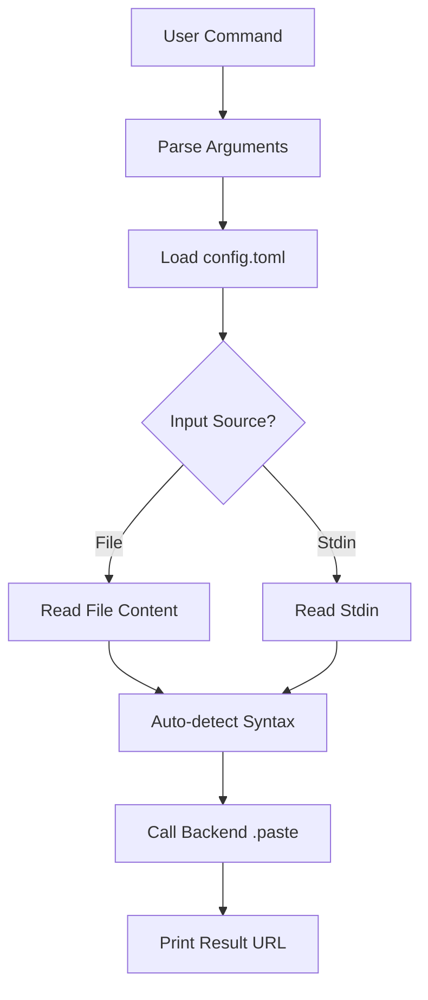
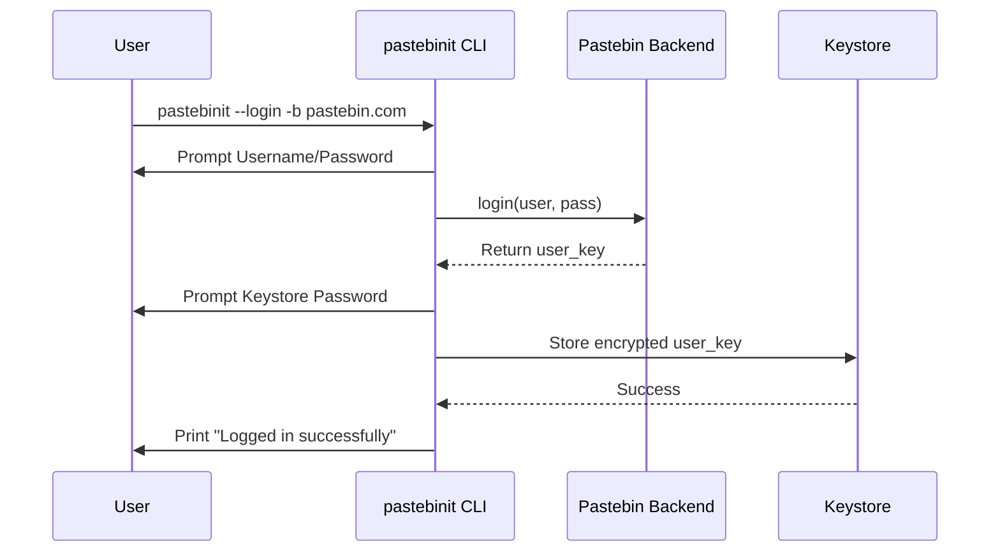

<details>
<summary>Relevant source files</summary>

The following files were used as context for generating this wiki page:

- [README.md](README.md)
- [pastebinit/cli.py](pastebinit/cli.py)
- [pastebinit/config.py](pastebinit/config.py)
- [pastebinit/syntax.py](pastebinit/syntax.py)
- [pastebinit/backends/base.py](pastebinit/backends/base.py)
- [pastebinit/backends/pastebin_com.py](pastebinit/backends/pastebin_com.py)
</details>

# Usage Guide & Examples

## Introduction
`pastebinit` is a command-line utility designed to streamline the process of sending text and files to various pastebin services. It provides a unified interface for multiple backends, handling authentication, syntax highlighting, and privacy settings automatically.

The system is built on a modular architecture where a central CLI orchestrates interactions between user input, configuration files, and specialized backend implementations. It supports advanced features like automatic syntax detection and encrypted credential storage.
Sources: [README.md:1-15](README.md#L1-L15), [pastebinit/cli.py:10-25](pastebinit/cli.py#L10-L25)

## Core Command Execution
The primary workflow involves the `cli.py` module parsing arguments and delegating the upload logic to a specific backend. Users can provide input via file paths or standard input (stdin).

### Basic Usage Flow
The following diagram illustrates how `pastebinit` processes a typical paste request:



The application defaults to the `bpa.st` backend unless otherwise configured or specified via the `-b` flag.
Sources: [pastebinit/cli.py:46-125](pastebinit/cli.py#L46-L125), [pastebinit/config.py:16-21](pastebinit/config.py#L16-L21)

## Syntax Detection Logic
`pastebinit` uses the `syntax.py` module to determine the correct highlighting for a paste. The logic follows a priority sequence:
1. **Explicit Override**: User provides the `-f` or `--format` flag.
2. **Special Filenames**: Matches against known names like `Dockerfile` or `Makefile`.
3. **File Extension**: Maps extensions (e.g., `.py`, `.rs`) to backend-supported strings.
4. **Shebang Detection**: Inspects the first line of the content for `#!` headers.
5. **Fallback**: Defaults to `text`.

### Syntax Mapping Example
| File Detail | Resulting Syntax |
|---|---|
| `script.py` | `python` |
| `data.json` | `json` |
| `#!/bin/bash` | `bash` |
| `Makefile` | `make` |

Sources: [pastebinit/syntax.py:1-93](pastebinit/syntax.py#L1-L93), [pastebinit/cli.py:112-114](pastebinit/cli.py#L112-L114)

## Authentication and Credentials
For backends supporting authentication (like `pastebin.com`), the system provides a secure login flow.



Credentials are never stored in plain text; they are protected using Fernet/PBKDF2 encryption or the OS keyring.
Sources: [pastebinit/cli.py:75-87](pastebinit/cli.py#L75-L87), [pastebinit/backends/pastebin_com.py:48-58](pastebinit/backends/pastebin_com.py#L48-L58), [README.md:41-48](README.md#L41-L48)

## Configuration Options
Defaults are managed in `~/.config/pastebinit/config.toml`. The CLI merges these defaults with command-line arguments.

### Configuration Structure
| Section | Option | Default | Description |
|---|---|---|---|
| `[defaults]` | `backend` | `bpa.st` | Service to use if not specified |
| `[defaults]` | `private` | `1` | 0=public, 1=unlisted, 2=private |
| `[defaults]` | `expiry` | `N` | Never, 10M, 1H, 1D, 1W, 1M, 1Y |
| `[defaults]` | `format` | `auto` | Syntax highlighting format |

Sources: [pastebinit/config.py:16-21](pastebinit/config.py#L16-L21), [pastebinit/cli.py:31-45](pastebinit/cli.py#L31-L45)

## Backend Capabilities
Each backend implements the `BasePastebin` abstract class but supports different feature sets.

| Backend | Auth | Folders | Expiry | Privacy |
|---|:---:|:---:|:---:|:---:|
| `pastebin.com` | ✅ | ✅ | ✅ | ✅ |
| `paste.debian.net` | ❌ | ❌ | ✅ | ✅ |
| `bpa.st` | ❌ | ❌ | ✅ | ✅ |
| `paste.ubuntu.com` | ❌ | ❌ | ❌ | ✅ |

Sources: [README.md:50-59](README.md#L50-L59), [pastebinit/backends/base.py:27-33](pastebinit/backends/base.py#L27-L33)

## Advanced Usage Examples

### Pasting to a Specific Folder
Only supported by `pastebin.com`. If the folder does not exist, `--create-folder` can be used.

```bash
pastebinit -b pastebin.com --folder "MyLogs" --create-folder log.txt
```

Sources: [pastebinit/cli.py:41-43](pastebinit/cli.py#L41-L43), [pastebinit/backends/pastebin_com.py:133-142](pastebinit/backends/pastebin_com.py#L133-L142)

### Multi-file Upload
The CLI can iterate through multiple files, generating a unique URL for each.

```bash
pastebinit file1.txt file2.py file3.md
```

Sources: [pastebinit/cli.py:99-130](pastebinit/cli.py#L99-L130)

## Conclusion
The `Usage Guide & Examples` demonstrate a flexible system designed for both simple ad-hoc pastes and complex automated workflows with authenticated services. By leveraging automatic syntax detection and centralized configuration, `pastebinit` minimizes the required user input while maintaining high security via encrypted credential storage.
