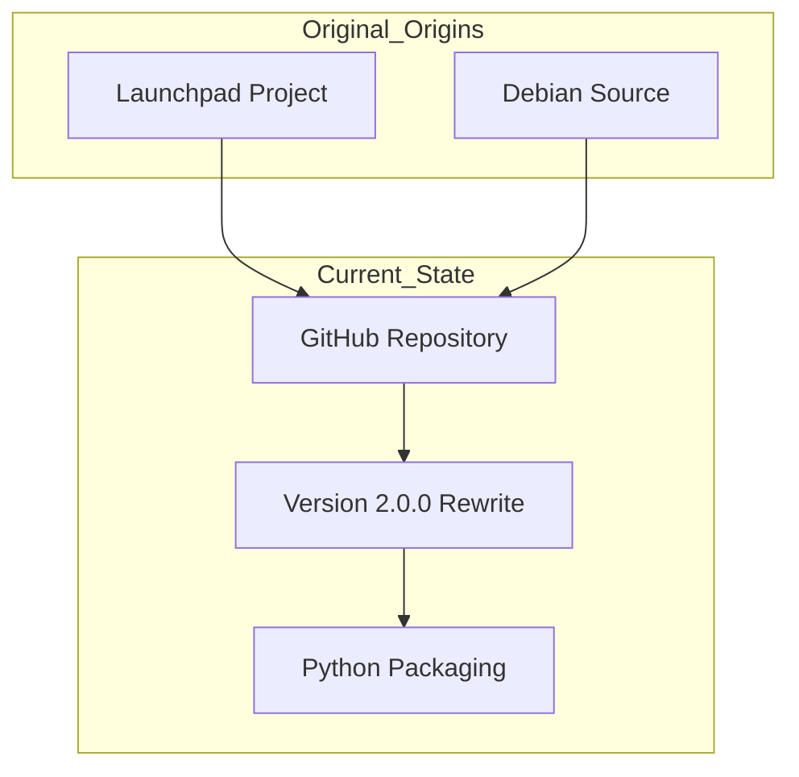

Relevant source files

The following files were used as context for generating this wiki page:

- [README.md](README.md)
- [AGENTS.md](AGENTS.md)
- [CLAUDE.md](CLAUDE.md)
- [CHANGELOG.md](CHANGELOG.md)
- [pyproject.toml](pyproject.toml)

# History & Credits

The history of `pastebinit` spans from its origins as a Launchpad-hosted utility to its modern incarnation as a Python-packaged CLI tool. This page details the evolutionary path of the software, the contributors who established its foundation, and the current maintenance structure.

Sources: [README.md:120-125](README.md#L120-L125), [AGENTS.md:3-5](AGENTS.md#L3-L5)

## Project Evolution

`pastebinit` was originally conceived as a Launchpad project designed to provide a command-line interface for various pastebin services. In its current form, it has undergone a significant architectural transformation, including a complete rewrite from scratch (version 2.0.0) and the adoption of modern Python packaging standards.

Sources: [README.md:120-125](README.md#L120-L125), [CHANGELOG.md:17-19](CHANGELOG.md#L17-L19)

### Major Milestones

The project history is marked by a transition from a traditional script-based utility to a robust package distributed via `pip` and Debian `.deb` packages.

| Version | Focus | Description |
| :--- | :--- | :--- |
| Original | Launchpad | Initial development hosted on Launchpad.net. |
| 2.0.0 | Rewrite | Complete rewrite from scratch to modernize the codebase. |
| 2.1.x | CI/CD | Implementation of GitHub Actions for auto-merging and building. |
| 2.2.1 | Current | Modern Python ≥ 3.10 support with `pyproject.toml`. |

Sources: [CHANGELOG.md:1-20](CHANGELOG.md#L1-L20), [pyproject.toml:7-10](pyproject.toml#L7-L10), [AGENTS.md:21-25](AGENTS.md#L21-L25)

The following diagram illustrates the evolution from the original source to the current GitHub-maintained repository.

The diagram shows the transition of the project from Launchpad and Debian sources into the current GitHub-hosted Python package.
Sources: [README.md:120-125](README.md#L120-L125), [CHANGELOG.md:17-19](CHANGELOG.md#L17-L19)

## Credits and Contributors

The project is the result of collaborative efforts across different platforms and eras of development.

### Original Authors
- **Stéphane Graber**: The original author of the project (stgraber@ubuntu.com).
- **Daniel Bartlett**: Co-author of the original utility (dan@f-box.org).

### Current Maintenance
- **Anders Eriksson**: Current maintainer and author of the modernized Python package version.
- **skorokithakis**: Identified as the current upstream source for the project lineage.

Sources: [README.md:120-125](README.md#L120-L125), [pyproject.toml:11-13](pyproject.toml#L11-L13)

## Project Lineage & References

The project maintains links to its historical sources to ensure continuity and respect for its GPL-2.0-or-later licensing.

- **Original Project**: [Launchpad.net/pastebinit](https://launchpad.net/pastebinit)
- **Debian Source**: [sources.debian.org/src/pastebinit/](https://sources.debian.org/src/pastebinit/)
- **Upstream**: [github.com/skorokithakis/pastebinit](https://github.com/skorokithakis/pastebinit)

Sources: [README.md:120-125](README.md#L120-L125), [pyproject.toml:29-31](pyproject.toml#L29-L31)

## Summary

The history of `pastebinit` reflects a commitment to maintaining a lightweight, functional CLI tool while adapting to modern software distribution methods. From its roots in the Ubuntu/Debian ecosystem under Stéphane Graber and Daniel Bartlett to its current state as a Python-packaged tool maintained by Anders Eriksson, it continues to serve as a bridge between the command line and web-based paste services.

Sources: [README.md:120-130](README.md#L120-L130), [AGENTS.md:1-10](AGENTS.md#L1-L10)
