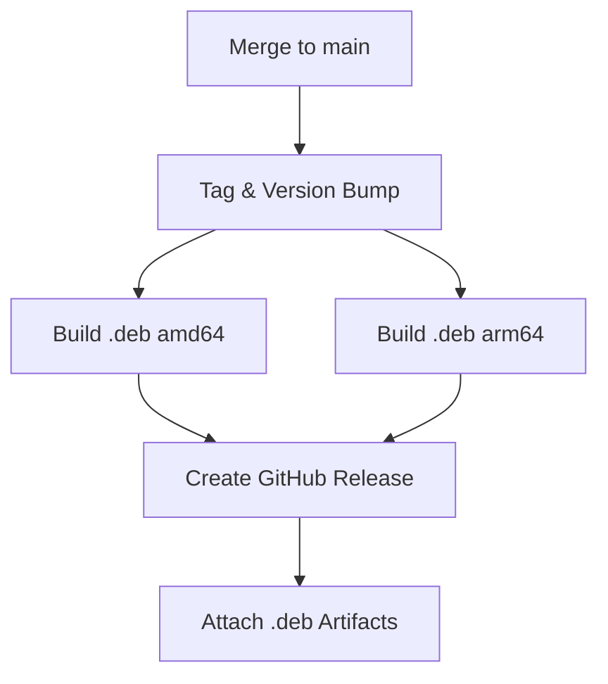
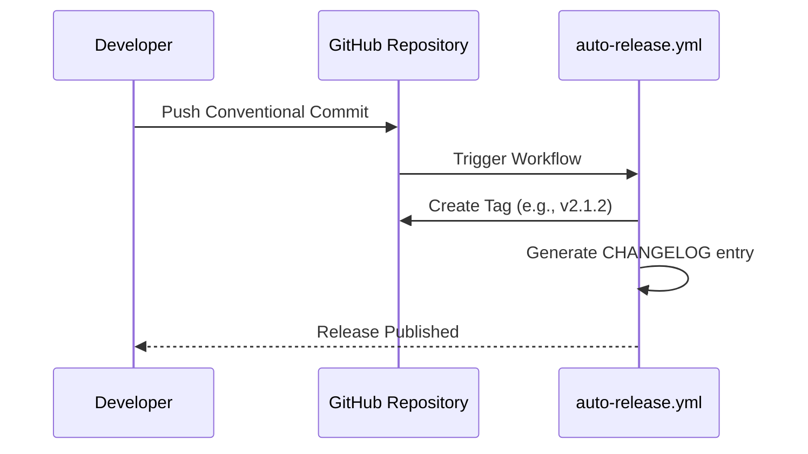

Relevant source files

The following files were used as context for generating this wiki page:

- [CHANGELOG.md](CHANGELOG.md)
- [AGENTS.md](AGENTS.md)
- [CLAUDE.md](CLAUDE.md)
- [release-please-config.json](release-please-config.json)
- [pyproject.toml](pyproject.toml)
- [README.md](README.md)

# Release History & Changelog

The release history and changelog system in `pastebinit` tracks the evolution of the tool from its original Launchpad roots to its current Python-based implementation. It serves as a record of bug fixes, new features, and version bumps, ensuring that developers and users can track the stability and capabilities of the software across different environments, including Debian/Ubuntu distributions and standard Python environments.

The project utilizes an automated release workflow triggered by merges to the `main` branch. This system manages versioning via Conventional Commits, builds architecture-specific Debian packages (amd64 and arm64), and maintains a detailed `CHANGELOG.md` to document changes between versions.

Sources: [AGENTS.md:1-5](AGENTS.md#L1-L5), [CHANGELOG.md:1-25](CHANGELOG.md#L1-L25), [README.md:1-5](README.md#L1-L5)

## Release Process Architecture

The release process is governed by GitHub Actions workflows that handle versioning, building, and publishing. The project uses a "simple" release type configuration for its root package, tracking changes specifically in the `CHANGELOG.md` file.

### Automation Workflow
When code is merged into the `main` branch, the `auto-release.yml` workflow is triggered. This process follows a three-step sequence:
1.  **Tagging:** The system bumps the patch version based on commit messages and creates a new Git tag.
2.  **Building:** A build matrix executes on `ubuntu-latest` and `ubuntu-24.04-arm` to generate `.deb` files for multiple architectures.
3.  **Release:** A GitHub release is created, and the build artifacts (Debian packages) are attached.

Sources: [AGENTS.md:27-32](AGENTS.md#L27-L32), [CLAUDE.md:27-32](CLAUDE.md#L27-L32), [release-please-config.json:1-8](release-please-config.json#L1-L8)

*This diagram illustrates the automated CI/CD pipeline triggered by merges to the main branch.*

## Versioning and Conventions

The project adheres to **Conventional Commits** to drive automatic versioning. Patch, minor, or major version bumps are determined by the prefixes used in commit messages.

### Version Metadata
Version information is stored in `pyproject.toml` and managed dynamically during the release process. The current defined version in the project metadata is `2.2.1`.

| File | Purpose |
|---|---|
| `pyproject.toml` | Stores project metadata including `version = "2.2.1"`. |
| `CHANGELOG.md` | Provides a human-readable history of changes categorized by version. |
| `release-please-config.json` | Configures the `release-please` bot for automated changelog management. |

Sources: [pyproject.toml:9](pyproject.toml#L9), [AGENTS.md:36](AGENTS.md#L36), [release-please-config.json:1-8](release-please-config.json#L1-L8)

## Historical Changelog Data

The project's recent history shows a transition to version 2.0.0 and subsequent maintenance releases.

### Recent Releases
*  **v2.1.2 (2026-05-01):** Focused on CI/CD bug fixes, including `build-essential` requirements and GITHUB_TOKEN permissions for auto-merging.
*  **v2.1.1 (2026-05-01):** Fixed missing environment variables in the auto-merge workflow.
*  **v2.1.0 (2026-04-30):** Marked the "complete rewrite from scratch" of the tool.

Sources: [CHANGELOG.md:3-23](CHANGELOG.md#L3-L23)

*This sequence shows the interaction between developer commits and the automated generation of changelog entries.*

## Debian Packaging History

A significant part of the release history involves the generation of Debian packages. The build process uses `dpkg-buildpackage` to create packages where the architecture is set to `any` in `debian/control`. This allows the project to provide native support for modern Linux environments.

### Build Artifacts
The release process ensures that the following artifacts are produced and documented:
- `pastebinit_<version>-1_amd64.deb`
- `pastebinit_<version>-1_arm64.deb`

Sources: [AGENTS.md:20-25](AGENTS.md#L20-L25), [README.md:20-27](README.md#L20-L27)

## Summary
The `pastebinit` release system is a highly automated environment that leverages GitHub Actions and Conventional Commits to maintain a consistent version history. By strictly following automated tagging and multi-architecture builds, the project ensures that the `CHANGELOG.md` and GitHub releases accurately reflect the state of the codebase, from the 2.0.0 rewrite to the current 2.2.1 stable version.
