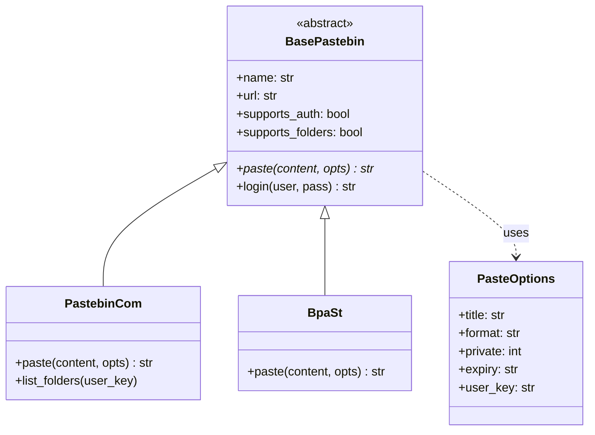
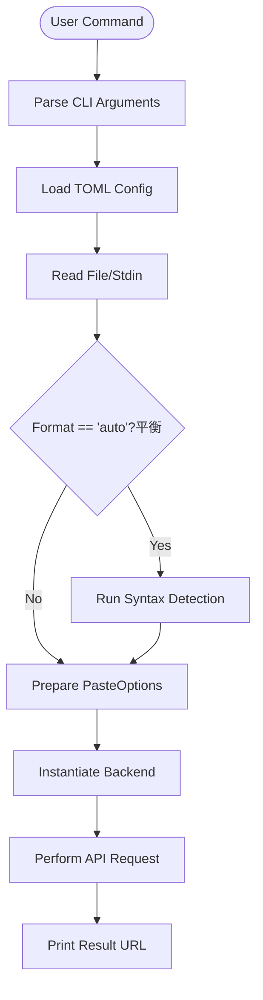

<details>
<summary>Relevant source files</summary>

The following files were used as context for generating this wiki page:

- [pastebinit/cli.py](pastebinit/cli.py)
- [pastebinit/backends/base.py](pastebinit/backends/base.py)
- [pastebinit/config.py](pastebinit/config.py)
- [pastebinit/syntax.py](pastebinit/syntax.py)
- [pastebinit/backends/pastebin_com.py](pastebinit/backends/pastebin_com.py)
- [pastebinit/backends/bpa_st.py](pastebinit/backends/bpa_st.py)
</details>

# Architecture Overview

The `pastebinit` application is a Python-based command-line utility designed to facilitate the uploading of text or files to various pastebin services. It employs a modular backend architecture that allows it to support multiple providers with varying API capabilities, such as authentication, folder management, and expiration settings.

The system is structured around a central Command Line Interface (CLI) that orchestrates configuration loading, input processing (including automatic syntax detection), and backend execution. It uses a provider-agnostic base class to ensure consistency across different service implementations.
Sources: [AGENTS.md:1-10](AGENTS.md#L1-L10), [pastebinit/cli.py:1-25](pastebinit/cli.py#L1-L25)

## Core Component Structure

The application is divided into several functional layers: the CLI entry point, the configuration management system, a syntax detection engine, and a set of specialized backends.

### System Components Table

| Component | Description | Primary File |
| :--- | :--- | :--- |
| **CLI Engine** | Handles argument parsing, user interaction, and high-level workflow orchestration. | [pastebinit/cli.py](pastebinit/cli.py) |
| **Configuration** | Manages persistent settings via TOML files and environment variables. | [pastebinit/config.py](pastebinit/config.py) |
| **Syntax Engine** | Detects code language based on file extensions, shebangs, or names. | [pastebinit/syntax.py](pastebinit/syntax.py) |
| **Backend Base** | Defines the abstract interface and data structures for all pastebin providers. | [pastebinit/backends/base.py](pastebinit/backends/base.py) |
| **Credentials** | Manages encrypted storage of API keys and user tokens using `cryptography`. | [AGENTS.md:5-10](AGENTS.md#L5-L10) |

Sources: [pastebinit/cli.py:15-50](pastebinit/cli.py#L15-L50), [pastebinit/config.py:10-25](pastebinit/config.py#L10-L25), [pastebinit/syntax.py:1-10](pastebinit/syntax.py#L1-L10), [pastebinit/backends/base.py:25-45](pastebinit/backends/base.py#L25-L45)

## Backend Architecture

The system utilizes an inheritance-based model where every service provider must implement the `BasePastebin` abstract base class. This ensures that the CLI can interact with any backend using a unified interface regardless of the underlying API protocol (REST, XML-RPC, etc.).

### Class Relationship Diagram

The following diagram illustrates the relationship between the base abstraction and concrete implementations.



The `PasteOptions` dataclass is the primary vehicle for passing user preferences from the CLI to the backends.
Sources: [pastebinit/backends/base.py:25-50](pastebinit/backends/base.py#L25-L50), [pastebinit/backends/pastebin_com.py:15-30](pastebinit/backends/pastebin_com.py#L15-L30), [pastebinit/backends/bpa_st.py:10-20](pastebinit/backends/bpa_st.py#L10-L20)

## Data Flow: Paste Operation

When a user initiates a paste, the application follows a linear flow from input acquisition to remote submission.

### Execution Sequence

1.  **Initialization**: CLI parses arguments and loads defaults from `~/.config/pastebinit/config.toml`.
2.  **Input Processing**: Content is read from specified files or `stdin`.
3.  **Syntax Detection**: If format is set to "auto", the `syntax.detect` function analyzes the filename and content.
4.  **Backend Selection**: The requested backend class is instantiated.
5.  **Execution**: The backend performs the network request and returns the resulting URL.



Sources: [pastebinit/cli.py:80-145](pastebinit/cli.py#L80-L145), [pastebinit/config.py:35-45](pastebinit/config.py#L35-L45), [pastebinit/syntax.py:85-105](pastebinit/syntax.py#L85-L105)

## Syntax Detection Logic

The `pastebinit/syntax.py` module contains a specialized engine for determining the appropriate lexer for a given paste. It operates on a priority-based lookup system:

1.  **Special Names**: Matches specific filenames like `Dockerfile` or `Makefile`.
2.  **Extensions**: Maps standard file extensions (e.g., `.py`, `.rs`) to backend-compatible strings.
3.  **Shebangs**: Analyzes the first line of the content for `#!` interpreters (e.g., `/usr/bin/env python3`).
4.  **Fallback**: Defaults to `text` if no match is found.

Sources: [pastebinit/syntax.py:1-83](pastebinit/syntax.py#L1-L83)

## Configuration and Defaults

The application follows the XDG Base Directory Specification for configuration storage. The hierarchy for determining settings is:
1.  Command-line arguments (Highest priority).
2.  `~/.config/pastebinit/config.toml` user settings.
3.  Internal hardcoded defaults (Lowest priority).

### Default Configuration Structure

```python
_DEFAULTS: dict[str, Any] = {
    "defaults": {
        "backend": "bpa.st",
        "private": 1,
        "expiry": "N",
        "format": "auto",
    }
}
```

Sources: [pastebinit/config.py:15-25](pastebinit/config.py#L15-L25), [pastebinit/cli.py:26-45](pastebinit/cli.py#L26-L45)

## Conclusion

The architecture of `pastebinit` emphasizes extensibility through its backend-provider pattern and robustness through its multi-layered configuration and syntax detection. By decoupling the CLI logic from specific service implementations, the system maintains compatibility with various web APIs while providing a consistent user experience.
