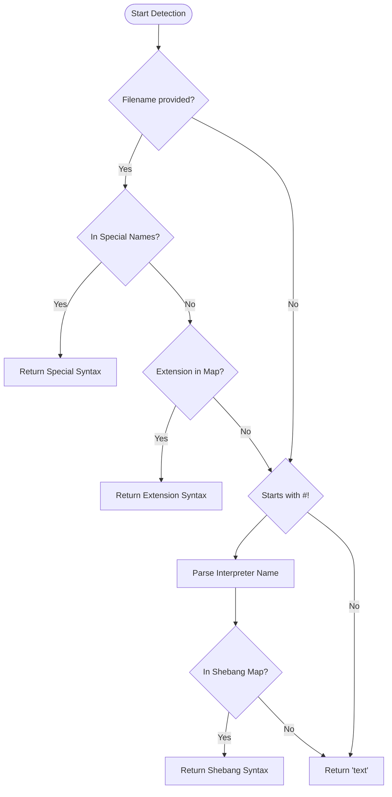
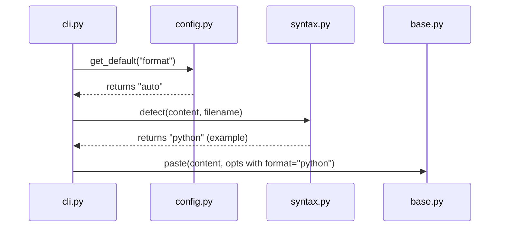

<details>
<summary>Relevant source files</summary>

The following files were used as context for generating this wiki page:

- [pastebinit/syntax.py](pastebinit/syntax.py)
- [tests/test_syntax.py](tests/test_syntax.py)
- [pastebinit/cli.py](pastebinit/cli.py)
- [README.md](README.md)
- [pastebinit/config.py](pastebinit/config.py)
</details>

# Auto Syntax Detection

Auto Syntax Detection is a core feature of `pastebinit` that allows the application to automatically determine the appropriate programming language or format for a code snippet before uploading it to a pastebin service. This ensures that the code is rendered with correct syntax highlighting on the destination platform without requiring the user to manually specify the format via command-line arguments.

The detection logic is primarily contained within the `pastebinit.syntax` module and is triggered by the Command Line Interface (CLI) when the format is set to "auto" (the default behavior). It utilizes three primary methods for identification: filename-to-syntax mapping for specific known filenames, file extension analysis, and shebang line inspection for script files.

Sources: [README.md:10](README.md#L10), [pastebinit/syntax.py:1-85](pastebinit/syntax.py#L1-L85), [pastebinit/cli.py:99-100](pastebinit/cli.py#L99-L100)

## Detection Logic Flow

The detection process follows a specific hierarchy of checks to ensure the most accurate classification. It first checks the filename (if provided), followed by the file extension, and finally inspects the first line of the content for a shebang.



The diagram above illustrates the fallback logic used by the `detect` function to resolve a syntax string.
Sources: [pastebinit/syntax.py:70-85](pastebinit/syntax.py#L70-L85)

## Primary Components

### Syntax Mapping Structures
The system relies on three static dictionaries to map file attributes to syntax identifiers.

| Data Structure | Purpose | Example Mappings |
| :--- | :--- | :--- |
| `EXTENSION_MAP` | Maps standard file extensions to syntax names. | `.py` -> `python`, `.rs` -> `rust`, `.js` -> `javascript` |
| `_SPECIAL_NAMES` | Handles files without extensions or with specific naming conventions. | `dockerfile` -> `bash`, `makefile` -> `make` |
| `SHEBANG_MAP` | Maps shebang interpreters to syntax names for script detection. | `python3` -> `python`, `node` -> `javascript`, `zsh` -> `bash` |

Sources: [pastebinit/syntax.py:4-67](pastebinit/syntax.py#L4-L67)

### Implementation Detail: `detect` Function
The core logic resides in `pastebinit/syntax.py`. It takes the file content as a string and an optional filename.

```python
def detect(content: str, filename: Optional[str] = None) -> str:
    """Return pastebin syntax format for content, using filename hint if given."""
    if filename:
        p = Path(filename)
        name_lower = p.name.lower()
        if name_lower in _SPECIAL_NAMES:
            return _SPECIAL_NAMES[name_lower]
        ext = p.suffix.lower()
        if ext in EXTENSION_MAP:
            return EXTENSION_MAP[ext]

    lines = content.splitlines()
    if lines and lines[0].startswith("#!"):
        parts = lines[0].lstrip("#!").strip().split()
        if parts:
            interpreter = Path(parts[-1]).name.lower()
            if interpreter in SHEBANG_MAP:
                return SHEBANG_MAP[interpreter]

    return "text"
```

Sources: [pastebinit/syntax.py:70-85](pastebinit/syntax.py#L70-L85)

## CLI Integration and Defaults

The CLI uses the `detect` function when the user does not provide an explicit format. By default, `pastebinit` is configured to use "auto" for the format option, as defined in the global defaults.

### Interaction Sequence
When a user executes `pastebinit <filename>`, the following sequence occurs:



Sources: [pastebinit/cli.py:99-100](pastebinit/cli.py#L99-L100), [pastebinit/config.py:15-20](pastebinit/config.py#L15-L20)

### Configuration Defaults
If no configuration is found in `~/.config/pastebinit/config.toml`, the system uses hardcoded defaults that prioritize automatic detection.

| Option | Default Value | Description |
| :--- | :--- | :--- |
| `format` | `auto` | Triggers the `detect` function in `syntax.py`. |
| `backend` | `bpa.st` | The default service used if `-b` is not specified. |

Sources: [pastebinit/config.py:15-20](pastebinit/config.py#L15-L20), [pastebinit/cli.py:23-28](pastebinit/cli.py#L23-L28)

## Testing and Validation
The syntax detection feature is validated through unit tests in `tests/test_syntax.py`, covering various scenarios:
*  **Extension Detection**: Validates that `.py` returns `python` and `.rs` returns `rust`.
*  **Special Filenames**: Ensures `Dockerfile` is detected as `bash` and `Makefile` as `make`.
*  **Shebang Detection**: Confirms that scripts starting with `#!/usr/bin/env node` or `#!/bin/bash` are correctly identified even without a filename.
*  **Fallback**: Verifies that unknown formats default to `text`.

Sources: [tests/test_syntax.py:4-38](tests/test_syntax.py#L4-L38)

## Conclusion
Auto Syntax Detection provides a seamless user experience by automating the metadata generation required by pastebin APIs. By combining filename patterns with content-based shebang analysis, it accurately identifies a wide range of common programming languages while defaulting to plain text for safety.
