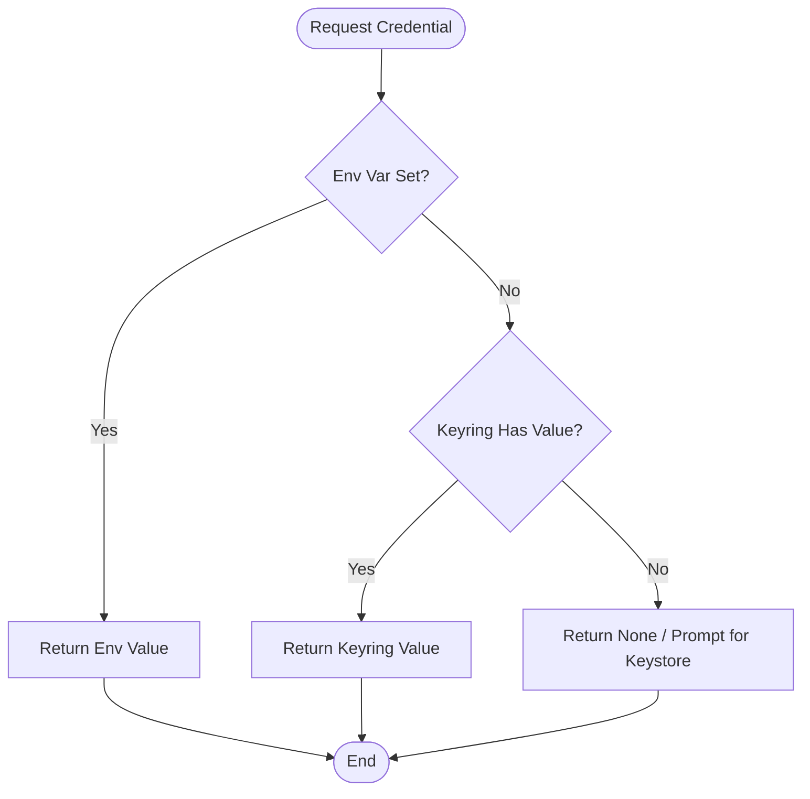
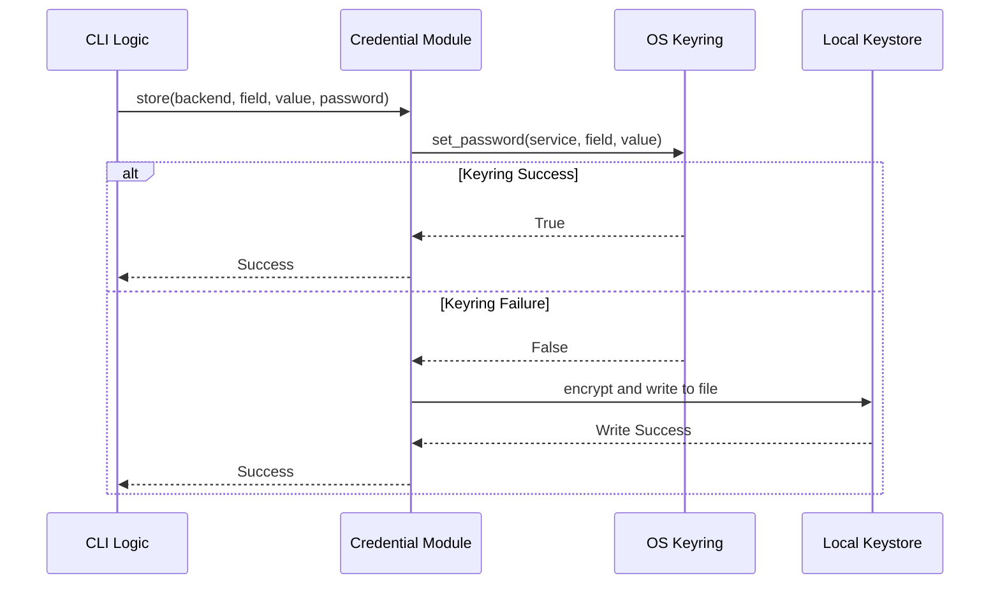

<details>
<summary>Relevant source files</summary>

The following files were used as context for generating this wiki page:

- [pastebinit/credentials.py](pastebinit/credentials.py)
- [README.md](README.md)
- [pastebinit/cli.py](pastebinit/cli.py)
- [pastebinit/backends/pastebin_com.py](pastebinit/backends/pastebin_com.py)
- [AGENTS.md](AGENTS.md)
- [pyproject.toml](pyproject.toml)
</details>

# Secure Credential Features

The Secure Credential Features in `pastebinit` provide a robust framework for managing sensitive information, such as API keys and user passwords, required for interacting with various pastebin services. The system is designed to prevent hardcoding of secrets and ensures that credentials are never stored in plain text on the local filesystem.

The project employs a multi-tiered approach to credential security, utilizing environment variables for ephemeral use, the OS-level keyring (such as GNOME Keyring or KWallet) for integrated desktop security, and an encrypted local keystore using Fernet and PBKDF2 for fallback or standalone security. This ensures that users can authenticate with services like `pastebin.com` while maintaining a high level of security across different operating environments.
Sources: [README.md:14-15](README.md#L14-L15), [AGENTS.md:52-52](AGENTS.md#L52), [pastebinit/credentials.py:100-112](pastebinit/credentials.py#L100-L112)

## Credential Hierarchy and Retrieval Logic

`pastebinit` follows a specific priority when retrieving credentials to balance ease of use with security. The system attempts to find a credential field (e.g., `api_dev_key`, `username`) by checking sources in the following order:

1.  **Environment Variables**: Highest priority. Useful for CI/CD environments or temporary sessions.
2.  **OS Keyring**: Integrated storage provided by the operating system.
3.  **Encrypted Keystore**: A local file encrypted with a user-provided password.

### Retrieval Process Flow

The following diagram illustrates the logic used by the `get` function to resolve a credential field for a specific backend.



The retrieval logic ensures that environment variables can always override stored credentials for flexibility.
Sources: [pastebinit/credentials.py:100-112](pastebinit/credentials.py#L100-L112)

### Credential Mapping
Specific fields for backends are mapped to environment variables as follows:

| Backend | Credential Field | Environment Variable |
| :--- | :--- | :--- |
| `pastebin.com` | `api_dev_key` | `PASTEBIN_API_KEY` |
| `pastebin.com` | `username` | `PASTEBIN_USERNAME` |
| `pastebin.com` | `password` | `PASTEBIN_PASSWORD` |

Sources: [pastebinit/credentials.py:16-22](pastebinit/credentials.py#L16-L22), [README.md:57-59](README.md#L57-L59)

## Storage Mechanisms

### OS Keyring Integration
The application utilizes the `keyring` Python library to interface with system-level secret stores. This is the preferred method for persistent storage as it leverages the user's existing login session security.
Sources: [pyproject.toml:22-22](pyproject.toml#L22), [pastebinit/credentials.py:35-51](pastebinit/credentials.py#L35-L51)

### Local Encrypted Keystore
When the OS keyring is unavailable or fails, `pastebinit` falls back to an encrypted keystore file located at `~/.config/pastebinit/keystore`.

*  **Encryption Algorithm**: Fernet (AES-128 in CBC mode with HMAC SHA256).
*  **Key Derivation**: PBKDF2HMAC using SHA256 with 600,000 iterations.
*  **Salt**: A unique 16-byte random salt stored as a prefix in the keystore file.
*  **File Permissions**: The keystore is created with `0600` permissions (read/write only by the owner) to prevent unauthorized local access.

Sources: [pastebinit/credentials.py:12-14](pastebinit/credentials.py#L12-L14), [pastebinit/credentials.py:25-33](pastebinit/credentials.py#L25-L33), [pastebinit/credentials.py:68-88](pastebinit/credentials.py#L68-L88)

### Storage Logic Sequence



Sources: [pastebinit/credentials.py:115-118](pastebinit/credentials.py#L115-L118), [pastebinit/cli.py:84-88](pastebinit/cli.py#L84-L88)

## Authentication Management via CLI

The CLI provides direct commands to manage the lifecycle of secure credentials through the `--login` and `--logout` flags.

### User Login Flow
When a user executes `pastebinit --login`, the following process occurs:
1.  The user is prompted for their service credentials (e.g., username and password).
2.  The backend (e.g., `pastebin.com`) authenticates the user and returns a session key (e.g., `user_key`).
3.  The user is prompted for a "Keystore password".
4.  The system attempts to store the `username` and `user_key` in the OS keyring or the encrypted keystore.

### Credential Removal
The `--logout` command triggers the `clear` function, which iterates through known credential fields (`username`, `user_key`, `api_dev_key`, `password`) and attempts to delete them from the OS keyring.
Sources: [pastebinit/cli.py:77-99](pastebinit/cli.py#L77-L99), [pastebinit/credentials.py:121-137](pastebinit/credentials.py#L121-L137)

## Security Implementation Details

### Implementation Snippet: Key Derivation
The following code demonstrates the use of PBKDF2 for deriving encryption keys from user passwords, ensuring resistance to brute-force attacks.

```python
def _derive_key(password: str, salt: bytes) -> bytes:
    kdf = PBKDF2HMAC(
        algorithm=hashes.SHA256(),
        length=32,
        salt=salt,
        iterations=600_000,
    )
    return base64.urlsafe_b64encode(kdf.derive(password.encode()))
```

Sources: [pastebinit/credentials.py:25-33](pastebinit/credentials.py#L25-L33)

### Filesystem Security
The application ensures that the configuration directory and keystore file are managed with appropriate permissions.

```python
# Create with 0600 from the start
fd = os.open(KEYSTORE_FILE, os.O_WRONLY | os.O_CREAT | os.O_TRUNC,
             stat.S_IRUSR | stat.S_IWUSR)
# Tighten permissions on pre-existing keystore
os.fchmod(fd, stat.S_IRUSR | stat.S_IWUSR)
```

Sources: [pastebinit/credentials.py:91-95](pastebinit/credentials.py#L91-L95)

## Conclusion
The Secure Credential Features of `pastebinit` provide a professional-grade security layer for a command-line utility. By integrating with the OS keyring and providing a robustly encrypted local fallback, the system ensures that user data remains protected regardless of the operating environment while maintaining a seamless user experience for authenticated pastes.
