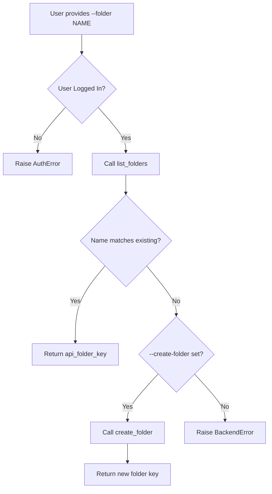
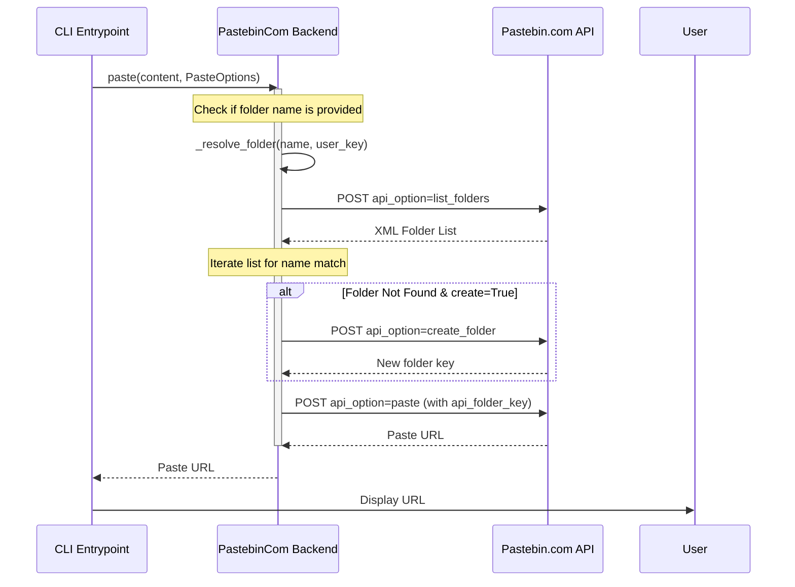

<details>
<summary>Relevant source files</summary>

The following files were used as context for generating this wiki page:

- [pastebinit/backends/pastebin\_com.py](pastebinit/backends/pastebin_com.py)
- [pastebinit/backends/base.py](pastebinit/backends/base.py)
- [pastebinit/cli.py](pastebinit/cli.py)
- [README.md](README.md)
- [tests/backends/test\_pastebin\_com.py](tests/backends/test_pastebin_com.py)
- [tests/backends/test\_base.py](tests/backends/test_base.py)
</details>

# Folder Management

Folder Management in `pastebinit` is a specialized feature currently exclusive to the **pastebin.com** backend. It allows users to organize their pastes into logical groups within their account rather than leaving them in a flat root list. This system supports listing existing folders, creating new folders programmatically, and resolving folder names to unique API keys during the upload process.

The folder system is tightly integrated with the user's authentication state. Operations such as listing or creating folders require a valid `user_key`, which is obtained during the login process. The Command Line Interface (CLI) exposes this functionality through specific flags that allow users to target existing folders or automatically generate new ones if they are missing.

Sources: [README.md:12-12](README.md#L12), [README.md:55-56](README.md#L55-L56), [pastebinit/backends/pastebin_com.py:16-16](pastebinit/backends/pastebin_com.py#L16)

## Architecture and Backend Support

The folder management logic is defined in the base abstraction layer but implemented specifically in backends that declare support for it. The `BasePastebin` class provides the interface, while `PastebinCom` enables the capability.

### Capabilities Declaration
Backends indicate support for folder management using the `supports_folders` boolean attribute. This allows the CLI to dynamically show or hide folder-related options when listing backend capabilities.

Sources: [pastebinit/backends/base.py:38-38](pastebinit/backends/base.py#L38), [pastebinit/backends/pastebin_com.py:19-19](pastebinit/backends/pastebin_com.py#L19)

### Component Overview
The system relies on three primary methods to interact with the Pastebin API for folder operations:

| Method | Purpose | Implementation Status |
| :--- | :--- | :--- |
| `list_folders(user_key)` | Retrieves all folders associated with a user account. | Supported in `pastebin.com` |
| `create_folder(name, user_key)` | Creates a new folder on the remote service. | Supported in `pastebin.com` |
| `_resolve_folder(name, user_key, create)` | Internal helper to map a name to a folder key. | Logic in `pastebin_com.py` |

Sources: [pastebinit/backends/base.py:54-60](pastebinit/backends/base.py#L54-L60), [pastebinit/backends/pastebin_com.py:116-146](pastebinit/backends/pastebin_com.py#L116-L146)

## Folder Resolution Logic

When a user specifies a folder name via the CLI, the system must convert that human-readable name into a `api_folder_key` required by the Pastebin API. This process involves checking the remote account for a match and potentially creating the folder if requested.



*The diagram shows the logic flow inside the `_resolve_folder` method.* 
Sources: [pastebinit/backends/pastebin_com.py:149-158](pastebinit/backends/pastebin_com.py#L149-L158)

### Resolution Implementation
The `_resolve_folder` method iterates through the user's folders to find a matching name. If no match is found and the `create` parameter is `True`, it triggers a creation request to the API.

```python
# pastebinit/backends/pastebin_com.py:149-158
def _resolve_folder(self, name: str, user_key: str, create: bool = False) -> str:
    for f in self.list_folders(user_key):
        if f["name"] == name:
            return f["key"]
    if create:
        return self.create_folder(name, user_key)
    raise BackendError(
        f"Folder '{name}' not found on pastebin.com. Use --create-folder to create it."
    )
```

## CLI Integration

The CLI facilitates folder management through two primary arguments: `--folder` and `--create-folder`. These are mapped to the `PasteOptions` dataclass before being passed to the backend.

### CLI Arguments
*  `--folder NAME`: Specifies the target folder for the upload.
*  `--create-folder`: A boolean flag that permits the creation of the folder if the specified `NAME` does not exist.

Sources: [pastebinit/cli.py:34-37](pastebinit/cli.py#L34-L37), [pastebinit/backends/base.py:27-28](pastebinit/backends/base.py#L27-L28)

### Data Flow for Folder Uploads
The following sequence diagram illustrates how the CLI interacts with the backend to handle a folder-targeted paste.



*Sequence of events when uploading text to a specific folder.*
Sources: [pastebinit/backends/pastebin_com.py:68-76](pastebinit/backends/pastebin_com.py#L68-L76), [pastebinit/cli.py:108-116](pastebinit/cli.py#L108-L116)

## API Specifications

The Pastebin.com backend utilizes specific API parameters for folder management, transmitted via `urllib.request`.

### Folder API Parameters
| Parameter | Backend Method | Description |
| :--- | :--- | :--- |
| `api_option` | `list_folders` | Set to `list_folders` |
| `api_option` | `create_folder` | Set to `create_folder` |
| `api_folder_name` | `create_folder` | The name of the new folder to create. |
| `api_folder_key` | `paste` | The unique ID of the target folder. |
| `api_user_key` | All | The session key obtained via `login()`. |

Sources: [pastebinit/backends/pastebin_com.py:116-146](pastebinit/backends/pastebin_com.py#L116-L146)

### Data Structure
Folders are parsed from XML responses into a list of dictionaries with the following structure:

```python
{
    "key": "unique_folder_id",
    "name": "Human Readable Name"
}
```

Sources: [pastebinit/backends/pastebin_com.py:121-133](pastebinit/backends/pastebin_com.py#L121-L133), [tests/backends/test_pastebin_com.py:72-77](tests/backends/test_pastebin_com.py#L72-L77)

## Summary
Folder Management provides a structured way to handle uploads for authenticated users on supported backends. By combining automated resolution and creation logic, the system abstracts the complexity of managing folder IDs, allowing users to interact with folders using simple text names through the CLI.

Sources: [README.md:12-12](README.md#L12), [pastebinit/cli.py:34-37](pastebinit/cli.py#L34-L37)
