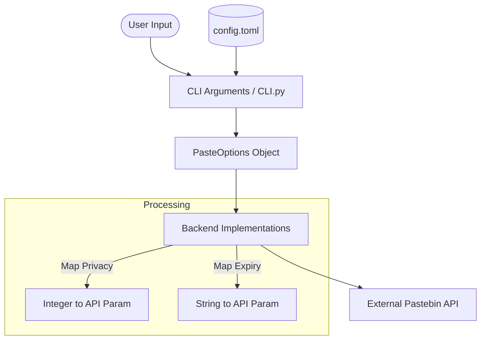

<details>
<summary>Relevant source files</summary>

The following files were used as context for generating this wiki page:

- [pastebinit/backends/base.py](pastebinit/backends/base.py)
- [pastebinit/config.py](pastebinit/config.py)
- [pastebinit/cli.py](pastebinit/cli.py)
- [pastebinit/backends/pastebin_com.py](pastebinit/backends/pastebin_com.py)
- [pastebinit/backends/paste_debian_net.py](pastebinit/backends/paste_debian_net.py)
- [pastebinit/backends/dpaste.py](pastebinit/backends/dpaste.py)
</details>

# Privacy & Expiry Options

## Introduction

Privacy and expiry options in `pastebinit` allow users to control the visibility and lifespan of their pasted content across various supported backends. These options are centralized in the `PasteOptions` data structure and can be configured via command-line arguments or a global configuration file.

The system ensures that user preferences are translated into backend-specific API parameters, accommodating differences in how various services handle "private" or "unlisted" statuses and their respective expiration timelines (e.g., minutes, days, or years).

Sources: [pastebinit/backends/base.py:24-34](pastebinit/backends/base.py#L24-L34), [pastebinit/cli.py:27-37](pastebinit/cli.py#L27-L37)

## Core Components and Logic

The privacy and expiry logic is distributed between the CLI argument parser, the configuration manager, and the individual backend implementations.

### Data Structure: PasteOptions

The `PasteOptions` dataclass acts as the unified transport for these settings. It defines the standard internal representations for privacy (integers) and expiry (strings).

| Field | Type | Default | Description |
| :--- | :--- | :--- | :--- |
| `private` | `int` | `1` | Privacy level: 0 (Public), 1 (Unlisted), 2 (Private) |
| `expiry` | `str` | `"N"` | Expiry code: e.g., N (Never), 1D (1 Day), 1W (1 Week) |

Sources: [pastebinit/backends/base.py:24-34](pastebinit/backends/base.py#L24-L34)

### Data Flow

The following diagram illustrates how privacy and expiry options flow from the user to the backend service:



Sources: [pastebinit/cli.py:102-114](pastebinit/cli.py#L102-L114), [pastebinit/config.py:17-22](pastebinit/config.py#L17-L22)

## Privacy Implementation

Privacy is handled as a tri-state integer level. While `pastebinit` defines three levels, individual backends support different subsets of these capabilities.

*  **0 (Public):** Searchable and visible on public lists.
*  **1 (Unlisted):** Visible only via direct link (Default).
*  **2 (Private):** Visible only to the owner (requires authentication).

### Backend Support for Privacy

| Backend | Privacy Capability | Implementation Detail |
| :--- | :--- | :--- |
| `pastebin.com` | Full (0, 1, 2) | Directly uses integer value in `api_paste_private`. |
| `paste.debian.net` | Boolean | Maps `private > 0` to a boolean. |
| `paste.opendev.org` | Boolean | Sets `private="on"` if `private > 0`. |

Sources: [pastebinit/backends/pastebin_com.py:19, 62](pastebinit/backends/pastebin_com.py#L19), [pastebinit/backends/paste_debian_net.py:18, 26](pastebinit/backends/paste_debian_net.py#L18), [pastebinit/backends/paste_opendev.py:18](pastebinit/backends/paste_opendev.py#L18)

## Expiry Implementation

Expiry options use standard codes which are mapped to service-specific requirements by each backend class. Common codes include `N` (Never), `10M` (10 Minutes), `1D` (1 Day), `1W` (1 Week), `1M` (1 Month), and `1Y` (1 Year).

### Backend Mapping Examples

Each backend maintains its own internal mapping or set of supported values:

```python
# pastebin.com supported values
_EXPIRY = {"N", "10M", "1H", "1D", "1W", "2W", "1M", "6M", "1Y"}

# paste.debian.net mapping to integer days
_EXPIRY_DAYS = {
    "N": 90, "1D": 1, "1W": 7, "2W": 14, "1M": 30, "6M": 180, "1Y": 90,
}

# dpaste.com mapping to integer strings
_EXPIRY_MAP = {"N": "365", "1D": "1", "1W": "7", "1M": "30", "1Y": "365"}
```

Sources: [pastebinit/backends/pastebin_com.py:11](pastebinit/backends/pastebin_com.py#L11), [pastebinit/backends/paste_debian_net.py:7-9](pastebinit/backends/paste_debian_net.py#L7-L9), [pastebinit/backends/dpaste.py:6](pastebinit/backends/dpaste.py#L6)

## Configuration and Defaults

The `config.py` module manages default values for these options, ensuring that if a user does not specify them, the system falls back to safe defaults.

| Option | Default Value | Source |
| :--- | :--- | :--- |
| `private` | `1` (Unlisted) | `_DEFAULTS` in `config.py` |
| `expiry` | `"N"` (Never) | `_DEFAULTS` in `config.py` |

Users can override these in `~/.config/pastebinit/config.toml`:

```toml
[defaults]
private = 0
expiry = "1W"
```

Sources: [pastebinit/config.py:17-22](pastebinit/config.py#L17-L22), [README.md:82-88](README.md#L82-L88)

## Summary

`pastebinit` provides a flexible abstraction for privacy and expiry, allowing users to define their intent once while the application handles the translation to diverse backend APIs. By leveraging the `PasteOptions` dataclass and backend-specific mapping dictionaries, the system maintains consistency across different pasting services while respecting their individual technical limitations.
