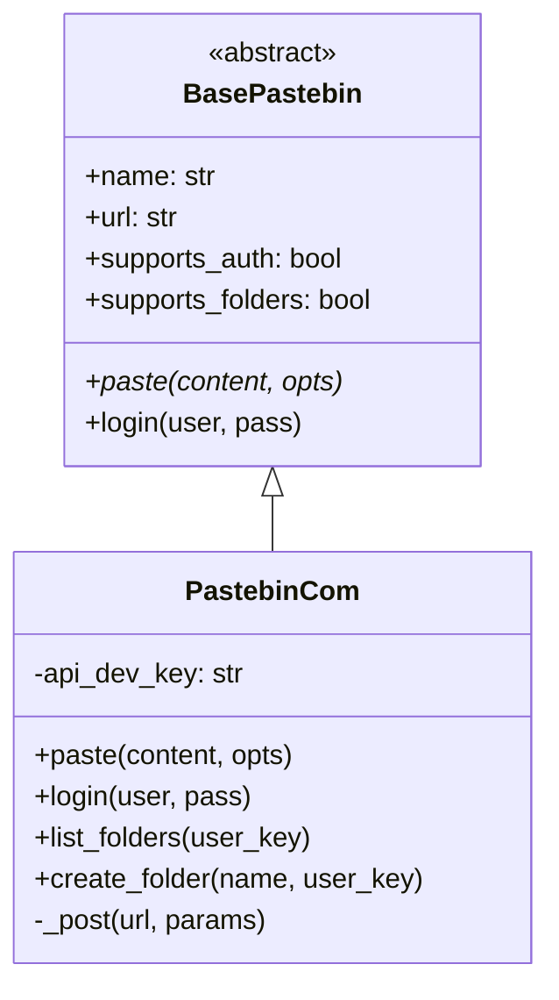
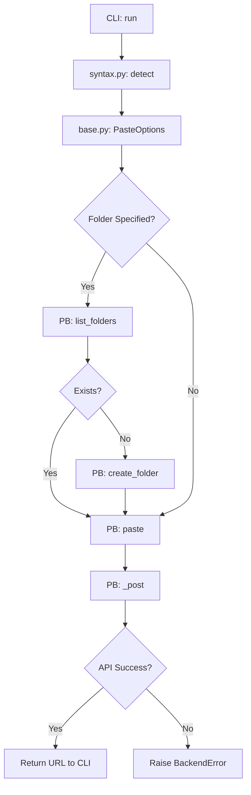
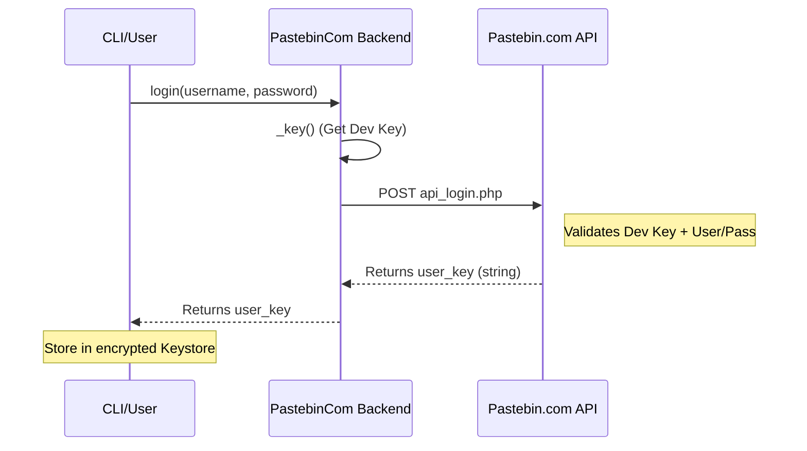

<details>
<summary>Relevant source files</summary>

The following files were used as context for generating this wiki page:

- [pastebinit/backends/pastebin\_com.py](pastebinit/backends/pastebin_com.py)
- [tests/backends/test\_pastebin\_com.py](tests/backends/test_pastebin_com.py)
- [pastebinit/cli.py](pastebinit/cli.py)
- [pastebinit/backends/base.py](pastebinit/backends/base.py)
- [pastebinit/syntax.py](pastebinit/syntax.py)
- [README.md](README.md)
</details>

# Pastebin.com API Integration

## Introduction
The Pastebin.com API integration is the most comprehensive backend implementation within the `pastebinit` project. While other backends may only support basic pasting, the Pastebin.com module provides full API coverage, including user authentication, folder management, privacy controls, and syntax highlighting.

This system allows users to interact with Pastebin.com both as anonymous guests and as registered users. It leverages the official Pastebin API endpoints to perform complex operations like listing existing pastes, deleting content, and organizing uploads into specific user folders.
Sources: [README.md:8-10](README.md#L8-L10), [pastebinit/backends/pastebin_com.py:15-21](pastebinit/backends/pastebin_com.py#L15-L21)

## Architecture and Components

The integration is built upon a class-based architecture that inherits from a common base, ensuring a consistent interface for the CLI while implementing specialized logic for the Pastebin.com protocol.

### Class Hierarchy
The `PastebinCom` class inherits from `BasePastebin`. It implements abstract methods and overrides capability flags to signal its advanced feature set to the CLI.



This diagram illustrates the inheritance relationship where `PastebinCom` provides concrete implementations for Pastebin.com specific operations.
Sources: [pastebinit/backends/base.py:38-66](pastebinit/backends/base.py#L38-L66), [pastebinit/backends/pastebin_com.py:15-21](pastebinit/backends/pastebin_com.py#L15-L21)

### Key API Endpoints
The backend communicates with two primary Pastebin.com endpoints:
| Endpoint Purpose | URL |
| :--- | :--- |
| **Main API** | `https://pastebin.com/api/api_post.php` |
| **Authentication** | `https://pastebin.com/api/api_login.php` |

Sources: [pastebinit/backends/pastebin_com.py:11-12](pastebinit/backends/pastebin_com.py#L11-L12)

## Data Flow: Paste Operations

When a user initiates a paste via the CLI, the data flows through several validation and resolution steps before reaching the remote API.



This flow shows how folder resolution and syntax detection are integrated into the paste process.
Sources: [pastebinit/backends/pastebin_com.py:64-80](pastebinit/backends/pastebin_com.py#L64-L80), [pastebinit/cli.py:126-160](pastebinit/cli.py#L126-L160)

### Paste Configuration Options
The integration utilizes the `PasteOptions` dataclass to pass parameters. Pastebin.com supports a specific set of expiry codes:
*  `N`: Never
*  `10M`: 10 Minutes
*  `1H`: 1 Hour
*  `1D`: 1 Day
*  `1W`: 1 Week
*  `2W`: 2 Weeks
*  `1M`: 1 Month
*  `6M`: 6 Months
*  `1Y`: 1 Year

Sources: [pastebinit/backends/pastebin_com.py:14](pastebinit/backends/pastebin_com.py#L14), [pastebinit/backends/base.py:28-36](pastebinit/backends/base.py#L28-L36)

## Authentication and Security

### Login Flow
Authentication requires a developer API key (API Dev Key) in addition to user credentials. The `login` method exchanges a username and password for a `user_key`, which is subsequently used for all user-specific actions.



The sequence demonstrates the requirement of an API Dev Key to obtain a session-like `user_key`.
Sources: [pastebinit/backends/pastebin_com.py:51-62](pastebinit/backends/pastebin_com.py#L51-L62), [pastebinit/cli.py:91-104](pastebinit/cli.py#L91-L104)

### Credential Handling
The system retrieves the `api_dev_key` in a specific order of precedence:
1.  Directly passed to the constructor.
2.  Environment variable `PASTEBIN_API_KEY`.
3.  Encrypted keystore managed by the `credentials` module.

Sources: [pastebinit/backends/pastebin_com.py:26-36](pastebinit/backends/pastebin_com.py#L26-L36), [tests/backends/test_pastebin_com.py:73-77](tests/backends/test_pastebin_com.py#L73-L77)

## Folder and User Management

Pastebin.com is the only backend in the project that supports the `supports_folders` capability.

### Folder Resolution Logic
The method `_resolve_folder` implements an "upsert-like" logic. If a folder name is provided but does not exist, and the `create_folder` flag is set, the backend will automatically create the folder and return the new folder's unique key.
Sources: [pastebinit/backends/pastebin_com.py:145-153](pastebinit/backends/pastebin_com.py#L145-L153)

### User Metadata
The `get_user_info` method parses an XML response from the API to provide details about the account:
*  **Username and Email**
*  **API Tier**: Indicates account level (e.g., Pro).
*  **Account Defaults**: Default privacy settings and website URL.

Sources: [pastebinit/backends/pastebin_com.py:129-143](pastebinit/backends/pastebin_com.py#L129-L143)

## Technical Implementation Details

### Response Parsing
Unlike modern JSON-based APIs, Pastebin.com returns data in either plain text (for URLs and keys) or XML (for lists and user details). The backend uses `xml.etree.ElementTree` to parse these responses.

```python
# Example of parsing paste list from XML
root = ET.fromstring(f"<root>{result}</root>")
return [
    {
        "key": p.findtext("paste_key", ""),
        "url": p.findtext("paste_url", ""),
        # ... other fields
    }
    for p in root.findall("paste")
]
```

Sources: [pastebinit/backends/pastebin_com.py:82-101](pastebinit/backends/pastebin_com.py#L82-L101)

### Error Handling
The backend monitors responses for the string `"Bad API request"`. If detected, it raises a `BackendError` containing the specific error message returned by the server, such as "maximum pastes per day reached" or "invalid login".
Sources: [pastebinit/backends/pastebin_com.py:48-49](pastebinit/backends/pastebin_com.py#L48-L49), [tests/backends/test_pastebin_com.py:65-67](tests/backends/test_pastebin_com.py#L65-L67)

## Summary
The Pastebin.com integration serves as the flagship backend for `pastebinit`. It demonstrates a robust implementation of complex API features including stateful authentication, hierarchical organization (folders), and detailed metadata retrieval, all while maintaining a consistent interface for the command-line utility.
