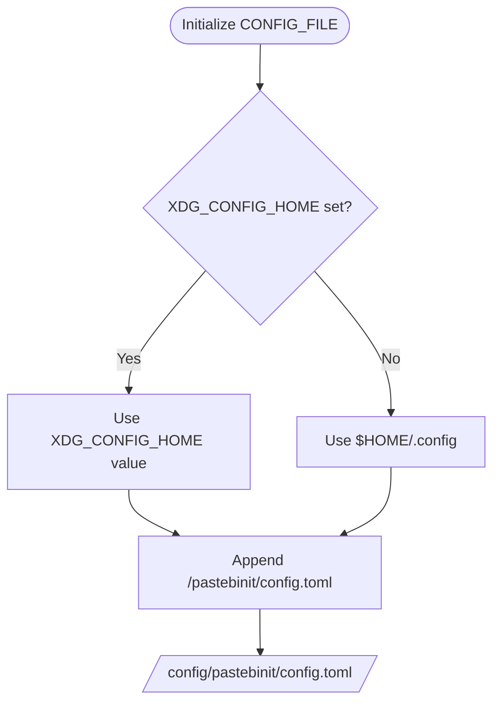
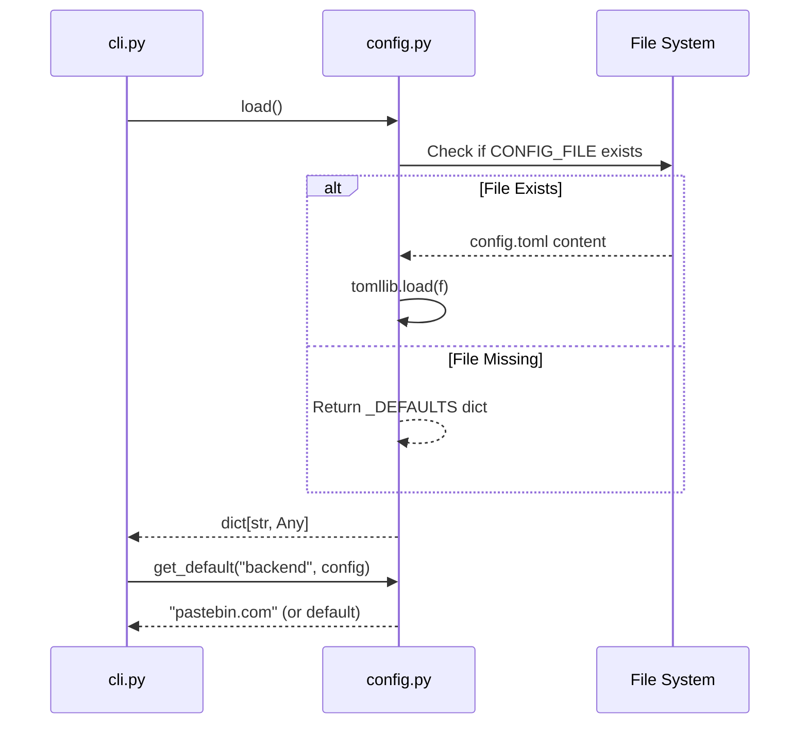

<details>
<summary>Relevant source files</summary>

The following files were used as context for generating this wiki page:

- [pastebinit/config.py](pastebinit/config.py)
- [tests/test_config.py](tests/test_config.py)
- [pastebinit/cli.py](pastebinit/cli.py)
- [README.md](README.md)
- [pyproject.toml](pyproject.toml)
- [tests/test_cli.py](tests/test_cli.py)
</details>

# TOML Configuration File

The TOML configuration file in `pastebinit` serves as the central persistent storage for user preferences and backend-specific defaults. It allows users to define global settings such as the default pastebin service, privacy levels, and syntax formatting, which are automatically applied unless overridden by command-line arguments. Sources: [README.md:16-16](README.md#L16), [pastebinit/config.py:12-14](pastebinit/config.py#L12-L14)

This configuration system is designed to be cross-platform, following XDG directory standards where applicable, and utilizes the `tomli` (or `tomllib` in Python 3.11+) and `tomli-w` libraries for robust parsing and serialization of the TOML format. Sources: [pastebinit/config.py:6-10](pastebinit/config.py#L6-L10), [pyproject.toml:19-22](pyproject.toml#L19-L22)

## File Location and Structure

The configuration file is located at `~/.config/pastebinit/config.toml`. The directory path is determined dynamically based on the `XDG_CONFIG_HOME` environment variable, falling back to the user's home `.config` directory if the variable is not set. Sources: [pastebinit/config.py:12-13](pastebinit/config.py#L12-L13), [README.md:16-16](README.md#L16)

### Standard Directory Resolution
The following diagram illustrates how the system determines the configuration file path:



Sources: [pastebinit/config.py:12-13](pastebinit/config.py#L12-L13)

## Configuration Schema

The configuration is structured into sections using TOML tables. The primary section is `[defaults]`, which stores global fallback values. Additionally, per-backend sections (e.g., `[pastebin.com]`) can be defined to store service-specific credentials or overrides. Sources: [README.md:85-93](README.md#L85-L93), [pastebinit/config.py:15-22](pastebinit/config.py#L15-L22)

### Default Settings
If no configuration file exists, the application initializes with a hardcoded set of internal defaults.

| Option | Type | Internal Default | Description |
| :--- | :--- | :--- | :--- |
| `backend` | String | `bpa.st` | The default pastebin service to use. |
| `private` | Integer | `1` | Default privacy: 0 (Public), 1 (Unlisted), 2 (Private). |
| `expiry` | String | `N` | Default expiration time (e.g., N for Never, 1D for one day). |
| `format` | String | `auto` | Default syntax highlighting format. |

Sources: [pastebinit/config.py:15-22](pastebinit/config.py#L15-L22), [pastebinit/cli.py:27-35](pastebinit/cli.py#L27-L35)

### Configuration Loading Logic
The following sequence diagram shows how the CLI interacts with the configuration module to resolve settings:



Sources: [pastebinit/config.py:25-31](pastebinit/config.py#L25-L31), [pastebinit/config.py:41-44](pastebinit/config.py#L41-L44), [pastebinit/cli.py:21-30](pastebinit/cli.py#L21-L30)

## Implementation Details

### Data Retrieval and Persistence
The `config.py` module provides three primary functions for managing configuration:

1.  **`load()`**: Attempts to read `config.toml`. If the file is missing, it returns a copy of the hardcoded `_DEFAULTS` dictionary to ensure the application remains functional without manual setup. Sources: [pastebinit/config.py:25-30](pastebinit/config.py#L25-L30), [tests/test_config.py:6-11](tests/test_config.py#L6-L11)
2.  **`save(config)`**: Serializes a dictionary to the TOML file. It ensures the parent directory exists before writing. Sources: [pastebinit/config.py:33-36](pastebinit/config.py#L33-L36), [tests/test_config.py:14-22](tests/test_config.py#L14-L22)
3.  **`get_default(key, config)`**: A helper function that attempts to retrieve a value from the `defaults` table of the provided configuration. If the key is missing in the file, it falls back to the hardcoded internal default. Sources: [pastebinit/config.py:39-44](pastebinit/config.py#L39-L44)

### CLI Integration
The CLI uses the configuration to populate the `argparse` parser defaults. This ensures that even if a user does not provide flags like `-b` or `-p`, the application behaves according to the user's stored preferences. Sources: [pastebinit/cli.py:21-35](pastebinit/cli.py#L21-L35), [tests/test_cli.py:18-24](tests/test_cli.py#L18-L24)

```python
# pastebinit/cli.py:21-35
def build_parser() -> argparse.ArgumentParser:
    defaults = cfg.load()
    p = argparse.ArgumentParser(...)
    p.add_argument("-b", "--backend", default=cfg.get_default("backend", defaults), ...)
    p.add_argument("-f", "--format", default=cfg.get_default("format", defaults), ...)
    p.add_argument("-p", "--private", type=int, default=cfg.get_default("private", defaults), ...)
    p.add_argument("-e", "--expiry", default=cfg.get_default("expiry", defaults), ...)
    return p
```

Sources: [pastebinit/cli.py:21-35](pastebinit/cli.py#L21-L35)

## Conclusion
The TOML configuration system provides a flexible and standard way to manage user preferences. By combining XDG-compliant file locations with a layered fallback mechanism (File -> Internal Defaults -> CLI Overrides), the application maintains ease of use for both casual users and those requiring specific per-backend configurations. Sources: [pastebinit/config.py:12-44](pastebinit/config.py#L12-L44), [README.md:83-93](README.md#L83-L93)
