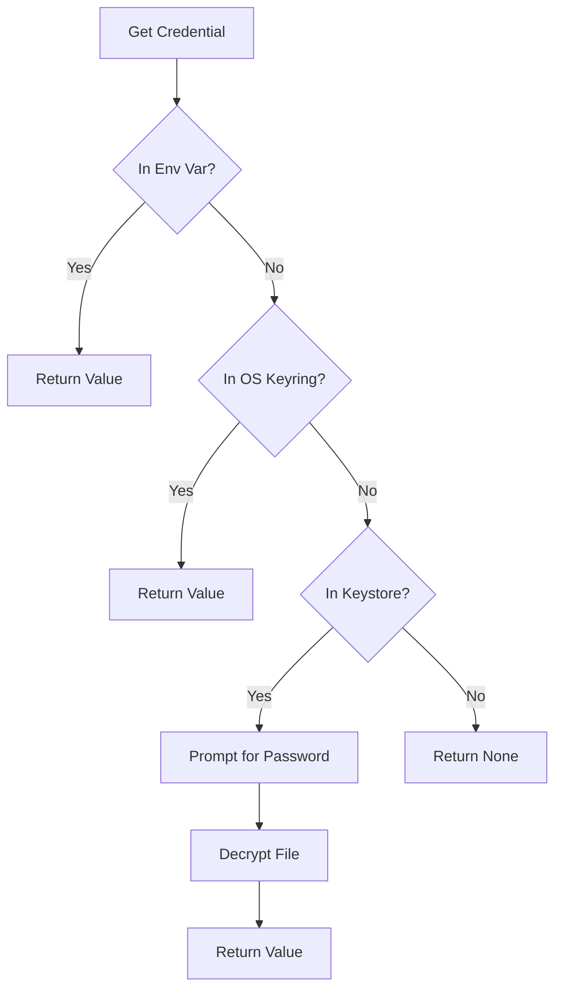
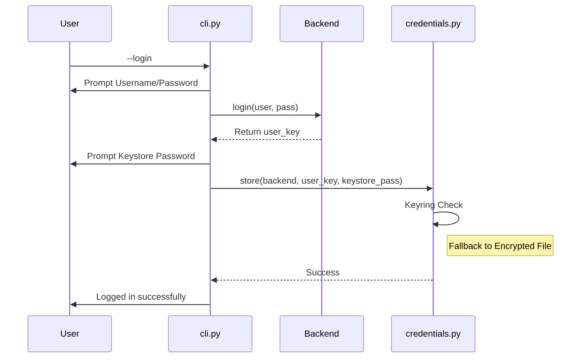

<details>
<summary>Relevant source files</summary>

The following files were used as context for generating this wiki page:

- [pastebinit/credentials.py](pastebinit/credentials.py)
- [tests/test_credentials.py](tests/test_credentials.py)
- [pastebinit/cli.py](pastebinit/cli.py)
- [README.md](README.md)
- [pyproject.toml](pyproject.toml)
- [pastebinit/config.py](pastebinit/config.py)
</details>

# Local Keystore & Encryption

The Local Keystore & Encryption system in `pastebinit` provides a secure mechanism for managing sensitive user credentials, such as API keys and session tokens, required by various pastebin backends. It prioritizes security by using multi-layered storage strategies, ranging from environment variables and OS-level keyrings to a locally encrypted file-based keystore.

The system's primary goal is to ensure that credentials like `user_key` or `api_dev_key` are never stored in plain text. By utilizing industry-standard encryption algorithms and key derivation functions, `pastebinit` protects user data from unauthorized access even if the local configuration directory is compromised.

Sources: [README.md:9-11](README.md#L9-L11), [pastebinit/credentials.py:1-20](pastebinit/credentials.py#L1-L20)

## Credential Retrieval Hierarchy

When `pastebinit` requires a credential for a specific backend, it follows a strict hierarchical lookup order to balance convenience and security.

1.  **Environment Variables:** Checked first for quick overrides or CI/CD usage.
2.  **OS Keyring:** Consulted next, leveraging platform-native secure storage (e.g., GNOME Keyring, KWallet).
3.  **Encrypted Keystore:** If the above methods fail, the system falls back to a local file that requires a user-provided password to decrypt.

The following flowchart illustrates the decision logic for retrieving credentials:



A flowchart showing the priority order of credential retrieval.
Sources: [pastebinit/credentials.py:104-118](pastebinit/credentials.py#L104-L118), [README.md:54-61](README.md#L54-L61)

## Encryption Architecture

The local file-based keystore uses a robust encryption stack provided by the `cryptography` library. It implements a Fernet (AES-128 in CBC mode) encryption scheme keyed by a value derived via PBKDF2.

### Key Derivation and Storage
To protect against brute-force attacks, the encryption key is not stored. Instead, it is derived from a user password using PBKDF2HMAC with SHA256 and 600,000 iterations. A unique 16-byte salt is generated for every write operation.

| Component | Specification |
| :--- | :--- |
| **KDF** | PBKDF2HMAC |
| **Hash Algorithm** | SHA256 |
| **Iterations** | 600,000 |
| **Symmetric Cipher** | Fernet (AES) |
| **Salt Size** | 16 bytes |

Sources: [pastebinit/credentials.py:27-35](pastebinit/credentials.py#L27-L35), [pyproject.toml:22](pyproject.toml#L22)

### Data Structure
The encrypted payload is a JSON-serialized dictionary mapping backend names to their respective credential fields. The physical file format prepends the 16-byte salt to the encrypted Fernet token.

```python
# Storage logic in pastebinit/credentials.py
salt = os.urandom(16)
encrypted = Fernet(_derive_key(password, salt)).encrypt(json.dumps(existing).encode())
# ...
f.write(salt + encrypted)
```

Sources: [pastebinit/credentials.py:78-95](pastebinit/credentials.py#L78-L95)

## File Security and Permissions

The system enforces strict file-level security to prevent local users from reading sensitive data. The keystore is located within the user's XDG configuration directory (typically `~/.config/pastebinit/keystore`).

Key security measures include:
*  **Restricted Permissions:** The keystore file is created with mode `0600` (read/write only by the owner).
*  **Atomic Hardening:** Using `os.open` with `S_IRUSR | S_IWUSR` and `os.fchmod` to ensure no window of vulnerability exists between file creation and permission application.

Sources: [pastebinit/credentials.py:16-17](pastebinit/credentials.py#L16-L17), [pastebinit/credentials.py:88-95](pastebinit/credentials.py#L88-L95), [tests/test_credentials.py:38-40](tests/test_credentials.py#L38-L40)

## Integration with CLI

The CLI provides user-facing commands to manage the credential lifecycle. When a user runs `pastebinit --login`, the application performs a sequence to authenticate with the backend and secure the resulting tokens.



A sequence diagram showing the login and storage flow.
Sources: [pastebinit/cli.py:81-93](pastebinit/cli.py#L81-L93), [pastebinit/credentials.py:121-124](pastebinit/credentials.py#L121-L124)

### Environment Variable Mapping
For backends like `pastebin.com`, the system maps internal credential fields to specific environment variables.

| Backend | Field | Environment Variable |
| :--- | :--- | :--- |
| `pastebin.com` | `api_dev_key` | `PASTEBIN_API_KEY` |
| `pastebin.com` | `username` | `PASTEBIN_USERNAME` |
| `pastebin.com` | `password` | `PASTEBIN_PASSWORD` |

Sources: [pastebinit/credentials.py:20-24](pastebinit/credentials.py#L20-L24), [tests/test_credentials.py:7-11](tests/test_credentials.py#L7-L11)

## Conclusion
The Local Keystore & Encryption module provides a secure foundation for `pastebinit`. By combining platform-native keyrings with a high-iteration PBKDF2 encrypted file fallback, it ensures that sensitive API keys and user tokens remain protected on the local machine while providing flexible access for different user environments.
