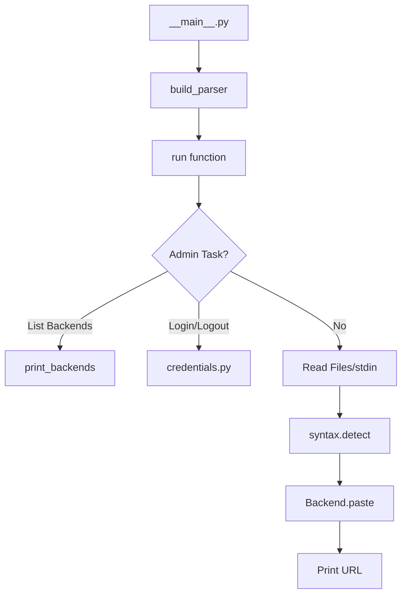
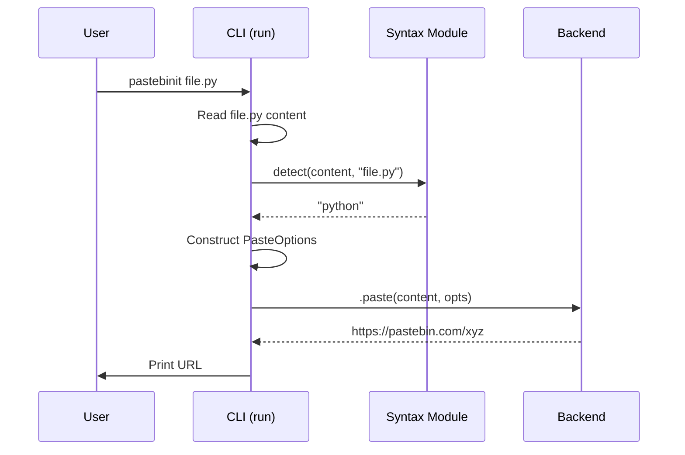

<details>
<summary>Relevant source files</summary>

The following files were used as context for generating this wiki page:

- [pastebinit/cli.py](pastebinit/cli.py)
- [pastebinit/__main__.py](pastebinit/__main__.py)
- [pastebinit/config.py](pastebinit/config.py)
- [pastebinit/syntax.py](pastebinit/syntax.py)
- [pastebinit/backends/base.py](pastebinit/backends/base.py)
- [README.md](README.md)
</details>

# Command-Line Interface (CLI)

The Command-Line Interface (CLI) serves as the primary entry point for the `pastebinit` application, enabling users to send text and files to various pastebin services directly from the terminal. It handles argument parsing, configuration loading, credential management, and coordinates the flow between input data and backend service selection.

Sources: [pastebinit/cli.py](pastebinit/cli.py), [pastebinit/__main__.py](pastebinit/__main__.py), [README.md:1-5](README.md#L1-L5)

## Architecture and Execution Flow

The CLI is structured around three main phases: argument parsing, environment setup (loading configs/credentials), and execution. The execution logic differentiates between administrative tasks (listing backends, login, logout) and the core functionality of pasting content.



The execution starts in `__main__.py` which calls `cli.main()`. The `run` function manages the operational logic based on the parsed `argparse.Namespace`.

Sources: [pastebinit/cli.py:113-116](pastebinit/cli.py#L113-L116), [pastebinit/cli.py:65-110](pastebinit/cli.py#L65-L110), [pastebinit/__main__.py:1-2](pastebinit/__main__.py#L1-L2)

## Component Breakdown

### Argument Parsing
The `build_parser` function utilizes `argparse` to define the CLI signature. It integrates default values fetched from the configuration system.

| Argument | Short | Description | Default |
| :--- | :--- | :--- | :--- |
| `files` | N/A | Files to paste | `stdin` |
| `--backend` | `-b` | Service to use | `bpa.st` (configurable) |
| `--format` | `-f` | Syntax highlighting | `auto` |
| `--private` | `-p` | Privacy level (0-2) | `1` (unlisted) |
| `--expiry` | `-e` | Expiration time code | `N` (Never) |
| `--login` | N/A | Authenticate and save keys | False |

Sources: [pastebinit/cli.py:19-48](pastebinit/cli.py#L19-L48), [pastebinit/config.py:14-20](pastebinit/config.py#L14-L20)

### Syntax Detection
When the format is set to `auto` (the default), the CLI uses the `syntax` module to determine the correct lexer for the content. It checks three priority levels:
1.  **Special Filenames:** Matches names like `Dockerfile` or `Makefile`.
2.  **File Extensions:** Maps extensions like `.py` to `python`.
3.  **Shebang Lines:** Inspects the first line of content for `#!` interpreters.

Sources: [pastebinit/syntax.py:53-76](pastebinit/syntax.py#L53-L76), [pastebinit/cli.py:98-100](pastebinit/cli.py#L98-L100)

### Configuration Management
The CLI interacts with `~/.config/pastebinit/config.toml` via the `config` module. Defaults for the CLI are resolved using the following hierarchy:
1.  Command-line arguments provided by the user.
2.  Values defined in the `[defaults]` section of the TOML config.
3.  Hardcoded internal defaults (e.g., `backend = "bpa.st"`).

Sources: [pastebinit/config.py:23-27](pastebinit/config.py#L23-L27), [pastebinit/cli.py:20-30](pastebinit/cli.py#L20-L30)

## Data Flow: Pasting Operation

The pasting process involves transforming raw content and CLI options into a `PasteOptions` dataclass, which is then consumed by the selected backend.



### Implementation Detail: Content Handling
The CLI supports multiple file inputs. If no files are provided, it defaults to reading from `sys.stdin`.

```python
# pastebinit/cli.py:87-94
filenames = args.files or ["-"]
for filename in filenames:
    if filename == "-":
        content = sys.stdin.read().rstrip()
        display_name = None
    else:
        with open(filename) as f:
            content = f.read().rstrip()
```

Sources: [pastebinit/cli.py:87-97](pastebinit/cli.py#L87-L97), [pastebinit/backends/base.py:24-32](pastebinit/backends/base.py#L24-L32)

## Authentication Flow
The CLI handles session persistent authentication through the `--login` flag. It prompts for credentials, performs a login request via the backend, and stores the resulting user key using the `credentials` module (which supports OS keyrings or encrypted local storage).

Sources: [pastebinit/cli.py:69-80](pastebinit/cli.py#L69-L80), [README.md:65-72](README.md#L65-L72)

## Conclusion
The `pastebinit` CLI provides a robust interface for text sharing by abstracting service-specific APIs behind a unified command set. By integrating automated syntax detection and local configuration management, it minimizes the required user input while maintaining flexibility for advanced features like folder management and private pastes.
