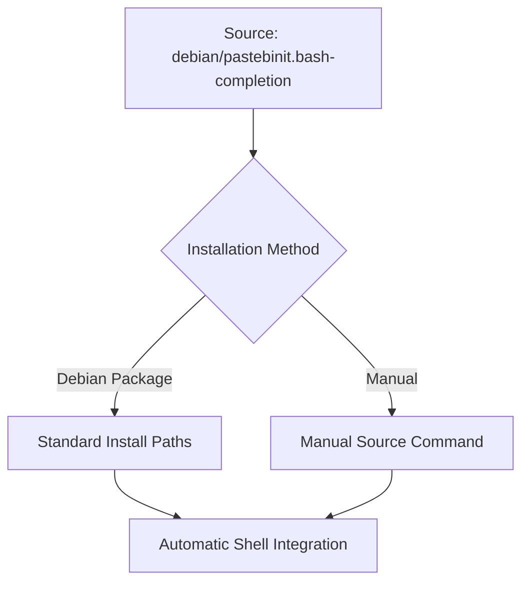

<details>
<summary>Relevant source files</summary>

The following files were used as context for generating this wiki page:

- [README.md](README.md)
- [AGENTS.md](AGENTS.md)
- [CLAUDE.md](CLAUDE.md)
- [pastebinit/cli.py](pastebinit/cli.py)
- [pyproject.toml](pyproject.toml)

</details>

# Bash Autocompletion

Bash autocompletion is a feature in `pastebinit` designed to enhance the command-line interface (CLI) experience by providing suggestions for commands, flags, and arguments. This functionality is primarily bundled and delivered through the Debian packaging system, ensuring that users on supported Linux distributions have immediate access to tab-completion for complex CLI options like backend selection and privacy levels.

Sources: [README.md:14-15](README.md#L14-L15), [README.md:83-83](README.md#L83)

## Architecture and Delivery

The autocompletion logic is stored in a dedicated script within the project's Debian configuration directory. While the CLI itself is built using Python's `argparse` library, the autocompletion support is specifically managed via standard Debian install paths to integrate seamlessly with the user's shell environment.

### Deployment Flow
The following diagram illustrates how the autocompletion script is delivered to the end-user's system.



*This diagram shows the transition of the completion script from the source repository to the user environment.*

Sources: [README.md:14-15](README.md#L14-L15), [README.md:83-87](README.md#L83-L87), [AGENTS.md:21-21](AGENTS.md#L21)

## CLI Options for Completion

The autocompletion script targets the arguments defined in the `build_parser` function within the core CLI module. These arguments represent the possible suggestions provided to the user.

| Argument | Short Flag | Purpose | Completion Type |
| :--- | :--- | :--- | :--- |
| `--backend` | `-b` | Selects the pastebin service | Dynamic (Backend list) |
| `--format` | `-f` | Sets syntax highlighting | Dynamic (Syntax list) |
| `--private` | `-p` | Sets privacy level (0-2) | Static choices |
| `--expiry` | `-e` | Sets expiration time | Static codes |
| `--files` | N/A | Positional file arguments | Path/File completion |

Sources: [pastebinit/cli.py:20-50](pastebinit/cli.py#L20-L50)

### Completable Backend Logic
The CLI maintains a registry of supported backends. Autocompletion logic can leverage the `BACKENDS` dictionary keys to suggest available services.

```python
# From pastebinit/cli.py:73-74
backend = get_backend(args.backend)
# BACKENDS is imported from pastebinit.backends
```

Sources: [pastebinit/cli.py:9](pastebinit/cli.py#L9), [pastebinit/cli.py:73-74](pastebinit/cli.py#L73-L74)

## Installation and Activation

There are two primary ways to enable Bash autocompletion for `pastebinit`:

1.  **Standard Package Installation:** When installing via the `.deb` package (available for **amd64** and **arm64**), the script is placed in standard system paths, making it active by default for all users.
2.  **Manual Activation:** For users installing via `pip` or from source, the script must be sourced manually into the current shell session or added to the shell profile (e.g., `.bashrc`).

### Manual Activation Command

```bash
source debian/pastebinit.bash-completion
```

Sources: [README.md:23-28](README.md#L23-L28), [README.md:83-87](README.md#L83-L87), [CLAUDE.md:27-27](CLAUDE.md#L27)

## Integration with Python Entry Points
The autocompletion relies on the CLI being correctly registered as a script. The `pyproject.toml` file defines the `pastebinit` command, which points to the `main` function in `pastebinit/cli.py`. This registration ensures that when the shell attempts to complete the command `pastebinit`, it correctly identifies the executable.

```toml
[project.scripts]
pastebinit = "pastebinit.cli:main"
```

Sources: [pyproject.toml:29-30](pyproject.toml#L29-L30), [pastebinit/cli.py:155-158](pastebinit/cli.py#L155-L158)

## Summary
Bash autocompletion for `pastebinit` provides a streamlined user experience by automating the discovery of backend services, syntax formats, and configuration flags. It is integrated into the Debian packaging workflow but remains accessible for manual use in other environments by sourcing the `debian/pastebinit.bash-completion` file.
