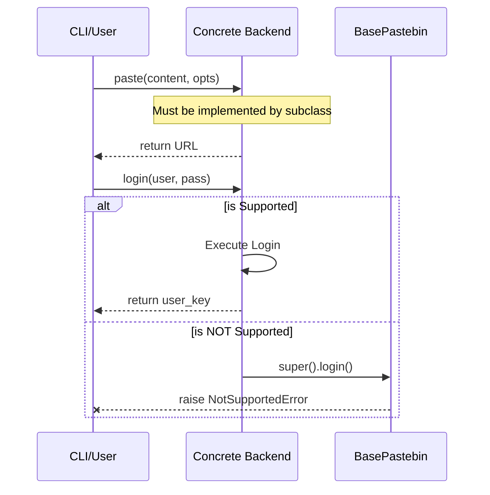

<details>
<summary>Relevant source files</summary>

The following files were used as context for generating this wiki page:

- [pastebinit/backends/base.py](pastebinit/backends/base.py)
- [tests/backends/test_base.py](tests/backends/test_base.py)
- [pastebinit/backends/__init__.py](pastebinit/backends/__init__.py)
- [pastebinit/cli.py](pastebinit/cli.py)
- [pastebinit/backends/pastebin_com.py](pastebinit/backends/pastebin_com.py)
</details>

# Base Backend Interface

The **Base Backend Interface** defines the contract and shared logic for all pastebin service integrations within `pastebinit`. It utilizes an abstract base class (ABC) to ensure that every backend implements a core set of functionalities, such as content submission, while providing default behaviors for optional features like authentication, folder management, and paste listing.

This architecture allows the `pastebinit` CLI to interact with diverse services (e.g., pastebin.com, dpaste.com, bpa.st) through a unified API, shielding the core application logic from the specific implementation details of each network request or data format.

## Architecture and Core Classes

The system relies on a central abstract class and a data structure for passing options. All specific service implementations must inherit from the base class defined in `pastebinit/backends/base.py`.

### BasePastebin Class
The `BasePastebin` class serves as the template for all backends. It defines boolean flags to signal capability support, which the CLI uses to toggle features or display information to the user.

Sources: [pastebinit/backends/base.py:31-40](pastebinit/backends/base.py#L31-L40), [pastebinit/cli.py:53-62](pastebinit/cli.py#L53-L62)

### PasteOptions Data Structure
The `PasteOptions` dataclass encapsulates all possible parameters for a paste operation, ensuring a consistent signature for the `paste` method across all subclasses.

| Field | Type | Default | Description |
| :--- | :--- | :--- | :--- |
| `title` | `str` | `""` | The title of the paste. |
| `format` | `str` | `"text"` | Syntax highlighting format. |
| `private` | `int` | `1` | Privacy level (0=public, 1=unlisted, 2=private). |
| `expiry` | `str` | `"N"` | Expiry duration code. |
| `folder` | `Optional[str]` | `None` | Target folder name for the paste. |
| `create_folder`| `bool` | `False` | Whether to create the folder if missing. |
| `user_key` | `Optional[str]` | `None` | Authentication token for the user. |

Sources: [pastebinit/backends/base.py:20-28](pastebinit/backends/base.py#L20-L28), [tests/backends/test_base.py:18-24](tests/backends/test_base.py#L18-L24)

## Capability Discovery and Error Handling

The interface uses a combination of boolean attributes and specific exception types to manage feature support and runtime failures.

### Capabilities
Each backend instance declares its capabilities through static attributes:
*  `supports_auth`: Whether the service allows user login.
*  `supports_folders`: Whether pastes can be organized into folders.
*  `supports_expiry`: Whether the service supports auto-deletion.
*  `supports_privacy`: Whether the service supports non-public pastes.
*  `supports_syntax`: Whether the service provides syntax highlighting.

Sources: [pastebinit/backends/base.py:34-38](pastebinit/backends/base.py#L34-L38)

### Exception Hierarchy
A dedicated hierarchy of exceptions is used to communicate errors from the backends to the CLI layer:
*  `BackendError`: Base exception for all backend-related issues.
*  `NotSupportedError`: Raised when a method (like `login`) is called on a backend that does not support it.
*  `AuthError`: Specific to authentication failures.

Sources: [pastebinit/backends/base.py:10-17](pastebinit/backends/base.py#L10-L17)

## Data Flow and Relationships

The following diagram illustrates how the CLI interacts with the backend factory to obtain a concrete implementation of the `BasePastebin` interface.

```mermaid
flowchart TD
    CLI[CLI Module] -->|Request Backend| Factory[get_backend]
    Factory -->|Lookup| Registry[(BACKENDS Dictionary)]
    Registry -->|Return Class| Factory
    Factory -->|Instantiate| Concrete[Concrete Backend Instance]
    Concrete --|> Base[BasePastebin ABC]
    CLI -->|Call .paste with PasteOptions| Concrete
    Concrete -->|Return URL| CLI
```

The CLI utilizes `get_backend(name)` to retrieve an instance of a registered backend. All registered backends, such as `PastebinCom` or `BpaSt`, must implement the `paste` method.

Sources: [pastebinit/backends/__init__.py:18-25](pastebinit/backends/__init__.py#L18-L25), [pastebinit/cli.py:67-118](pastebinit/cli.py#L67-L118)

### Method Implementation Logic
While `paste` is a mandatory abstract method, other operations provide a default "Not Supported" behavior.



Sources: [pastebinit/backends/base.py:42-61](pastebinit/backends/base.py#L42-L61), [tests/backends/test_base.py:32-44](tests/backends/test_base.py#L32-L44)

## Component Summary Table

| Component | Location | Role |
| :--- | :--- | :--- |
| `BasePastebin` | `base.py` | Abstract Base Class defining the backend contract. |
| `PasteOptions` | `base.py` | Configuration object for paste parameters. |
| `USER_AGENT` | `base.py` | Standardized header for network requests: `pastebinit/{version}`. |
| `get_backend` | `__init__.py` | Factory function to retrieve backend instances by name. |
| `BACKENDS` | `__init__.py` | Registry mapping strings (e.g., "pastebin.com") to backend classes. |

Sources: [pastebinit/backends/base.py:7-38](pastebinit/backends/base.py#L7-L38), [pastebinit/backends/__init__.py:10-16](pastebinit/backends/__init__.py#L10-L16)

## Conclusion

The Base Backend Interface provides a robust foundation for the `pastebinit` extensibility model. By enforcing a strict API via `BasePastebin` and `PasteOptions`, the project ensures that adding new services requires minimal changes to the core CLI logic, while the capability flags allow the application to gracefully degrade or enhance its user interface based on the features offered by the selected service.
