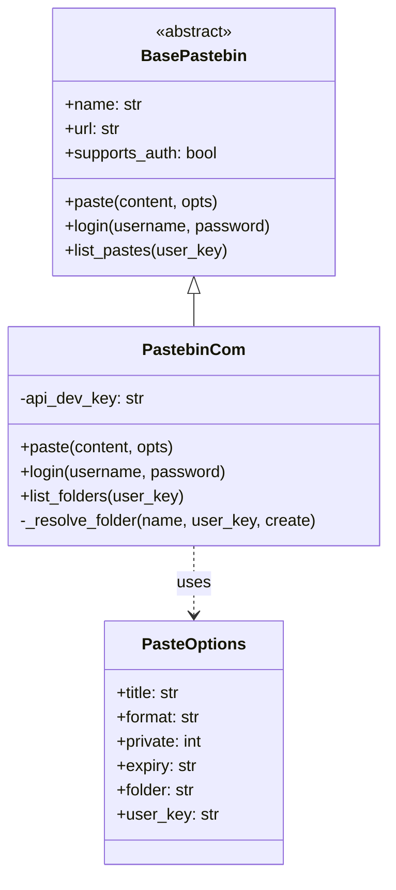
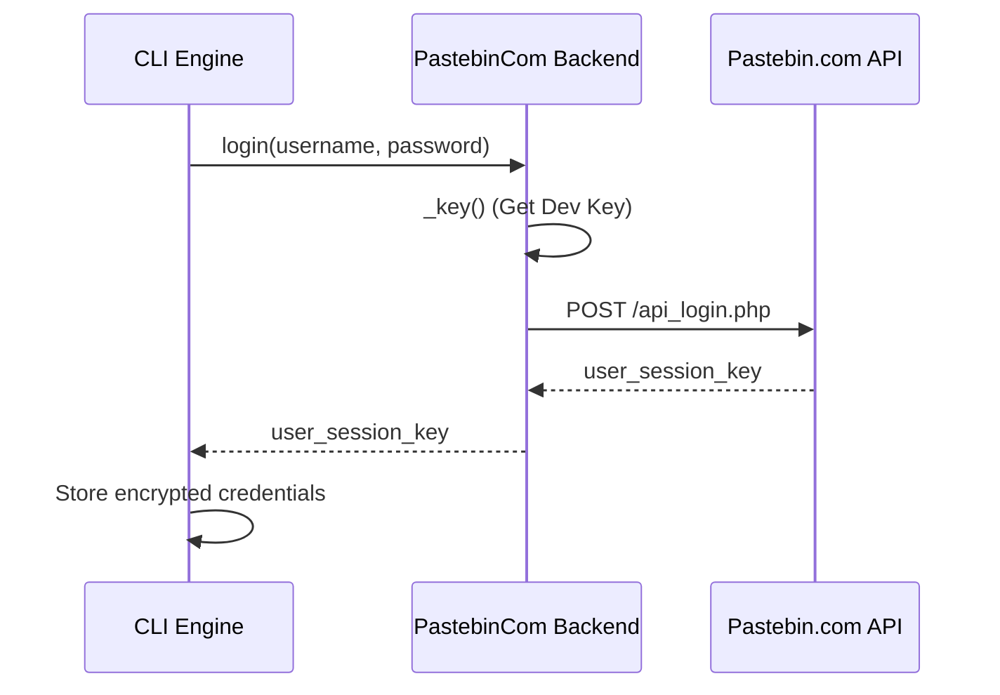
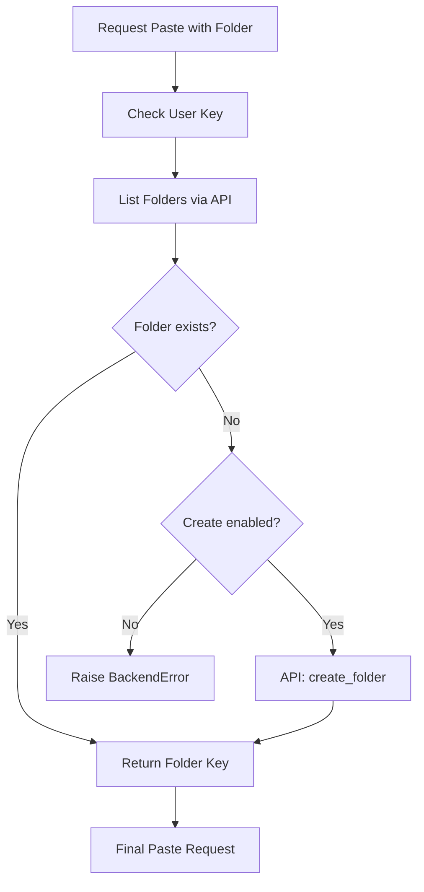

Relevant source files

The following files were used as context for generating this wiki page:

- [pastebinit/backends/pastebin_com.py](pastebinit/backends/pastebin_com.py)
- [pastebinit/backends/base.py](pastebinit/backends/base.py)
- [pastebinit/cli.py](pastebinit/cli.py)
- [pastebinit/syntax.py](pastebinit/syntax.py)
- [tests/backends/test_pastebin_com.py](tests/backends/test_pastebin_com.py)
- [README.md](README.md)

# pastebin.com Backend Provider

The `pastebin.com` backend provider is the most feature-complete implementation within the `pastebinit` project. It facilitates interaction with the Pastebin.com Pro API, supporting complex operations including user authentication, hierarchical folder management, and granular privacy controls.

Unlike simpler backends in the project, this provider implements the full suite of capabilities defined in the `BasePastebin` abstract class, allowing users to not only create pastes but also list, delete, and organize them within a personal account.

Sources: [pastebinit/backends/pastebin_com.py:16-23](pastebinit/backends/pastebin_com.py#L16-L23), [README.md:9-12](README.md#L9-L12)

## Architecture and Class Hierarchy

The `PastebinCom` class inherits from `BasePastebin` and implements all abstract methods required for Pastebin interaction. It utilizes the `PasteOptions` dataclass to encapsulate configuration such as syntax highlighting, expiry, and folder targets.

The diagram above illustrates the inheritance relationship where `PastebinCom` concretizes the backend interface.

Sources: [pastebinit/backends/base.py:33-59](pastebinit/backends/base.py#L33-L59), [pastebinit/backends/pastebin_com.py:16-23](pastebinit/backends/pastebin_com.py#L16-L23)

## Authentication and Credential Management

Authentication with Pastebin.com is a two-step process involving an API Developer Key and a User Session Key.

1.  **API Developer Key**: This key is required for all requests. It is retrieved via the `_key()` method, which looks for a key provided during initialization, in environment variables (`PASTEBIN_API_KEY`), or within the encrypted keystore.
2.  **User Session Key**: Generated via the `login()` method. The CLI captures the username and password, sends them to `https://pastebin.com/api/api_login.php`, and stores the resulting session key.

### Login Flow

The sequence shows how the CLI coordinates with the backend to establish a persistent session.

Sources: [pastebinit/backends/pastebin_com.py:28-44](pastebinit/backends/pastebin_com.py#L28-L44), [pastebinit/cli.py:73-84](pastebinit/cli.py#L73-L84)

## Paste Operations

The core functionality of the provider is handled by the `paste()` method. It maps internal `PasteOptions` to the specific POST parameters required by the Pastebin.com API.

| Parameter | API Field | Description |
| :--- | :--- | :--- |
| `content` | `api_paste_code` | The actual text to be pasted. |
| `opts.title` | `api_paste_name` | The title of the paste. |
| `opts.format` | `api_paste_format` | Syntax highlighting (defaults to 'text' if not 'auto'). |
| `opts.private` | `api_paste_private` | 0=Public, 1=Unlisted, 2=Private. |
| `opts.expiry` | `api_paste_expire_date` | Expiry code (e.g., '1D', '1W', '1M'). |
| `opts.user_key` | `api_user_key` | Optional session key for account-linked pastes. |

Sources: [pastebinit/backends/pastebin_com.py:61-75](pastebinit/backends/pastebin_com.py#L61-L75), [pastebinit/backends/base.py:24-30](pastebinit/backends/base.py#L24-L30)

### Syntax and Expiry Mapping
Before the backend receives the request, `pastebinit/syntax.py` attempts to detect the correct format based on file extensions or shebang lines. The backend then validates the expiry against a set of allowed values: `N, 10M, 1H, 1D, 1W, 2W, 1M, 6M, 1Y`.

Sources: [pastebinit/syntax.py:75-97](pastebinit/syntax.py#L75-L97), [pastebinit/backends/pastebin_com.py:11](pastebinit/backends/pastebin_com.py#L11)

## Folder Management and Resolution

Pastebin.com supports organizing pastes into folders. The provider implements a resolution logic to map folder names to internal API folder keys.

When a folder name is provided in `PasteOptions`:
1.  The backend calls `list_folders()` to fetch all existing folders for the user.
2.  It searches for a folder matching the provided name.
3.  If not found and `create_folder` is `True`, it triggers `create_folder()` via the API.
4.  The resulting `folder_key` is then included in the final paste request.

The flowchart describes the internal logic used to handle named folders during a paste operation.

Sources: [pastebinit/backends/pastebin_com.py:108-137](pastebinit/backends/pastebin_com.py#L108-L137)

## Data Retrieval and Management

The provider supports managing existing account data through several methods:

*  **`list_pastes(user_key, limit=50)`**: Fetches an XML response from the API and parses it into a list of dictionaries containing keys, titles, dates, and URLs.
*  **`delete_paste(paste_key, user_key)`**: Removes a specific paste from the user's account.
*  **`get_user_info(user_key)`**: Retrieves account details such as email, avatar URL, and API tier.

Sources: [pastebinit/backends/pastebin_com.py:84-106](pastebinit/backends/pastebin_com.py#L84-L106), [pastebinit/backends/pastebin_com.py:118-127](pastebinit/backends/pastebin_com.py#L118-L127)

## Summary
The `pastebin.com` Backend Provider serves as the reference implementation for advanced features in `pastebinit`. By utilizing the official Pastebin.com API via XML parsing and multipart form data, it provides comprehensive control over the lifecycle of a paste, from auto-detection of syntax to secure storage in account-specific folders.

Sources: [pastebinit/backends/pastebin_com.py:1-140](pastebinit/backends/pastebin_com.py#L1-L140), [README.md:1-25](README.md#L1-L25)
