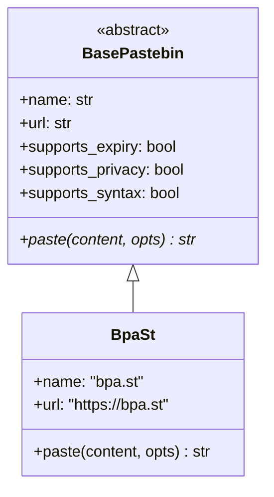
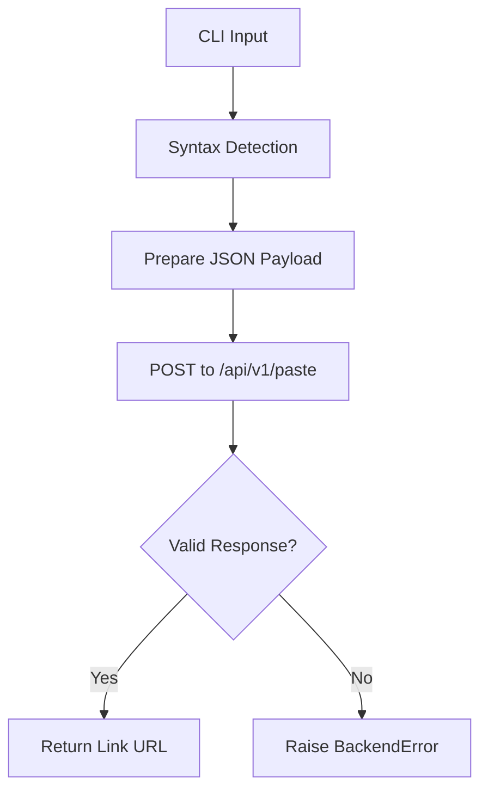

<details>
<summary>Relevant source files</summary>

The following files were used as context for generating this wiki page:

- [pastebinit/backends/bpa_st.py](pastebinit/backends/bpa_st.py)
- [tests/backends/test_bpa_st.py](tests/backends/test_bpa_st.py)
- [pastebinit/backends/base.py](pastebinit/backends/base.py)
- [pastebinit/backends/__init__.py](pastebinit/backends/__init__.py)
- [pastebinit/cli.py](pastebinit/cli.py)
- [README.md](README.md)
</details>

# bpa.st Backend Provider

The `bpa.st` backend provider is a specific implementation within the `pastebinit` project that allows users to upload text and files to the bpa.st service. It serves as the default backend for the application and provides a streamlined interface for anonymous pasting with support for syntax highlighting, expiry, and privacy settings.

As a member of the backend ecosystem, it inherits from the `BasePastebin` abstract class, ensuring a consistent interface for the command-line client. Unlike some other providers like `pastebin.com`, the `bpa.st` backend does not require authentication, making it the primary choice for quick, non-credentialed uploads.

Sources: [pastebinit/backends/bpa_st.py:10-15](pastebinit/backends/bpa_st.py#L10-L15), [pastebinit/backends/__init__.py:19](pastebinit/backends/__init__.py#L19), [README.md:14-15](README.md#L14-L15)

## Architecture and Integration

The `BpaSt` class is located in `pastebinit/backends/bpa_st.py` and implements the standard backend interface. It is registered in the global `BACKENDS` dictionary and designated as the system default.

### Class Hierarchy
The following diagram illustrates the relationship between the base backend and the bpa.st implementation.



Sources: [pastebinit/backends/base.py:32-48](pastebinit/backends/base.py#L32-L48), [pastebinit/backends/bpa_st.py:10-15](pastebinit/backends/bpa_st.py#L10-L15)

### Capabilities
The backend advertises specific capabilities that the CLI uses to determine available features during runtime.

| Capability | Supported | Description |
| :--- | :---: | :--- |
| Authentication | ❌ | No login or user key support. |
| Expiry | ✅ | Supports limited time-based expiration (primarily 1 day). |
| Privacy | ✅ | Supports marking pastes as "private" (unlisted). |
| Syntax | ✅ | Supports lexer-based syntax highlighting. |

Sources: [pastebinit/backends/bpa_st.py:12-15](pastebinit/backends/bpa_st.py#L12-L15), [README.md:74](README.md#L74)

## Data Flow and API Implementation

The `paste` method is the core of the provider. It transforms `PasteOptions` into a JSON payload for the bpa.st REST API.

### Request Pipeline
When a paste is initiated, the backend processes the input through the following flow:



The API endpoint used is `https://bpa.st/api/v1/paste`. The request is sent as an `application/json` POST request containing a list of files, an expiry duration, and a privacy flag.

Sources: [pastebinit/backends/bpa_st.py:6-26](pastebinit/backends/bpa_st.py#L6-L26), [pastebinit/cli.py:136-155](pastebinit/cli.py#L136-L155)

### Payload Structure
The backend constructs a JSON object with the following schema:

```json
{
    "files": [
        {
            "content": "...",
            "lexer": "python",
            "name": "paste.txt"
        }
    ],
    "expiry": "1day",
    "private": true
}
```

*  **Lexer**: Defaults to "text" if auto-detection fails or is empty.
*  **Expiry**: Currently only reliably supports "1day". Other values are known to cause 400/500 errors from the service.
*  **Privacy**: Set to `True` if the `PasteOptions.private` value is greater than 0.

Sources: [pastebinit/backends/bpa_st.py:7-22](pastebinit/backends/bpa_st.py#L7-L22)

### Error Handling
The backend implements error checking on the network response. If the returned JSON does not contain a "link" key, or if a network `OSError` occurs, it raises a `BackendError`.

```python
        try:
            with urllib.request.urlopen(req, timeout=15) as resp:
                result = json.loads(resp.read())
        except OSError as e:
            raise BackendError(f"bpa.st error: {e}") from e
        if "link" not in result:
            raise BackendError(f"bpa.st error: unexpected response {result}")
        return result["link"]
```

Sources: [pastebinit/backends/bpa_st.py:27-35](pastebinit/backends/bpa_st.py#L27-L35)

## Testing and Validation

The backend is validated via `pytest` in `tests/backends/test_bpa_st.py`. These tests use mocking to simulate API responses and verify payload construction.

| Test Case | Purpose |
| :--- | :--- |
| `test_paste_returns_url` | Verifies the backend correctly extracts the "link" field from a successful API response. |
| `test_paste_sends_json` | Ensures the syntax format (lexer) and expiry are correctly mapped into the JSON payload. |
| `test_paste_error_raises` | Confirms that unexpected API responses or errors trigger a `BackendError`. |

Sources: [tests/backends/test_bpa_st.py:10-38](tests/backends/test_bpa_st.py#L10-L38)

## Summary

The `bpa.st` provider is the foundational backend for `pastebinit`. It offers a robust, authentication-free path for sharing code snippets. While it supports features like syntax highlighting and privacy, it is architecturally constrained by the current bpa.st API to a single-day expiry for reliable operation. Its implementation emphasizes simplicity and direct JSON communication with the provider's REST endpoint.
