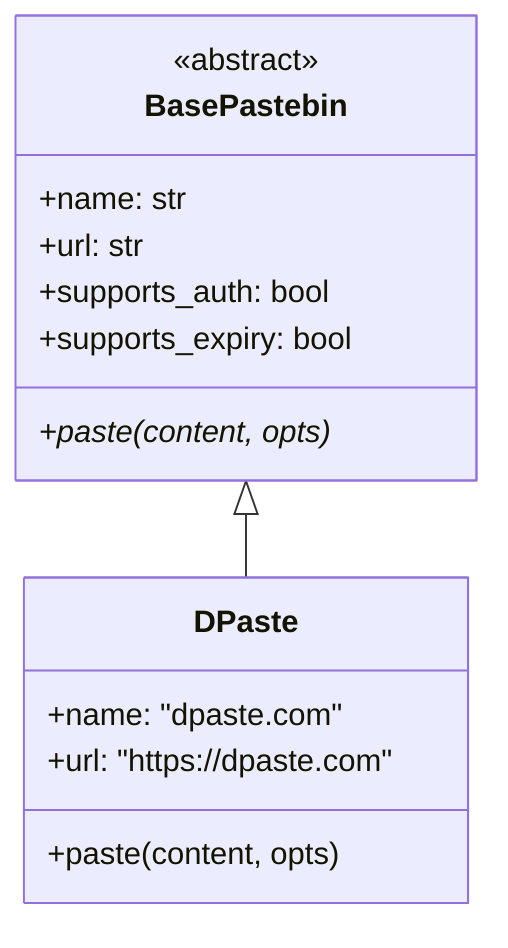
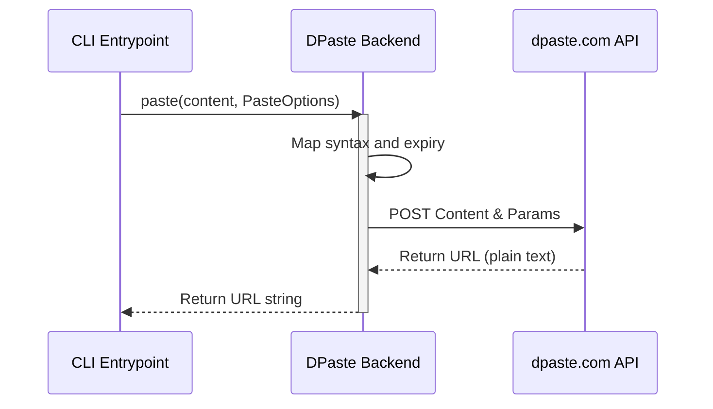

<details>
<summary>Relevant source files</summary>

The following files were used as context for generating this wiki page:

- [pastebinit/backends/dpaste.py](pastebinit/backends/dpaste.py)
- [tests/backends/test_dpaste.py](tests/backends/test_dpaste.py)
- [pastebinit/backends/base.py](pastebinit/backends/base.py)
- [pastebinit/cli.py](pastebinit/cli.py)
- [pastebinit/backends/__init__.py](pastebinit/backends/__init__.py)

</details>

# dpaste.com Backend Provider

The `dpaste.com` backend provider is a specific implementation within the `pastebinit` application designed to interface with the dpaste.com web service. It allows users to send text content and files to the dpaste API, supporting features such as syntax highlighting, custom expiry times, and privacy settings.

This backend inherits from the base pastebin architecture, ensuring consistency with other providers like [pastebin.com](#pastebin-com-backend-provider) or [bpa.st](#bpast-backend-provider). It utilizes standard HTTP POST requests to submit data to the dpaste.com v2 API.

Sources: [pastebinit/backends/dpaste.py:6-14](pastebinit/backends/dpaste.py#L6-L14), [README.md:65](README.md#L65), [pastebinit/backends/__init__.py:10](pastebinit/backends/__init__.py#L10)

## Architecture and Class Hierarchy

The `DPaste` class is derived from `BasePastebin`. It implements the mandatory `paste` method while defining specific capabilities through boolean flags. Unlike some other providers, dpaste.com does not support user authentication or folder management within this implementation.



The diagram shows the inheritance relationship between the abstract base class and the dpaste implementation.

Sources: [pastebinit/backends/base.py:34-47](pastebinit/backends/base.py#L34-L47), [pastebinit/backends/dpaste.py:9-14](pastebinit/backends/dpaste.py#L9-L14)

## Capabilities and Features

The dpaste backend supports a subset of the global `pastebinit` options. The capabilities are explicitly defined in the class attributes:

| Feature | Supported | Description |
| :--- | :---: | :--- |
| **Authentication** | No | dpaste.com uploads are anonymous in this implementation. |
| **Expiry** | Yes | Supports pre-defined durations (1 day, 1 week, 1 month, 1 year). |
| **Privacy** | Yes | Inherits generic privacy support from `BasePastebin`. |
| **Syntax** | Yes | Supports syntax highlighting for various formats. |
| **Folders** | No | Does not support organizing pastes into folders. |

Sources: [pastebinit/backends/dpaste.py:12-14](pastebinit/backends/dpaste.py#L12-L14), [README.md:65](README.md#L65)

## Data Flow and API Integration

When a user initiates a paste, the `DPaste.paste` method processes the `PasteOptions` and maps them to the requirements of the dpaste.com API (located at `https://dpaste.com/api/v2/`).

### Expiry Mapping
The backend uses an internal map to convert standard `pastebinit` expiry codes into the numerical day values expected by dpaste.com.

| Code | Value (Days) |
| :--- | :--- |
| N | 365 |
| 1D | 1 |
| 1W | 7 |
| 1M | 30 |
| 1Y | 365 |

Sources: [pastebinit/backends/dpaste.py:7-19](pastebinit/backends/dpaste.py#L7-L19)

### Submission Process

The process follows a synchronous flow where content is encoded as form data and sent via `urllib.request`.



This diagram illustrates the flow from the command line interface through the backend to the remote API.

Sources: [pastebinit/backends/dpaste.py:16-32](pastebinit/backends/dpaste.py#L16-L32), [pastebinit/cli.py:149-166](pastebinit/cli.py#L149-L166)

## Implementation Details

The core logic resides in the `paste` method, which handles parameter preparation and network communication.

```python
# pastebinit/backends/dpaste.py:16-32
def paste(self, content: str, opts: PasteOptions) -> str:
    fmt = opts.format if opts.format not in ("auto", "text", "") else "text"
    expiry = _EXPIRY_MAP.get(opts.expiry, "7")
    params = {
        "content": content,
        "syntax": fmt,
        "title": opts.title,
        "expiry_days": expiry,
    }
    data = urllib.parse.urlencode(params).encode()
    req = urllib.request.Request(_API, data=data)
    req.add_header("User-Agent", USER_AGENT)
    try:
        with urllib.request.urlopen(req, timeout=15) as resp:
            return resp.read().decode().strip()
    except OSError as e:
        raise BackendError(f"dpaste.com error: {e}") from e
```

The backend ensures that the syntax format is defaulted to "text" if not specified or set to "auto". It also includes the application's global `USER_AGENT` in the request headers for identification.

Sources: [pastebinit/backends/dpaste.py:17-26](pastebinit/backends/dpaste.py#L17-L26), [pastebinit/backends/base.py:7](pastebinit/backends/base.py#L7)

## Error Handling

The backend wraps `OSError` exceptions (typically resulting from network failures or timeouts) into a specialized `BackendError`. This allows the CLI to provide a user-friendly error message rather than a raw stack trace.

Sources: [pastebinit/backends/dpaste.py:29-32](pastebinit/backends/dpaste.py#L29-L32), [pastebinit/cli.py:164-166](pastebinit/cli.py#L164-L166)

## Testing

The implementation is verified through unit tests that mock the network response. Tests ensure that:
1.  The resulting URL is correctly parsed and returned.
2.  The syntax format is correctly passed in the POST data.
3.  The expiry days are correctly mapped and included in the request.

Sources: [tests/backends/test_dpaste.py:15-39](tests/backends/test_dpaste.py#L15-L39)
