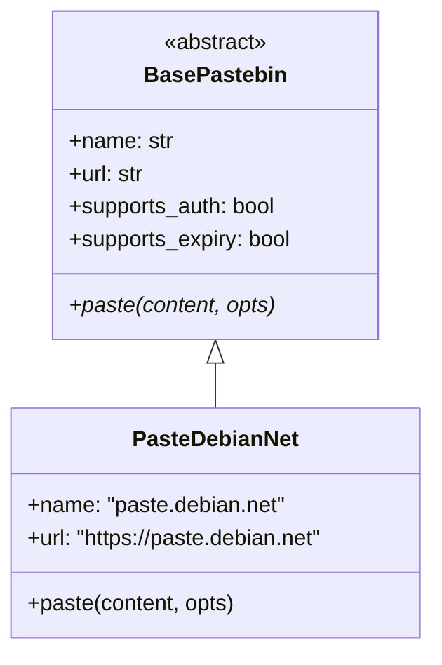
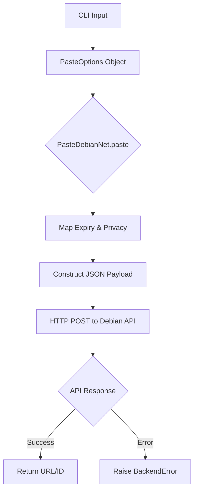

<details>
<summary>Relevant source files</summary>

The following files were used as context for generating this wiki page:

- [pastebinit/backends/paste\_debian\_net.py](pastebinit/backends/paste_debian_net.py)
- [tests/backends/test\_paste\_debian\_net.py](tests/backends/test_paste_debian_net.py)
- [pastebinit/backends/base.py](pastebinit/backends/base.py)
- [pastebinit/backends/__init__.py](pastebinit/backends/__init__.py)
- [pastebinit/cli.py](pastebinit/cli.py)
- [README.md](README.md)
</details>

# paste.debian.net Backend Provider

The `paste.debian.net` backend provider is a specialized module within the `pastebinit` application designed to facilitate the submission of text content to the Debian pastebin service. It integrates with the project's backend architecture by extending the base pastebin functionality to handle specific API requirements, such as JSON-based payloads and specific expiry durations. Sources: [README.md:10-12](README.md#L10-L12), [pastebinit/backends/paste\_debian\_net.py:11-13](pastebinit/backends/paste\_debian\_net.py#L11-L13)

This provider supports features such as unlisted/private pastes and configurable expiration periods, though it does not support user authentication or syntax highlighting through the `pastebinit` implementation of its API. Sources: [README.md:92](README.md#L92), [pastebinit/backends/paste\_debian\_net.py:16-17](pastebinit/backends/paste\_debian\_net.py#L16-L17)

## Architecture and Integration

The `PasteDebianNet` class is part of the `pastebinit.backends` package. It inherits from `BasePastebin`, a blueprint that defines the standard interface for all supported pastebin services. Sources: [pastebinit/backends/base.py:38-40](pastebinit/backends/base.py#L38-L40), [pastebinit/backends/paste\_debian\_net.py:13](pastebinit/backends/paste\_debian\_net.py#L13)

### Class Hierarchy
The following diagram illustrates the relationship between the base backend and the Debian-specific implementation.



The backend is registered in the global `BACKENDS` dictionary, allowing the CLI to instantiate it dynamically when the user specifies `-b paste.debian.net`. Sources: [pastebinit/backends/\_\_init\_\_.py:13](pastebinit/backends/\_\_init\_\_.py#L13), [pastebinit/cli.py:64](pastebinit/cli.py#L64)

## Data Flow and API Logic

When a user initiates a paste, the backend constructs a JSON payload and sends a POST request to the Debian API endpoint (`https://paste.debian.net/api/v1/paste`). Sources: [pastebinit/backends/paste\_debian\_net.py:5-22](pastebinit/backends/paste\_debian\_net.py#L5-L22)

### Paste Submission Process
The flow below describes the transformation of user input into a successful paste URL.



Sources: [pastebinit/backends/paste\_debian\_net.py:19-41](pastebinit/backends/paste\_debian\_net.py#L19-L41)

### Expiry Mapping
Unlike some backends that use strings or codes directly, the Debian backend maps `pastebinit` expiry codes to specific integer day values required by the API.

| Code | Days | Description |
| :--- | :--- | :--- |
| N | 90 | Never (defaults to 90 days on this service) |
| 1D | 1 | One Day |
| 1W | 7 | One Week |
| 2W | 14 | Two Weeks |
| 1M | 30 | One Month |
| 6M | 180 | Six Months |
| 1Y | 90 | One Year (caps at 90) |

Sources: [pastebinit/backends/paste\_debian\_net.py:7-10](pastebinit/backends/paste\_debian\_net.py#L7-L10), [pastebinit/backends/paste\_debian\_net.py:25](pastebinit/backends/paste\_debian\_net.py#L25)

## Implementation Details

### Configuration and Capabilities
The backend explicitly defines its capabilities, which are used by the CLI to inform the user of what features are available during the `--list-backends` command. Sources: [pastebinit/cli.py:53-58](pastebinit/cli.py#L53-L58), [pastebinit/backends/paste\_debian\_net.py:15-17](pastebinit/backends/paste\_debian\_net.py#L15-L17)

*  **Authentication:** Not supported (`supports_auth` defaults to `False`).
*  **Privacy:** Supported. A `private` value greater than 0 in `PasteOptions` triggers a boolean `true` in the API's `private` field.
*  **Syntax:** Not supported via this backend's API implementation (returns text).

### Response Handling
The backend handles three types of successful responses from the Debian API:
1.  **Direct URL:** If the API returns a `url` key, it is returned directly.
2.  **Hidden ID:** If the API returns an `id` key (often for private pastes), the backend constructs a "hidden" URL: `https://paste.debian.net/hidden/{id}`.
3.  **Error:** If an `error` key is present or a network failure occurs, a `BackendError` is raised.

Sources: [pastebinit/backends/paste\_debian\_net.py:35-41](pastebinit/backends/paste\_debian\_net.py#L35-L41), [tests/backends/test\_paste\_debian\_net.py:15-18](tests/backends/test\_paste\_debian\_net.py#L15-L18)

### Code Example: Payload Construction

```python
# pastebinit/backends/paste_debian_net.py:21-27
payload = json.dumps({
    "code": content,
    "filename": opts.title or "paste.txt",
    "expiry_days": _EXPIRY_DAYS.get(opts.expiry, 90),
    "private": opts.private > 0,
}).encode()
```

## Summary
The `paste.debian.net` backend provides a reliable bridge to the Debian pastebin service using a JSON-over-HTTP interface. It prioritizes simplicity, handling the specific expiry day mapping and hidden URL construction required to provide a seamless user experience within the broader `pastebinit` ecosystem. Sources: [pastebinit/backends/paste\_debian\_net.py](pastebinit/backends/paste\_debian\_net.py)
