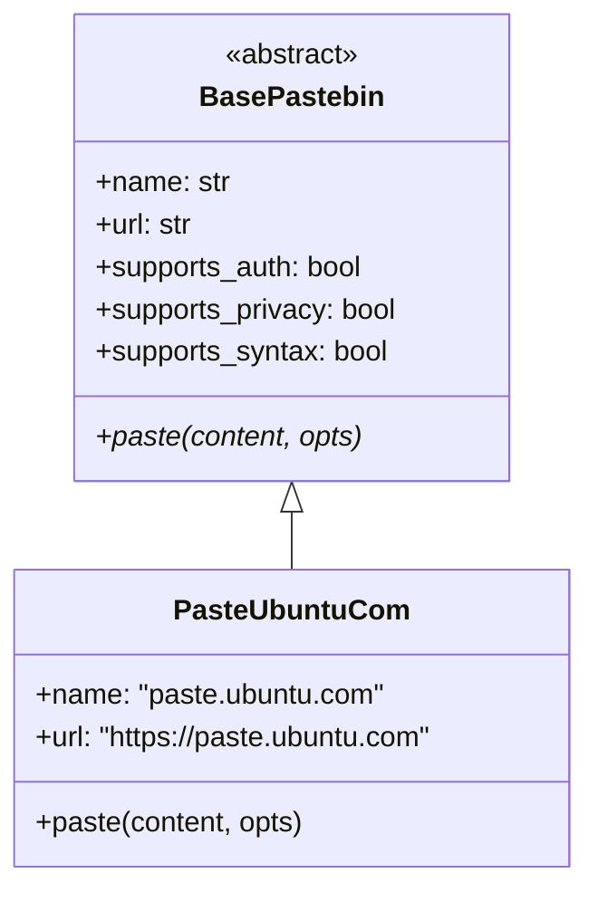
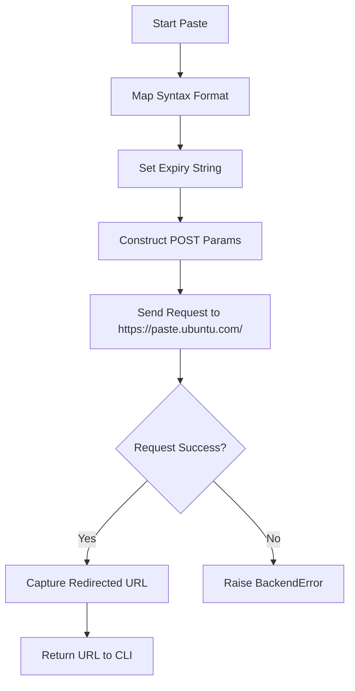

<details>
<summary>Relevant source files</summary>

The following files were used as context for generating this wiki page:

- [pastebinit/backends/paste\_ubuntu\_com.py](pastebinit/backends/paste_ubuntu_com.py)
- [tests/backends/test\_paste\_ubuntu\_com.py](tests/backends/test_paste_ubuntu_com.py)
- [pastebinit/backends/base.py](pastebinit/backends/base.py)
- [pastebinit/cli.py](pastebinit/cli.py)
- [pastebinit/backends/__init__.py](pastebinit/backends/__init__.py)
- [README.md](README.md)
</details>

# paste.ubuntu.com Backend Provider

The `paste.ubuntu.com` backend provider is a specialized module within `pastebinit` designed to facilitate the uploading of text and code snippets to the Ubuntu pastebin service. It implements the standard backend interface defined by the project, allowing users to send content via the command line with support for specific features like syntax highlighting and privacy (unlisted pastes).

This provider is one of several supported backends in the `pastebinit` ecosystem, which also includes services like `pastebin.com`, `paste.debian.net`, and `dpaste.com`. It is implemented as a Python class that inherits from a common base, ensuring consistent behavior across different pastebin services.

Sources: [pastebinit/backends/paste_ubuntu_com.py](pastebinit/backends/paste_ubuntu_com.py), [README.md:10-15](README.md#L10-L15), [pastebinit/backends/__init__.py:12-21](pastebinit/backends/__init__.py#L12-L21)

## Architecture and Class Hierarchy

The `PasteUbuntuCom` provider is built upon a standardized class hierarchy. It inherits from `BasePastebin`, which defines the mandatory `paste` method and optional capabilities through boolean flags.



The diagram above illustrates the inheritance relationship where `PasteUbuntuCom` concretely implements the abstract requirements of the base backend class.

Sources: [pastebinit/backends/base.py:29-45](pastebinit/backends/base.py#L29-L45), [pastebinit/backends/paste_ubuntu_com.py:12-17](pastebinit/backends/paste_ubuntu_com.py#L12-L17)

## Feature Support Matrix

The `paste.ubuntu.com` backend provides a specific subset of features compared to the full `pastebinit` capability set. Notably, it does not support user authentication or folder management.

| Feature | Supported | Description |
| :--- | :---: | :--- |
| Authentication | ❌ | No login or user key required for submissions. |
| Privacy | ✅ | Supports unlisted pastes via the privacy flag. |
| Syntax Highlighting | ✅ | Maps common formats to Ubuntu-specific syntax identifiers. |
| Expiry | ❌ | Uses a simplified internal mapping for expiration times. |
| Folders | ❌ | Not supported by the Ubuntu pastebin service. |

Sources: [pastebinit/backends/paste_ubuntu_com.py:15-17](pastebinit/backends/paste_ubuntu_com.py#L15-L17), [README.md:92-100](README.md#L92-L100)

## Data Flow and Submission Logic

When a user initiates a paste to Ubuntu, the backend processes the `PasteOptions` and constructs a URL-encoded POST request. Unlike some other backends that return JSON, the Ubuntu backend identifies the final paste URL by following the HTTP redirect after a successful submission.



This flowchart describes the internal logic of the `paste` method, emphasizing the mapping of options and the retrieval of the final URL from the response.

Sources: [pastebinit/backends/paste_ubuntu_com.py:19-38](pastebinit/backends/paste_ubuntu_com.py#L19-L38), [tests/backends/test_paste_ubuntu_com.py:7-12](tests/backends/test_paste_ubuntu_com.py#L7-L12)

### Syntax and Expiry Mapping

The provider utilizes internal dictionaries to translate standard `pastebinit` options into the specific strings required by the Ubuntu API.

**Syntax Mapping (`_SYNTAX_MAP`):**
The backend maps common format names to their Ubuntu counterparts (e.g., "python" becomes "python3", "html5" becomes "html").
Sources: [pastebinit/backends/paste_ubuntu_com.py:6-10](pastebinit/backends/paste_ubuntu_com.py#L6-L10)

**Expiry Mapping (`_EXPIRY`):**
Ubuntu uses specific time-based strings rather than numeric values.
- `N` or default: "year"
- `1D`: "day"
- `1W`: "week"
- `1M`: "month"

Sources: [pastebinit/backends/paste_ubuntu_com.py:5](pastebinit/backends/paste_ubuntu_com.py#L5)

## Implementation Details

The core logic resides in the `paste` method, which utilizes `urllib` for network communication and `PasteOptions` for configuration.

```python
# pastebinit/backends/paste_ubuntu_com.py:19-34
def paste(self, content: str, opts: PasteOptions) -> str:
    fmt = opts.format if opts.format not in ("auto", "") else "text"
    fmt = _SYNTAX_MAP.get(fmt, fmt)
    params = {
        "poster": opts.title or "pastebinit",
        "syntax": fmt,
        "expiration": _EXPIRY.get(opts.expiry, "year"),
        "content": content,
    }
    data = urllib.parse.urlencode(params).encode()
    req = urllib.request.Request("https://paste.ubuntu.com/", data=data)
    req.add_header("User-Agent", USER_AGENT)
```

The submission uses the `poster` parameter for the title, defaulting to "pastebinit" if none is provided by the CLI. The final URL returned to the user is the `resp.url` from the `urlopen` result, which represents the location of the newly created paste after redirection.

Sources: [pastebinit/backends/paste_ubuntu_com.py:22-38](pastebinit/backends/paste_ubuntu_com.py#L22-L38), [pastebinit/cli.py:143-150](pastebinit/cli.py#L143-L150)

## Conclusion

The `paste.ubuntu.com` backend provider provides a lightweight, no-authentication-required interface for sharing code on Ubuntu's infrastructure. By implementing the common backend interface, it integrates seamlessly with `pastebinit` features like auto-syntax detection and file reading while handling the specific URL-encoded form requirements of the Ubuntu service.
