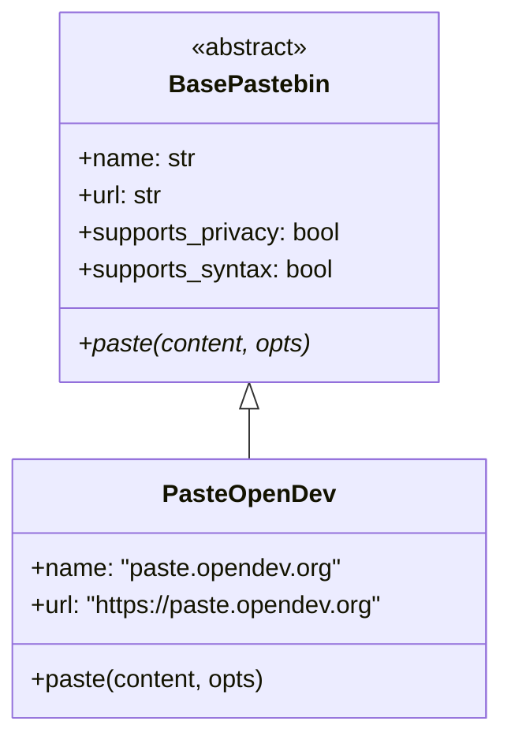
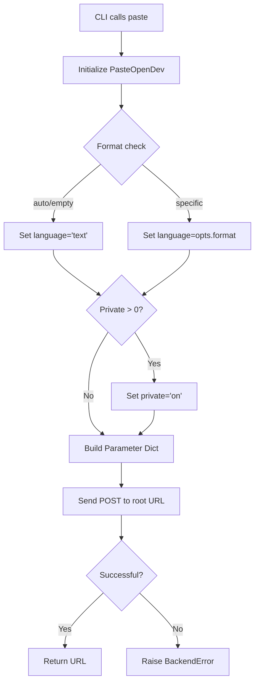

<details>
<summary>Relevant source files</summary>

The following files were used as context for generating this wiki page:

- [pastebinit/backends/paste_opendev.py](pastebinit/backends/paste_opendev.py)
- [tests/backends/test_paste_opendev.py](tests/backends/test_paste_opendev.py)
- [pastebinit/backends/base.py](pastebinit/backends/base.py)
- [pastebinit/backends/__init__.py](pastebinit/backends/__init__.py)
- [pastebinit/cli.py](pastebinit/cli.py)
- [README.md](README.md)
</details>

# paste.opendev.org Backend Provider

The `paste.opendev.org` backend provider is a specialized module within the `pastebinit` project designed to interface with the OpenDev pastebin service. It allows users to programmatically upload text content or files directly to `https://paste.opendev.org` via the command line.

This backend is integrated into the `pastebinit` registry, enabling it to be selected as a target for pastes. It supports features such as syntax highlighting and private paste flags, adhering to the standard interface defined by the base provider classes.

Sources: [pastebinit/backends/paste_opendev.py:7-10](pastebinit/backends/paste_opendev.py#L7-L10), [pastebinit/backends/__init__.py:12-21](pastebinit/backends/__init__.py#L12-L21), [README.md:65](README.md#L65)

## Architecture and Components

The `PasteOpenDev` class inherits from `BasePastebin`, which provides a standardized interface for all pastebin services in the application. It implements the required `paste` method to handle the specific requirements of the OpenDev API.

### Class Structure and Metadata
The backend defines metadata used by the CLI to identify and describe the service.

| Attribute | Value | Description |
| :--- | :--- | :--- |
| `name` | "paste.opendev.org" | Unique identifier for the backend. |
| `url` | `https://paste.opendev.org` | Base URL of the service. |
| `supports_privacy` | `True` | Indicates the ability to create unlisted/private pastes. |
| `supports_syntax` | `True` | Indicates support for language-based syntax highlighting. |

Sources: [pastebinit/backends/paste_opendev.py:7-11](pastebinit/backends/paste_opendev.py#L7-L11), [pastebinit/backends/base.py:38-44](pastebinit/backends/base.py#L38-L44)

### Class Hierarchy Diagram
The following diagram illustrates the relationship between the OpenDev provider and the core backend framework.



The diagram shows the inheritance from the abstract base class.
Sources: [pastebinit/backends/base.py:37-47](pastebinit/backends/base.py#L37-L47), [pastebinit/backends/paste_opendev.py:7-13](pastebinit/backends/paste_opendev.py#L7-L13)

## Data Flow and API Logic

The backend uses standard HTTP POST requests to submit data. Unlike some other providers that use JSON APIs, the OpenDev backend utilizes `application/x-www-form-urlencoded` data submitted to the root endpoint.

### Submission Process
1.  **Format Resolution**: The provider checks the `PasteOptions`. If the format is "auto" or empty, it defaults to "text".
2.  **Parameter Mapping**: The internal data structure maps content to the `code` key and syntax to the `language` key.
3.  **Privacy Flag**: If the privacy level is greater than 0, a `private` parameter is set to "on".
4.  **Network Request**: A `urllib.request.Request` is constructed with a custom `User-Agent`.
5.  **Response Handling**: The service returns the final URL of the paste upon success.



The flowchart depicts the logic within the `paste` method.
Sources: [pastebinit/backends/paste_opendev.py:13-27](pastebinit/backends/paste_opendev.py#L13-L27), [tests/backends/test_paste_opendev.py:13-20](tests/backends/test_paste_opendev.py#L13-L20)

### Request Parameters

| Parameter | Type | Description |
| :--- | :--- | :--- |
| `code` | String | The actual text content to be pasted. |
| `language` | String | The syntax highlighting language (e.g., "python"). |
| `private` | String | Set to "on" if the paste should be private. |

Sources: [pastebinit/backends/paste_opendev.py:15-18](pastebinit/backends/paste_opendev.py#L15-L18), [tests/backends/test_paste_opendev.py:19-20](tests/backends/test_paste_opendev.py#L19-L20)

## Implementation Details

The implementation relies on Python's `urllib` for network operations and includes error handling for network-related failures.

```python
# pastebinit/backends/paste_opendev.py:13-27
def paste(self, content: str, opts: PasteOptions) -> str:
    fmt = opts.format if opts.format not in ("auto", "") else "text"
    params = {"code": content, "language": fmt}
    if opts.private > 0:
        params["private"] = "on"
    data = urllib.parse.urlencode(params).encode()
    req = urllib.request.Request("https://paste.opendev.org/", data=data)
    req.add_header("User-Agent", USER_AGENT)
    try:
        with urllib.request.urlopen(req, timeout=15) as resp:
            return resp.url
    except OSError as e:
        raise BackendError(f"paste.opendev.org error: {e}") from e
```

Sources: [pastebinit/backends/paste_opendev.py:13-27](pastebinit/backends/paste_opendev.py#L13-L27)

### Service Capabilities
Based on the `BasePastebin` capability flags, the OpenDev backend has the following profile:
*  **Authentication**: Not supported. No implementation for `login`.
*  **Folders**: Not supported.
*  **Expiry**: Not supported (unlike `pastebin.com` or `dpaste.com`).
*  **Privacy**: Supported via the `private=on` parameter.
*  **Syntax**: Supported via the `language` parameter.

Sources: [pastebinit/backends/paste_opendev.py:10-11](pastebinit/backends/paste_opendev.py#L10-L11), [pastebinit/cli.py:53-61](pastebinit/cli.py#L53-L61), [README.md:65](README.md#L65)

## Conclusion
The `paste.opendev.org` backend is a lightweight provider that maps standard `pastebinit` options to the form-based submission requirements of the OpenDev service. It provides basic syntax highlighting and privacy controls but does not support advanced features like authentication, folders, or custom expiration dates.
