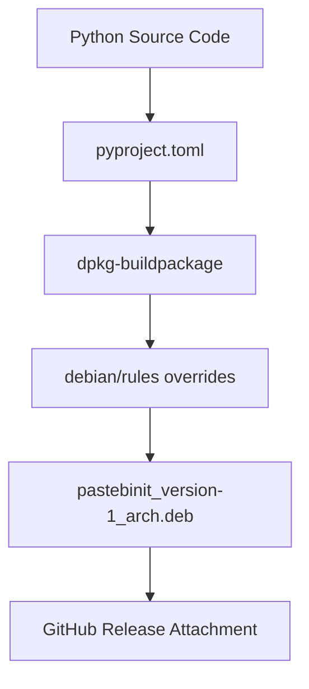
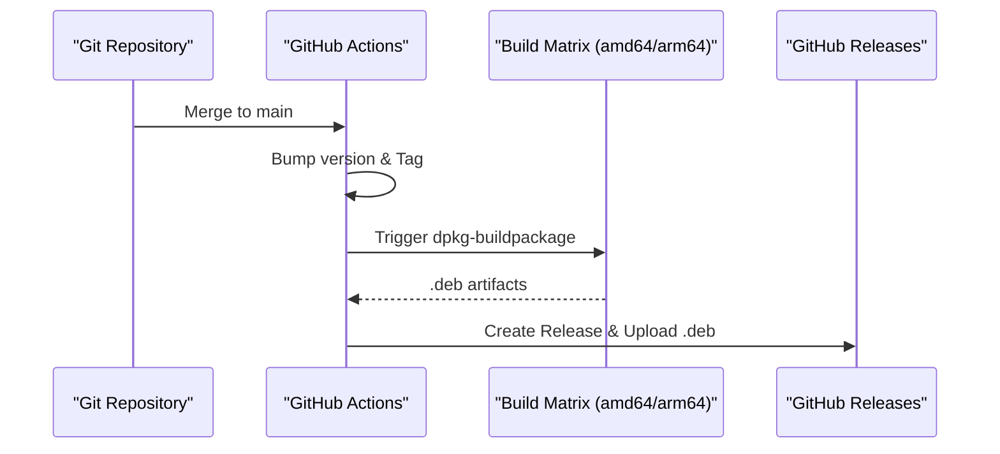

<details>
<summary>Relevant source files</summary>

The following files were used as context for generating this wiki page:

- [AGENTS.md](AGENTS.md)
- [CLAUDE.md](CLAUDE.md)
- [README.md](README.md)
- [CHANGELOG.md](CHANGELOG.md)
- [pyproject.toml](pyproject.toml)
</details>

# Debian Packaging Process

The Debian packaging process for `pastebinit` enables the distribution of the tool as a standard `.deb` archive for Debian-based systems. It encompasses the configuration of build metadata, architectural support for multiple platforms, and an automated release pipeline that integrates with GitHub Actions.

The project transition from a Launchpad-hosted tool to its current Python-based architecture necessitated a modern packaging approach using `setuptools` while maintaining traditional Debian artifacts like man pages and bash completion.
Sources: [README.md:1-10](README.md#L1-L10), [AGENTS.md:3-8](AGENTS.md#L3-L8), [CLAUDE.md:3-8](CLAUDE.md#L3-L8)

## Packaging Architecture and Artifacts

The packaging logic is centralized within the `debian/` directory, which contains instructions for the Debian build system. The tool is packaged to support various architectures, specifically `amd64` and `arm64`.

### Key Packaging Components

| Component | Description |
|---|---|
| `debian/control` | Defines package metadata and dependencies. Uses `Architecture: any` to trigger per-architecture builds. |
| `debian/rules` | Makefile for the build process; overrides `dh_builddeb` to move output to the repository root. |
| `debian/changelog` | Tracks version history and changes (automated via release workflows). |
| `debian/pastebinit.bash-completion` | Provides shell integration for command arguments. |
| `pyproject.toml` | Defines Python-specific build requirements (`setuptools`) and dependencies. |

Sources: [AGENTS.md:18-24](AGENTS.md#L18-L24), [CLAUDE.md:16-22](CLAUDE.md#L16-L22), [README.md:31-33](README.md#L31-L33), [pyproject.toml:1-5](pyproject.toml#L1-L5)

### Build Flow Diagram
The following diagram illustrates the transition from source code to a distributed Debian package.



Sources: [AGENTS.md:21-34](AGENTS.md#L21-L34), [CLAUDE.md:18-31](CLAUDE.md#L18-L31)

## Automation and Release Pipeline

The project employs an automated release process triggered by merges to the `main` branch. This process handles versioning, multi-architecture compilation, and asset distribution.

### Automated Workflow Steps
1.  **Tagging**: Based on Conventional Commits, the system bumps the version in `pyproject.toml` and creates a Git tag.
2.  **Matrix Build**: The `build-deb` job runs in parallel on `ubuntu-latest` for the `amd64` architecture and `ubuntu-24.04-arm` for the `arm64` architecture.
3.  **Release**: A GitHub release is generated, and the resulting `.deb` files are attached as assets.

Sources: [AGENTS.md:28-34](AGENTS.md#L28-L34), [CLAUDE.md:25-31](CLAUDE.md#L25-L31), [CHANGELOG.md:3-15](CHANGELOG.md#L3-L15)

### Deployment Sequence
This diagram shows how the CI/CD pipeline manages the package lifecycle during a release.



Sources: [AGENTS.md:28-34](AGENTS.md#L28-L34), [CLAUDE.md:25-31](CLAUDE.md#L25-L31)

## Development and Local Build Commands

Developers can replicate the packaging process locally to verify changes before submission.

```bash
# Build the .deb package locally
# -b: binary only, -us: unsigned source, -uc: unsigned changes
dpkg-buildpackage -b -us -uc
```

Sources: [AGENTS.md:14](AGENTS.md#L14), [CLAUDE.md:12](CLAUDE.md#L12)

### CI Build Options
In continuous integration environments, tests can be skipped to speed up the packaging process by setting environmental flags:
`DEB_BUILD_OPTIONS=nocheck`
Sources: [AGENTS.md:22](AGENTS.md#L22), [CLAUDE.md:20](CLAUDE.md#L20)

## Installation and Distribution
The output format follows the standard Debian naming convention: `pastebinit_<version>-1_<arch>.deb`. Users can install these artifacts using standard package managers.

```bash
# Example installation for latest release
ARCH=$(dpkg --print-architecture)
wget "https://github.com/blixten85/pastebinit/releases/latest/download/pastebinit_2.2.1-1_%24%7BARCH%7D.deb%22
sudo dpkg -i "pastebinit_2.2.1-1_${ARCH}.deb"
```

Sources: [README.md:39-43](README.md#L39-L43), [AGENTS.md:23](AGENTS.md#L23), [CLAUDE.md:21](CLAUDE.md#L21)

## Summary
The `pastebinit` Debian packaging process bridges Python package management with native Linux distribution standards. By utilizing a matrix-based CI pipeline, the project ensures that high-performance, architecture-specific binaries are available for end-users immediately upon version release.
