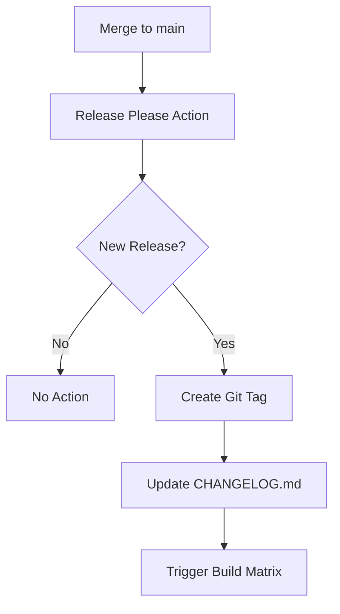
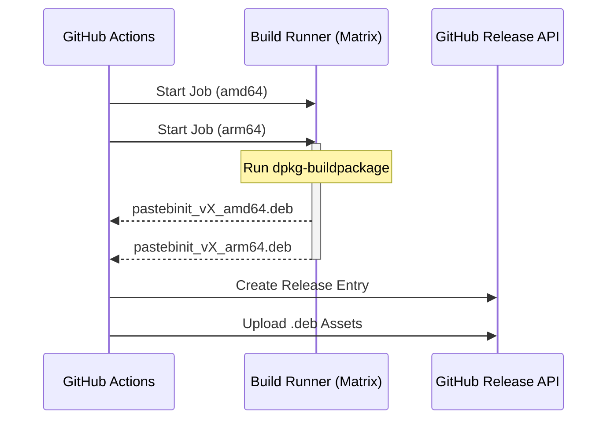

Relevant source files

The following files were used as context for generating this wiki page:

- [AGENTS.md](AGENTS.md)
- [CLAUDE.md](CLAUDE.md)
- [release-please-config.json](release-please-config.json)
- [README.md](README.md)
- [CHANGELOG.md](CHANGELOG.md)
- [renovate.json](renovate.json)
- [tests/test_dependabot_config.py](tests/test_dependabot_config.py)

# CI/CD & Automated Releases

The `pastebinit` project utilizes a modern automated CI/CD pipeline designed to handle testing, version management, multi-architecture artifact generation, and deployment. The system relies heavily on GitHub Actions and the [Conventional Commits](AGENTS.md%3A50) standard to drive automated versioning and changelog updates.

The primary scope of the CI/CD system includes:
*  Continuous integration for testing Python code across different environments.
*  Automated version bumping and git tagging based on commit metadata.
*  Parallelized Debian package (`.deb`) builds for multiple CPU architectures.
*  Automated GitHub Release creation with attached binary artifacts.

## Release Pipeline Architecture

The release process is primarily governed by the `auto-release.yml` workflow, which is triggered automatically upon merging changes into the `main` branch. This workflow coordinates several stages: versioning, artifact building via a matrix strategy, and final release publication.

### Automated Versioning and Tagging
The project uses `release-please` to manage version increments. By analyzing commit messages following the Conventional Commits specification (e.g., `feat:`, `fix:`), the system automatically determines if a patch, minor, or major version bump is required.

The logic for this automation is defined in the release configuration which specifies a "simple" release type and identifies the root package for changelog tracking.
Sources: [release-please-config.json:1-10](release-please-config.json#L1-L10), [AGENTS.md:41-44](AGENTS.md#L41-L44), [CHANGELOG.md:1-20](CHANGELOG.md#L1-L20)

### Build and Release Flow
Once a new version is tagged, the system initiates a parallel build process to generate platform-specific Debian packages. These are subsequently attached to a GitHub Release.

The build process leverages `dpkg-buildpackage` with the `nocheck` option to optimize speed in CI environments, as standard tests are handled in a separate CI workflow.
Sources: [AGENTS.md:35-47](AGENTS.md#L35-L47), [CLAUDE.md:33-40](CLAUDE.md#L33-L40)

## Artifact Generation (Debian Packaging)

The project maintains professional Debian packaging configuration within the `debian/` directory. This allows the CI system to produce standardized packages that include man pages, bash completion, and proper install paths.

### Multi-Architecture Matrix
The build system specifically targets two major architectures using GitHub-hosted runners:
*  **amd64**: Built on `ubuntu-latest`.
*  **arm64**: Built on `ubuntu-24.04-arm`.

The `debian/control` file specifies `Architecture: any`, which permits the generation of these per-architecture binaries. During the build, `debian/rules` is configured to override `dh_builddeb` to ensure the resulting file is moved to the repository root for easy collection by the release action.
Sources: [AGENTS.md:35-40](AGENTS.md#L35-L40), [CLAUDE.md:33-38](CLAUDE.md#L33-L38), [README.md:10-20](README.md#L10-L20)

## Maintenance and Dependency Automation

To ensure long-term stability and security, the project incorporates automated dependency management and verification tests for these configurations.

### Dependency Management Tools
Two primary tools are used to monitor and update dependencies:
1.  **Dependabot**: Configured to monitor `pip` (Python) and `github-actions` ecosystems.
2.  **Renovate**: Provides an alternative/supplementary update mechanism using the recommended configuration.

### Configuration Verification
The project includes specific tests to verify that automation configurations remain valid. The `tests/test_dependabot_config.py` file ensures that the Dependabot YAML is present, correctly formatted, and covers the necessary ecosystems with appropriate update schedules.

| Ecosystem | Tool | Purpose |
|---|---|---|
| Python (pip) | Dependabot / Renovate | Updates requirements in `pyproject.toml`. |
| CI/CD Actions | Dependabot | Keeps GitHub Action versions current. |
| Configuration | pytest | Validates `.github/dependabot.yml` structure. |

Sources: [renovate.json:1-5](renovate.json#L1-L5), [tests/test_dependabot_config.py:10-40](tests/test_dependabot_config.py#L10-L40), [CHANGELOG.md:10-15](CHANGELOG.md#L10-L15)

## Summary of CI/CD Components

| Feature | Implementation | File/Mechanism |
|---|---|---|
| **Test Runner** | pytest | `pyproject.toml`, `tests/` |
| **Linting/Build CI** | GitHub Actions | `ci.yml` (Badge in README) |
| **Manual Builds** | workflow_dispatch | `build.yml` |
| **Package Format** | Debian (.deb) | `debian/control`, `debian/rules` |
| **Versioning** | Conventional Commits | `AGENTS.md`, `CLAUDE.md` |
| **Release Logic** | release-please | `release-please-config.json` |

The CI/CD system provides a robust path from code submission to end-user distribution, ensuring that every merge to `main` results in a verified, versioned, and multi-arch accessible release.
Sources: [AGENTS.md:30-55](AGENTS.md#L30-L55), [CLAUDE.md:25-45](CLAUDE.md#L25-L45), [README.md:1-10](README.md#L1-L10)
