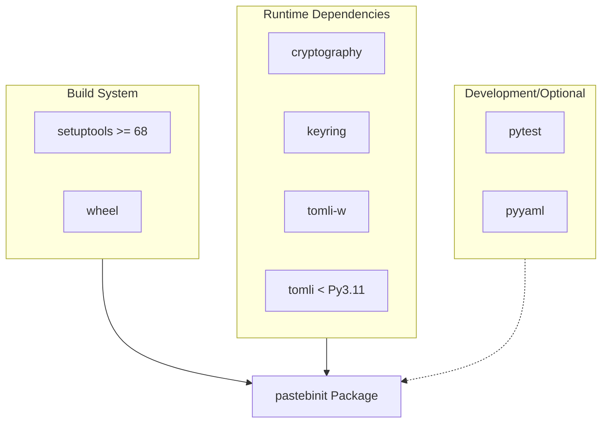
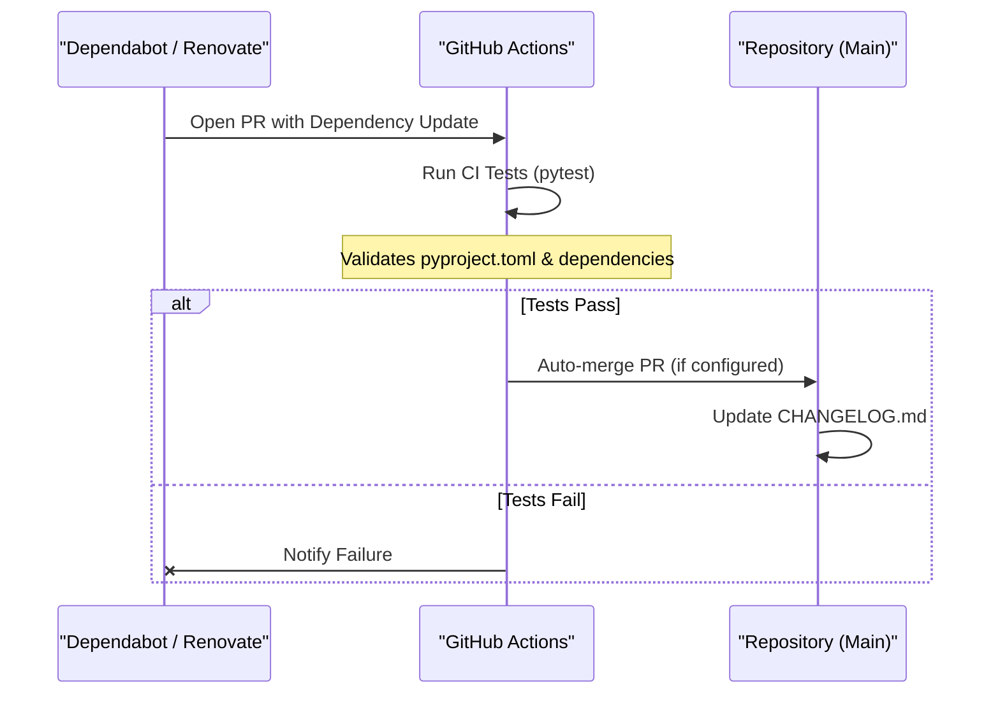

Relevant source files

The following files were used as context for generating this wiki page:

- [pyproject.toml](pyproject.toml)
- [renovate.json](renovate.json)
- [tests/test_dependabot_config.py](tests/test_dependabot_config.py)
- [AGENTS.md](AGENTS.md)
- [CLAUDE.md](CLAUDE.md)
- [CHANGELOG.md](CHANGELOG.md)

# Dependency Management

Dependency management in `pastebinit` is handled through a combination of standard Python packaging tools and automated update services. The project specifies its core requirements and development dependencies within a modern `pyproject.toml` configuration, ensuring a reproducible environment for both users and contributors.

The system utilizes automated bots to maintain security and compatibility by monitoring for new versions of external libraries and GitHub Actions. This lifecycle is validated through specialized tests that ensure the automated configuration remains intact.

## Core Runtime Dependencies

The project targets Python version 3.10 or higher. Runtime dependencies are strictly defined to support core functionality, specifically credential encryption and configuration parsing.

### Primary Dependencies
| Dependency | Version | Purpose |
| :--- | :--- | :--- |
| `cryptography` | `>=49.0.0` | Used for credential storage and encryption. |
| `keyring` | `>=25.7.0` | Facilitates secure storage of user credentials. |
| `tomli-w` | `>=1.2.0` | Handles writing TOML configuration files. |
| `tomli` | `>=2.4.1` | Used for reading TOML files on Python versions below 3.11. |

Sources: [pyproject.toml:13-20](pyproject.toml#L13-L20), [AGENTS.md:7-12](AGENTS.md#L7-L12), [CLAUDE.md:7-12](CLAUDE.md#L7-L12)

### Dependency Flow Diagram
This diagram illustrates how dependencies are categorized and utilized within the build system.

Sources: [pyproject.toml:1-25](pyproject.toml#L1-L25)

## Development and Optional Dependencies

Optional dependencies are grouped under the `test` extra, allowing developers to install only what is necessary for running the test suite.

- **pytest**: The primary framework for unit and integration testing.
- **pyyaml**: Required specifically for parsing YAML configurations, such as verifying the Dependabot setup.

Developers can install these using the command `pip install -e ".[dev]"` which targets the development environment specifications.

Sources: [pyproject.toml:22-26](pyproject.toml#L22-L26), [AGENTS.md:14-20](AGENTS.md#L14-L20), [CLAUDE.md:14-20](CLAUDE.md#L14-L20)

## Automation and Maintenance

The project employs two primary automation tools to manage dependency updates and versioning.

### Dependabot
The project includes a `.github/dependabot.yml` configuration (validated by `tests/test_dependabot_config.py`) to monitor two ecosystems:
1.  **pip**: Monitors Python package updates.
2.  **github-actions**: Monitors updates for CI/CD workflows.

Sources: [tests/test_dependabot_config.py:18-35](tests/test_dependabot_config.py#L18-L35)

### Renovate
Renovate is configured via `renovate.json` using the `config:recommended` preset to provide automated dependency PRs and maintenance.

Sources: [renovate.json:1-6](renovate.json#L1-L6)

### Update Integration Flow
This sequence diagram shows how dependency updates are handled by the system.

Sources: [CHANGELOG.md:5-10](CHANGELOG.md#L5-L10), [tests/test_dependabot_config.py:1-35](tests/test_dependabot_config.py#L1-L35)

## Build System Configuration

The project uses `setuptools` as the build backend. The metadata in `pyproject.toml` defines the project's identity and entry points, linking the CLI command `pastebinit` directly to the `pastebinit.cli:main` function.

Sources: [pyproject.toml:1-5](pyproject.toml#L1-L5), [pyproject.toml:28-29](pyproject.toml#L28-L29)

Dependency management in `pastebinit` is designed for high security and low maintenance, leveraging industry-standard tools to keep the small but critical set of external libraries up to date.
