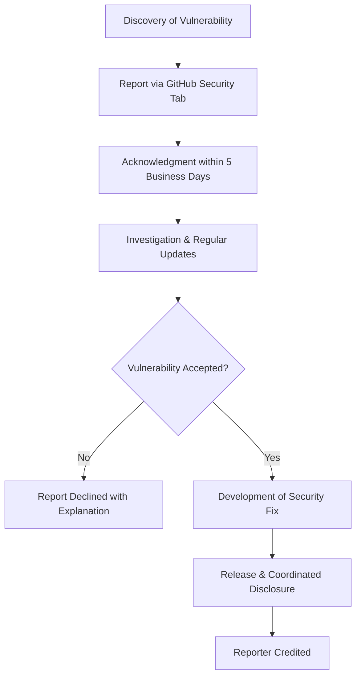
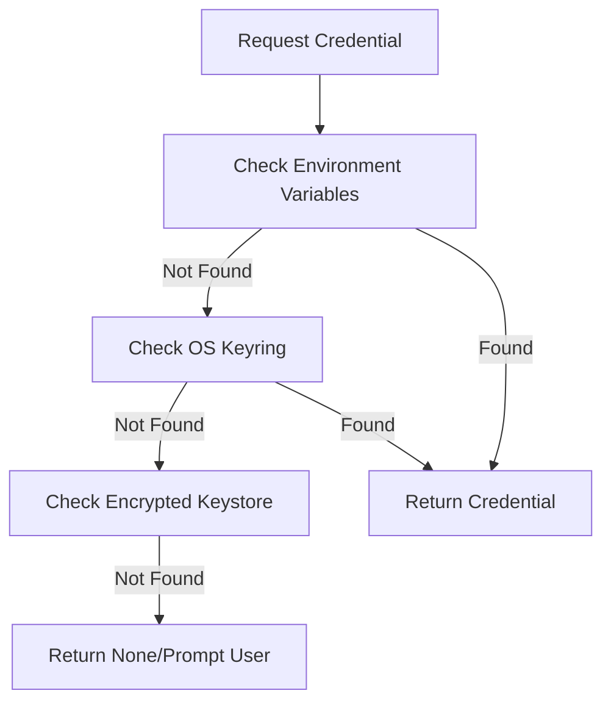

<details>
<summary>Relevant source files</summary>

The following files were used as context for generating this wiki page:

- [SECURITY.md](SECURITY.md)
- [pastebinit/credentials.py](pastebinit/credentials.py)
- [pastebinit/cli.py](pastebinit/cli.py)
- [AGENTS.md](AGENTS.md)
- [README.md](README.md)
- [pyproject.toml](pyproject.toml)
</details>

# Security Policy & Reporting

## Introduction
The pastebinit security policy outlines the procedures for reporting vulnerabilities and the architectural safeguards implemented to protect user data. The project emphasizes responsible disclosure through private reporting channels and employs multi-layered security for credential management, including encryption and integration with system-level keyrings.

The scope of security updates is limited to the latest stable release and the current `main` branch. Older versions are explicitly unsupported for security patches. 
Sources: [SECURITY.md:5-11](SECURITY.md#L5-L11), [AGENTS.md:37-41](AGENTS.md#L37-L41)

## Vulnerability Reporting Process
Vulnerabilities should never be reported via public GitHub issues. Instead, the project utilizes GitHub's Private Vulnerability Reporting and Security Advisory system to ensure sensitive information is handled securely before a fix is released.

### Reporting Workflow
The following diagram illustrates the lifecycle of a security report from initial discovery to public disclosure.



The reporting process guarantees an initial response within 5 business days and status updates at least every 2 weeks during investigation.
Sources: [SECURITY.md:15-32](SECURITY.md#L15-L32)

## Credential Security Architecture
The system is designed to prevent the exposure of sensitive authentication data, such as API keys and passwords. It utilizes a hierarchical approach to credential retrieval and storage.

### Data Flow for Credential Retrieval
When the CLI requires authentication (e.g., for `pastebin.com`), it follows a specific precedence to locate credentials.



Sources: [pastebinit/credentials.py:100-113](pastebinit/credentials.py#L100-L113), [README.md:73-83](README.md#L73-L83)

### Secure Storage Mechanisms
The project implements two primary methods for persistent secure storage to avoid hardcoding credentials:

1.  **OS Keyring Integration:** Uses the `keyring` library to interface with system-level managers like GNOME Keyring or KWallet. This is the preferred storage method.
2.  **Encrypted Keystore:** If a keyring is unavailable, credentials are saved in an encrypted file located at `~/.config/pastebinit/keystore`.

#### Keystore Implementation Details
The local keystore uses `cryptography` (Fernet) with keys derived from a user-provided password via PBKDF2HMAC.

| Component | Implementation | Description |
| :--- | :--- | :--- |
| **Algorithm** | Fernet (AES-128 in CBC mode) | Symmetric encryption for the JSON credential blob. |
| **KDF** | PBKDF2HMAC-SHA256 | Derives encryption keys from user passwords. |
| **Iterations** | 600,000 | High iteration count to resist brute-force attacks. |
| **File Permissions** | 0600 (User Read/Write Only) | Enforced via `os.fchmod` during file creation. |

Sources: [pastebinit/credentials.py:27-36](pastebinit/credentials.py#L27-L36), [pastebinit/credentials.py:76-96](pastebinit/credentials.py#L76-L96), [pyproject.toml:20-21](pyproject.toml#L20-L21)

## CLI Security Operations
The CLI provides specific commands to manage the security state of the application.

### Authentication Management
- **`--login`**: Triggers a secure prompt for credentials. Usernames are requested via standard input, while passwords and keystore master keys are captured using `getpass.getpass` to prevent terminal echoing.
- **`--logout`**: Clears saved credentials from the OS keyring for a specific backend.

```python
# Capturing credentials without echoing (pastebinit/cli.py)
if args.login:
    username = args.username or input(f"Username for {args.backend}: ")
    password = getpass.getpass(f"Password for {args.backend}: ")
    # ... logic for storage ...
    pw = getpass.getpass("Keystore password (to encrypt credentials): ")
```

Sources: [pastebinit/cli.py:84-93](pastebinit/cli.py#L84-L93), [pastebinit/credentials.py:121-137](pastebinit/credentials.py#L121-L137)

## Conclusion
The pastebinit security model relies on a combination of responsible disclosure policies and robust technical implementations. By leveraging modern cryptographic standards (PBKDF2, Fernet) and system-level security features (Keyrings, strict file permissions), the tool minimizes the risk of credential leakage while maintaining a clear path for handling newly discovered vulnerabilities.
