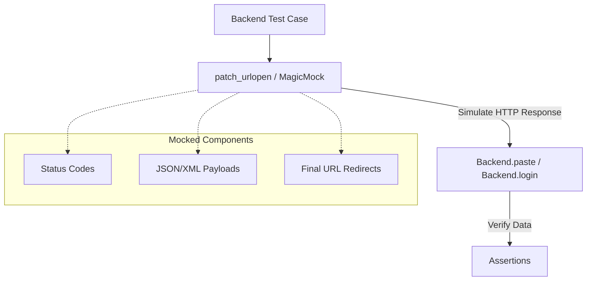
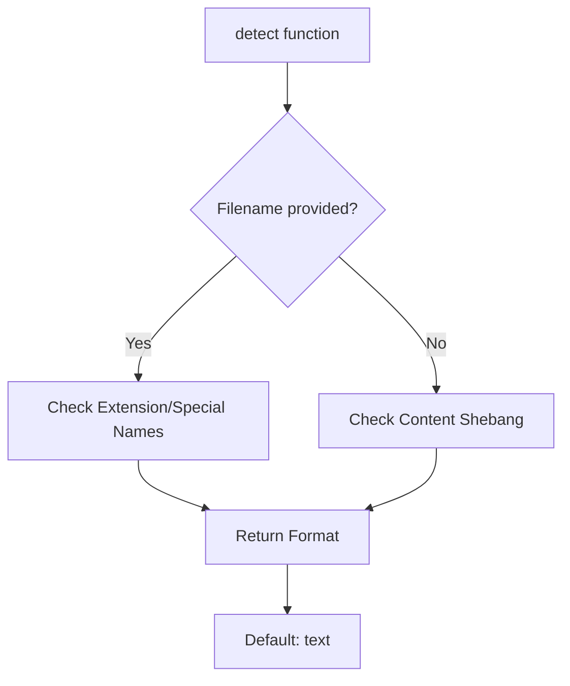

Relevant source files

The following files were used as context for generating this wiki page:

- [tests/conftest.py](tests/conftest.py)
- [tests/test_cli.py](tests/test_cli.py)
- [tests/test_config.py](tests/test_config.py)
- [tests/test_credentials.py](tests/test_credentials.py)
- [tests/test_syntax.py](tests/test_syntax.py)
- [tests/backends/test_pastebin_com.py](tests/backends/test_pastebin_com.py)
- [tests/backends/test_dpaste.py](tests/backends/test_dpaste.py)
- [tests/backends/test_bpa_st.py](tests/backends/test_bpa_st.py)
- [pyproject.toml](pyproject.toml)

# Pytest Test Suite

The Pytest test suite for `pastebinit` provides a comprehensive validation framework for the application's command-line interface, configuration management, credential security, and various pastebin service backends. It ensures that the core logic—such as syntax detection and API communication—remains reliable across updates.

The suite is designed to be isolated from the host environment, using mocking and temporary directories to prevent tests from modifying real user configurations or making actual network requests to external APIs.

Sources: [AGENTS.md:11](AGENTS.md#L11), [tests/test_cli.py:9-12](tests/test_cli.py#L9-L12)

## Test Configuration and Environment

The test suite is configured via `pyproject.toml`, which specifies the `tests` directory as the primary test path. The project utilizes `pytest` (version >= 7.4.4) and `pyyaml` for dependency management during testing.

Sources: [pyproject.toml:21-25](pyproject.toml#L21-L25), [pyproject.toml:34-35](pyproject.toml#L34-L35)

### Fixtures and Isolation
To maintain a clean testing environment, the suite uses a variety of fixtures:
*  **`no_real_config`**: An autouse fixture that redirects the `CONFIG_FILE` path to a temporary directory, preventing tests from reading or writing to `~/.config/pastebinit/config.toml`.
*  **Backend Fixtures**: Individual backend tests (e.g., `pastebin_com`, `dpaste`) use fixtures to initialize backend classes with test-specific parameters like development keys.

Sources: [tests/test_cli.py:9-13](tests/test_cli.py#L9-L13), [tests/backends/test_pastebin_com.py:10-12](tests/backends/test_pastebin_com.py#L10-L12)

## Backend Testing Architecture

The suite extensively tests the communication logic for various supported backends. Since these backends interact with external web APIs, the tests employ heavy mocking of `urllib.request.urlopen`.

*This diagram illustrates how backend tests isolate local logic from network dependencies using HTTP response mocking.*

Sources: [tests/backends/test_pastebin_com.py:15-18](tests/backends/test_pastebin_com.py#L15-L18), [tests/backends/test_dpaste.py:13-17](tests/backends/test_dpaste.py#L13-L17)

### Backend Test Coverage
| Backend Module | Tested Features | Key Validations |
| :--- | :--- | :--- |
| `pastebin_com` | Paste, Login, Delete, Folders | Verifies XML parsing of folder lists and private level flags. |
| `dpaste` | Paste, Expiry | Ensures syntax and expiry days are correctly encoded in POST data. |
| `bpa_st` | JSON API, Errors | Validates that JSON payloads are correctly structured for the v1 API. |
| `paste_debian_net` | JSON Paste | Checks for correct handling of ID and hidden URL responses. |

Sources: [tests/backends/test_pastebin_com.py:46-64](tests/backends/test_pastebin_com.py#L46-L64), [tests/backends/test_dpaste.py:28-34](tests/backends/test_dpaste.py#L28-L34), [tests/backends/test_bpa_st.py:22-29](tests/backends/test_bpa_st.py#L22-L29)

## CLI and Core Logic Validation

### CLI Argument Parsing
The `test_cli.py` file validates the `argparse` configuration. It ensures that default values for backend (`bpa.st`), privacy (`1`), and expiry (`N`) are correctly applied when no arguments are provided.

Sources: [tests/test_cli.py:16-21](tests/test_cli.py#L16-L21)

### Syntax Detection
The syntax detection engine is tested against file extensions, specific filenames (like `Dockerfile`), and shebang lines.

*The flow of syntax detection logic as verified by the test suite.*

Sources: [tests/test_syntax.py:4-28](tests/test_syntax.py#L4-L28)

## Credentials and Security Testing

The suite includes dedicated tests for the credential management system, ensuring that sensitive information is handled correctly.

*  **Environment Variables**: Tests verify that `PASTEBIN_API_KEY` and other environment variables take precedence.
*  **Keystore Security**: Validates that the encrypted keystore file is created with secure permissions (`600`).
*  **Decryption Integrity**: Ensures that providing an incorrect password to the keystore returns `None` rather than corrupted data.

Sources: [tests/test_credentials.py:7-11](tests/test_credentials.py#L7-L11), [tests/test_credentials.py:28-33](tests/test_credentials.py#L28-L33), [tests/test_credentials.py:41-46](tests/test_credentials.py#L41-L46)

## Conclusion

The Pytest test suite serves as the primary safeguard for `pastebinit`, covering the entire lifecycle of a paste operation from command-line input and syntax detection to secure credential retrieval and successful API interaction. By enforcing strict isolation through mocking, the suite ensures reliable development without external side effects.

Sources: [AGENTS.md:46](AGENTS.md#L46), [CLAUDE.md:44](CLAUDE.md#L44)
