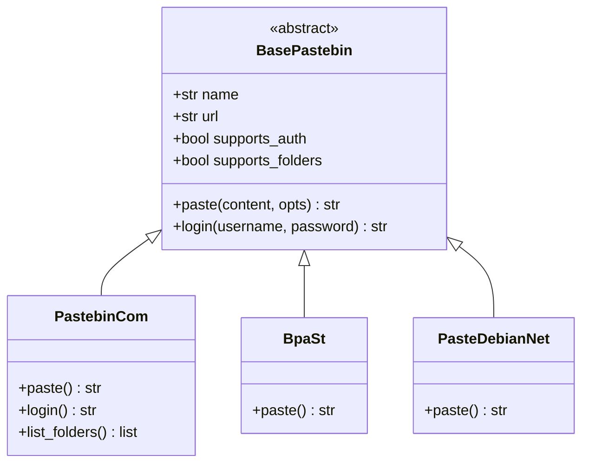
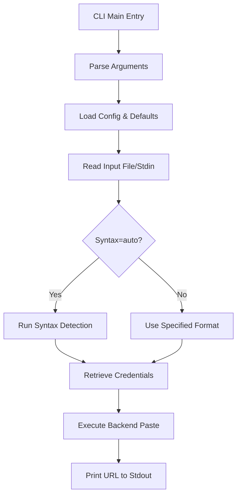
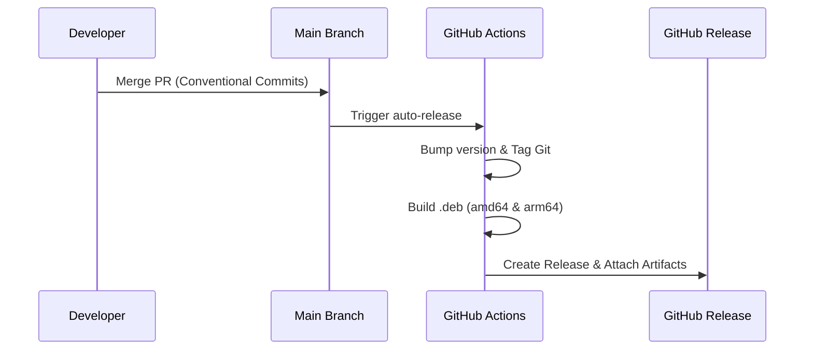

<details>
<summary>Relevant source files</summary>

The following files were used as context for generating this wiki page:

- [AGENTS.md](AGENTS.md)
- [CLAUDE.md](CLAUDE.md)
- [README.md](README.md)
- [pyproject.toml](pyproject.toml)
- [pastebinit/cli.py](pastebinit/cli.py)
- [pastebinit/backends/base.py](pastebinit/backends/base.py)
- [pastebinit/syntax.py](pastebinit/syntax.py)
- [pastebinit/config.py](pastebinit/config.py)
- [SECURITY.md](SECURITY.md)

</details>

# Developer & Contribution Guide

The `pastebinit` project is a Python-based command-line utility designed to streamline the process of sending text and files to various pastebin services. Originally originating as a Launchpad project, it has been modernized with Python packaging, a modular backend architecture, and robust security features like encrypted credential storage.

This guide serves as a comprehensive resource for developers looking to contribute to the codebase, add new backends, or maintain the project's infrastructure. It covers the technical stack, core architecture, development workflows, and deployment processes.

## Technical Stack & Environment

The project is built on modern Python standards, emphasizing security and ease of distribution.

| Component | Technology | Description |
| :--- | :--- | :--- |
| **Language** | Python ≥ 3.10 | Core programming language. |
| **Packaging** | setuptools / pyproject.toml | Build system and metadata management. |
| **Security** | `cryptography`, `keyring` | Used for Fernet/PBKDF2 keystores and OS-level credential storage. |
| **Configuration** | `tomli` / `tomli-w` | TOML parsing for configuration files. |
| **Testing** | `pytest` | Test suite framework. |
| **Packaging** | Debian (`.deb`) | Support for amd64 and arm64 architectures. |

Sources: [AGENTS.md:13-18](AGENTS.md#L13-L18), [pyproject.toml:13-22](pyproject.toml#L13-L22), [README.md:15-22](README.md#L15-L22)

### Development Setup

Developers should use an editable installation to test changes in real-time. The following commands are standard for the development environment:

```bash
# Install in editable mode with development dependencies
pip install -e ".[dev]"

# Execute the CLI directly
pastebinit --help

# Run the test suite
pytest

# Build a Debian package locally
dpkg-buildpackage -b -us -uc
```

Sources: [CLAUDE.md:13-18](CLAUDE.md#L13-L18), [AGENTS.md:20-25](AGENTS.md#L20-L25)

## Core Architecture

The system is designed around a decoupled architecture where the CLI interacts with a generic backend interface, allowing for easy expansion to new services.

### Backend System
The project uses an abstract base class `BasePastebin` to define the contract for all pastebin integrations. This ensures consistency across different service implementations, such as `pastebin.com` or `dpaste.com`.



The diagram shows the inheritance hierarchy where specialized backends implement the abstract `paste` method and optional features like authentication.
Sources: [pastebinit/backends/base.py:37-72](pastebinit/backends/base.py#L37-L72), [pastebinit/backends/pastebin_com.py:16-150](pastebinit/backends/pastebin_com.py#L16-L150)

### Logic Flow: CLI to Backend
The CLI serves as the entry point, handling argument parsing and coordinating data flow between configuration, syntax detection, and the selected backend.



This flowchart illustrates the sequence from user input to the final output of the paste URL.
Sources: [pastebinit/cli.py:91-168](pastebinit/cli.py#L91-L168), [pastebinit/syntax.py:65-85](pastebinit/syntax.py#L65-L85)

### Syntax Detection
Automatic syntax detection is handled by `pastebinit/syntax.py`, which uses a three-tier approach:
1.  **Special Filenames:** Identifies files like `Dockerfile` or `Makefile`.
2.  **File Extensions:** Maps common extensions (e.g., `.py`, `.rs`, `.ts`) to pastebin-compatible format strings.
3.  **Shebang Lines:** Inspects the first line of the content for interpreter paths (e.g., `#!/bin/bash`).

Sources: [pastebinit/syntax.py:1-85](pastebinit/syntax.py#L1-L85)

## Configuration & Credentials

`pastebinit` adheres to the XDG Base Directory Specification for configuration.

### Configuration File
User defaults are stored in `~/.config/pastebinit/config.toml`. The `config.py` module manages reading and writing these settings using `tomli` and `tomli_w`.

| Option | Type | Default | Description |
| :--- | :--- | :--- | :--- |
| `backend` | string | `bpa.st` | The default service to use. |
| `private` | integer | `1` | Privacy level (0: Public, 1: Unlisted, 2: Private). |
| `expiry` | string | `N` | Default expiration code (e.g., 1D, 1W, 1M). |
| `format` | string | `auto` | Default syntax highlighting. |

Sources: [pastebinit/config.py:12-42](pastebinit/config.py#L12-L42), [README.md:73-82](README.md#L73-L82)

### Credential Management
Security is a priority; the application never stores raw passwords in plain text.
- **Keystore:** Uses `cryptography` for an encrypted local keystore.
- **Keyring:** Integrates with OS-native keyrings (GNOME Keyring, KWallet) via the `keyring` library.
- **Login Flow:** The `--login` command triggers a credential prompt, saves the encrypted token/user key, and clears them on `--logout`.

Sources: [pastebinit/cli.py:100-118](pastebinit/cli.py#L100-L118), [README.md:61-71](README.md#L61-L71), [AGENTS.md:50](AGENTS.md#L50)

## Contribution Workflow

The project follows a strict workflow to maintain code quality and automated release integrity.

### Commit Conventions
`pastebinit` uses **Conventional Commits**. This practice allows the automation tools (specifically `release-please`) to determine version bumps (patch, minor, or major) and generate changelogs automatically.
Sources: [AGENTS.md:49](AGENTS.md#L49), [release-please-config.json:1-10](release-please-config.json#L1-L10)

### Branching and PRs
1.  **Creation:** Contributors must create feature branches and are forbidden from pushing directly to `main`.
2.  **Tests:** All changes must include corresponding tests in the `tests/` directory. PRs cannot be merged unless all CI tests pass.
3.  **Focus:** PRs should be kept focused on a single change or feature.

Sources: [AGENTS.md:54-68](AGENTS.md#L54-L68), [CLAUDE.md:45-50](CLAUDE.md#L45-L50)

### Release Process
The release process is fully automated via GitHub Actions (`auto-release.yml`):



Sources: [AGENTS.md:41-47](AGENTS.md#L41-L47), [CLAUDE.md:36-41](CLAUDE.md#L36-L41)

## Security Policy

Vulnerabilities should not be reported via public issues. Instead, contributors and users are directed to use GitHub's **Security Advisory** system to report issues privately. The project maintainers commit to acknowledging reports within 5 business days and providing updates every 2 weeks.
Sources: [SECURITY.md:11-30](SECURITY.md#L11-L30)

The `pastebinit` architecture emphasizes modularity through its backend system and security through its credential handling, ensuring a robust tool for both users and developers.
