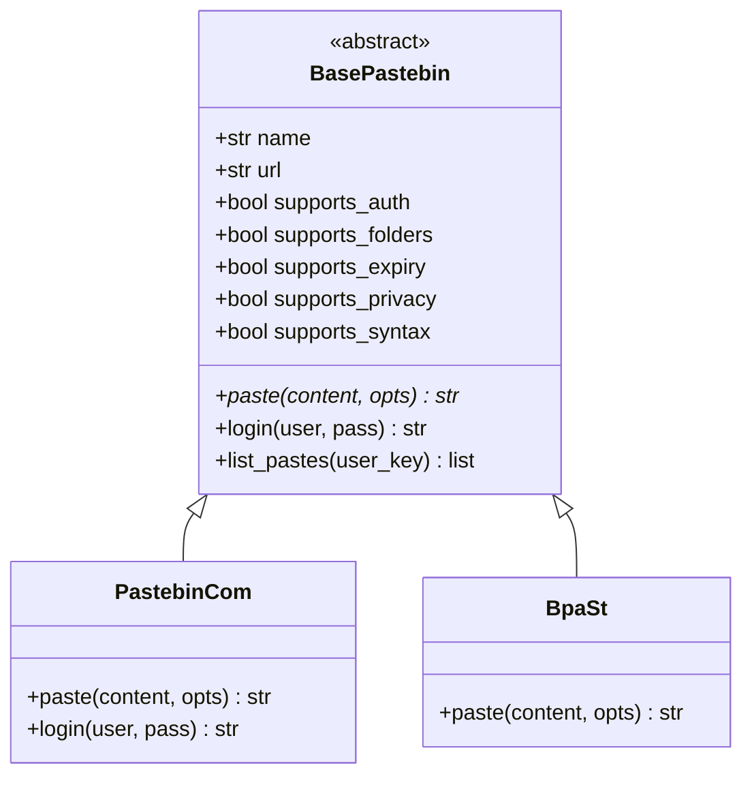
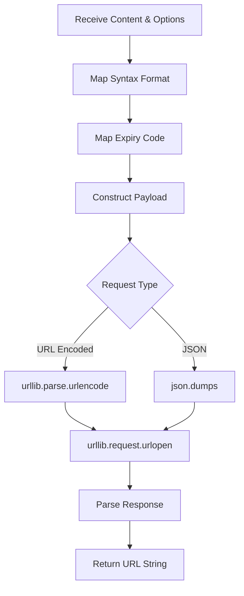

<details>
<summary>Relevant source files</summary>

The following files were used as context for generating this wiki page:

- [pastebinit/backends/base.py](pastebinit/backends/base.py)
- [pastebinit/backends/__init__.py](pastebinit/backends/__init__.py)
- [pastebinit/backends/pastebin_com.py](pastebinit/backends/pastebin_com.py)
- [pastebinit/backends/bpa_st.py](pastebinit/backends/bpa_st.py)
- [pastebinit/backends/paste_ubuntu_com.py](pastebinit/backends/paste_ubuntu_com.py)
- [pastebinit/backends/dpaste.py](pastebinit/backends/dpaste.py)
</details>

# Creating Custom Backends

Creating custom backends in `pastebinit` allows the application to interface with various pastebin services by implementing a standardized interface. The system is built on an extensible architecture where each service provider is represented by a specific Python class inheriting from a base abstract class.

The backend system manages the transformation of local content and options into service-specific API requests, handling authentication, metadata (like expiry and privacy), and result parsing.

Sources: [pastebinit/backends/base.py](pastebinit/backends/base.py), [pastebinit/backends/__init__.py](pastebinit/backends/__init__.py)

## Backend Architecture

The architecture relies on the `BasePastebin` abstract base class, which defines the contract for all backends. New backends must implement the `paste` method and can optionally override other methods to support advanced features like authentication or folder management.

### Class Hierarchy and Interface

All backends must inherit from `BasePastebin` and provide metadata about their capabilities.



This diagram shows the relationship between the abstract base class and concrete implementations.
Sources: [pastebinit/backends/base.py:35-64](pastebinit/backends/base.py#L35-L64), [pastebinit/backends/pastebin_com.py:16-24](pastebinit/backends/pastebin_com.py#L16-L24)

### Capability Flags

When implementing a backend, you must set boolean flags to indicate which features the service supports. These are used by the CLI to validate user arguments.

| Attribute | Type | Default | Description |
| :--- | :--- | :--- | :--- |
| `supports_auth` | bool | `False` | Whether the backend supports user login/API keys. |
| `supports_folders` | bool | `False` | Whether the backend allows organizing pastes into folders. |
| `supports_expiry` | bool | `False` | Whether the backend supports setting expiration dates. |
| `supports_privacy` | bool | `False` | Whether the backend supports public/unlisted/private settings. |
| `supports_syntax` | bool | `False` | Whether the backend supports syntax highlighting. |

Sources: [pastebinit/backends/base.py:38-42](pastebinit/backends/base.py#L38-L42)

## Implementation Details

### The `paste` Method

The core of any backend is the `paste` method. It receives the raw string content and a `PasteOptions` object containing metadata.

**PasteOptions Structure:**
- `title`: Optional title for the paste.
- `format`: Syntax highlighting format (e.g., "python").
- `private`: Integer (0=public, 1=unlisted, 2=private).
- `expiry`: Expiry code string (e.g., "1D", "1W", "N").
- `user_key`: Optional authentication token retrieved via `login`.

Sources: [pastebinit/backends/base.py:24-32](pastebinit/backends/base.py#L24-L32)

### Data Flow for a Paste Request

The following diagram illustrates how a backend processes a request, from receiving local options to returning a remote URL.



This flow represents the typical logic found in methods like `PastebinCom.paste` or `BpaSt.paste`.
Sources: [pastebinit/backends/pastebin_com.py:61-81](pastebinit/backends/pastebin_com.py#L61-L81), [pastebinit/backends/bpa_st.py:19-37](pastebinit/backends/bpa_st.py#L19-L37)

### Handling Authentication

For backends where `supports_auth = True`, the `login` method must be implemented. It typically exchanges a username and password for a session token or `user_key`.

```python
def login(self, username: str, password: str) -> str:
    # Example from pastebin.com implementation
    result = self._post(_LOGIN, {
        "api_dev_key": self._key(),
        "api_user_name": username,
        "api_user_password": password,
    })
    return result
```

Sources: [pastebinit/backends/pastebin_com.py:50-59](pastebinit/backends/pastebin_com.py#L50-L59)

## Registration and Integration

Once a backend class is created, it must be registered in the `BACKENDS` dictionary within `pastebinit/backends/__init__.py`.

```python
# pastebinit/backends/__init__.py
from .custom_backend import CustomBackend

BACKENDS: dict[str, type] = {
    "pastebin.com": PastebinCom,
    "custom.service": CustomBackend,
    # ...
}
```

The `get_backend` function uses this dictionary to instantiate the requested service.
Sources: [pastebinit/backends/__init__.py:10-25](pastebinit/backends/__init__.py#L10-L25)

## Error Handling

Backends should use the standard exception classes defined in `base.py` to ensure the CLI can provide meaningful error messages to the user:

- `BackendError`: General errors (network issues, API errors).
- `AuthError`: Authentication-specific failures.
- `NotSupportedError`: Raised when a feature (like folders) is called on a backend that doesn't support it.

Sources: [pastebinit/backends/base.py:11-21](pastebinit/backends/base.py#L11-L21)

## Conclusion

Creating a custom backend involves extending `BasePastebin`, implementing the network communication logic (usually via `urllib`), and mapping `pastebinit`'s standard options to the specific API requirements of the target service. By following this pattern, new services are immediately compatible with the CLI's configuration, syntax detection, and credential management systems.
